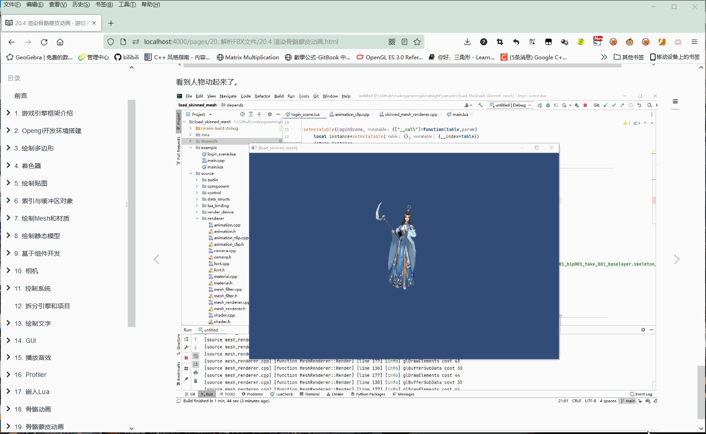
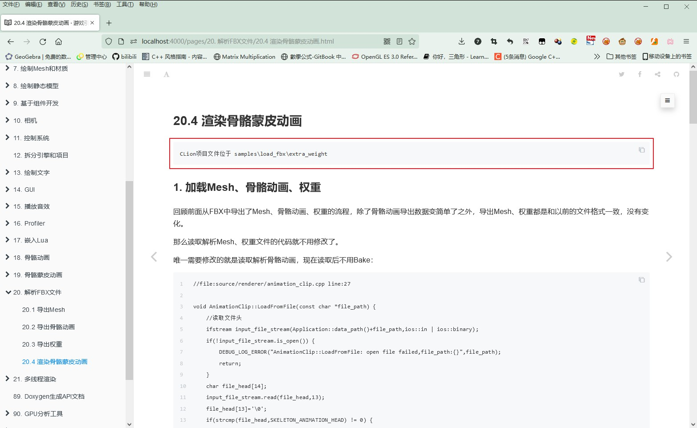

# [游戏引擎 浅入浅出](https://github.com/ThisisGame/cpp-game-engine-book)

## 项目介绍 README

本书以实际项目开发Timeline，完整介绍一个游戏引擎的所有模块，从最基础的OpenGL环境搭建，到骨骼动画、多线程渲染、阴影实现等等，最后实现一个完整的游戏引擎。



## 章节内容 Chapter

第 1 章介绍游戏引擎框架，以Unity为例，介绍游戏引擎组成。

第 2 章介绍OpenGL开发环境搭建，创建一个OpenGL空窗口来入坑。

第 3 章介绍使用OpenGL绘制三角形、正方形、立方体，来熟悉游戏渲染的最基础元素。

第 4 章介绍Shader的概念，编译链接，以及Shader格式、关键字。

第 5 章介绍贴图格式，从直接读取PNG、JPG渲染，然后介绍GPU所使用的的压缩纹理。

第 6 章介绍索引与缓冲区对象，索引就是多个顶点的下标，使用索引可以复用顶点渲染。而缓冲区则是将顶点数据存储于显存中，不用再每一帧都从内存上传到GPU。

第 7 章介绍引擎自定义的Mesh文件格式以及材质的组成。将原来写死在代码中的顶点数据存储到Mesh文件中，将原来写死在代码中的Shader参数存储到材质中。

第 8 章介绍使用Blender制作模型并编写Python代码导出为Mesh文件。

第 9 章介绍如何实现GameObject-Component模式。

第 10 章介绍什么是相机，以及多相机渲染排序。

第 11 章介绍获取鼠标、键盘输入。

第 12 章介绍如何将Demo代码，拆分为引擎源码与项目源码。

第 13 章介绍使用FreeType对指定字符生成单Alpha通道的纹理并渲染，以及使用顶点色实现彩色文字。

第 14 章介绍基础GUI控件的实现，包括UIImage、UIMask、UIText、UIButton。有了这几个基础，可以实现其他复杂的控件。

第 15 章介绍使用FMOD播放MP3、Wav音乐，以及使用FMOD专业音频编辑器制作音效与解析播放。

第 16 章介绍easy_profiler这个C++性能分析库。

第 17 章介绍使用Sol2这个开源库，将Lua集成到引擎，后续使用C++开发引擎，使用Lua编写测试代码。

第 18 章介绍骨骼动画原理，并介绍使用Blender制作骨骼动画、导出到skeleton_anim文件，在引擎解析。

第 19 章介绍骨骼蒙皮动画，在Blender刷权重，导出到weight文件，在引擎解析，渲染。

第 20 章介绍如何从FBX文件导出Mesh、骨骼动画、权重，实例导出古风少女并渲染。

第 21 章介绍多线程渲染，将OpenGL API放到单独的渲染线程，从主线程发命令到渲染线程，将DrawCall的影响分出去，减轻主线程负担。

第 22 章介绍不定时更新。

## 特性列表 Feature

写这本书的目的是普及游戏引擎基础知识，面向的读者有一定的Unity经验，对引擎某些点感兴趣即可。

每一章节介绍的知识点，都是供入门了解，并没有深挖。

简单、容易上手、短期目标、不枯燥，是这本书的追求的，太复杂的很容易中途放弃，我花了很多时间在这个上。

#### 容易上手

* 每一篇都从入门角度编写，一些名词，能和其他名词关联的我都会尽量关联。
  例如Shader的编译与Link，我用C语言的编译来对比。
  <table>
  <tr ><td></td><td bgcolor="AliceBlue"><b>C语言</td><td bgcolor="AliceBlue"><b>Shader</td></tr>
  <tr><td><b>目标硬件</td><td>CPU</td><td>GPU</td></tr>
  <tr><td rowspan="6"><b>编译流程</td><td>创建项目</td><td>创建GPU程序</td></tr>
  <tr><td>创建多个代码文件</td><td>创建Shader对象(顶点Shader和片段Shader) </td></tr>
  <tr><td>编写多个代码</td><td>上传Shader源码到Shader对象</td></tr>
  <tr><td>编译代码</td><td>编译Shader</td></tr>
  <tr><td>添加到链接列表</td><td>添加到链接列表</td></tr>
  <tr><td>链接</td><td>链接</td></tr>
  </table>

* 每一小节开头就贴上了这一节项目地址，把文件夹拖到CLion里面立即可以调试。
  
  <br>
* 代码片段开头标注这个代码所在文件以及行数。
  

#### 内容全面

从最简单的三角形绘制，到骨骼动画渲染、灯光阴影、多线程、物理、寻路AI、音频解析都会进行介绍。

<table>
    <tr>
        <td></td>
        <td></td>
        <td></td>
    </tr>
    <tr>
        <td></td>
        <td></td>
        <td></td>
    </tr>
</table>

#### 引擎生态

这应该是首次在引擎书里教如何建模、音频编辑。

Blender建模、FMOD、WWise音频制作，我都录制了视频。

其他的Substance、Toolbag插件开发，Renderdoc DrawCall分析都有简单介绍。

<table>
    <tr>
        <td></td>
        <td></td>
        <td></td>
    </tr>
    <tr>
        <td></td>
        <td></td>
        <td></td>
    </tr>
</table>

#### 短期目标

渲染的模型动画用美女、帅哥、色彩丰富的物体，更有成就感。

有了一定功能后，就会基于现有功能开发一个小游戏，阶段性成就才能长时间坚持。

<table>
    <tr>
        <td></td>
        <td></td>
        <td></td>
    </tr>
</table>

## 快速上手 Getting Start

#### 阅读图书

在线阅读：`http://www.thisisgame.com.cn/book/cpp-game-engine-book/`

本地阅读，按照下面步骤：

1. 安装`GitBook`

2. 克隆项目:`git clone https://github.com/ThisisGame/cpp-game-engine-book.git`

3. 双击`gitbook_serve.bat`启动本地GitBook服务器，成功后，打开浏览器访问`http://localhost:4000`，即可阅读。

#### 随书项目调试

1. 安装CLion。
2. 在每小节开头找到CLion项目目录，用CLion打开。

## 常见问题 FAQ

#### 书中讲述的引擎技术适用哪些系统平台？

目前适配Windows与MacOS。

```diff
- 由于Arm版Mac只支持OpenGL Core，所以《6.2 OpenGL Core Profile》之前的章节实例无法在Arm版Mac运行。
```

#### 为何不使用VisualStudio？

为了简单，CLion支持Windows与Mac。

VisualStudio C++只支持Windows，Mac上就需要XCode，增加了学习成本。

## 行为准则 Code Of Conduct

* 引擎使用C++开发，遵从Google C++规范，贡献代码时，需要先熟悉代码风格。
  
  
* 贡献代码时，请先fork本项目到你的名下，然后修改代码，通过合并请求来提交。
* 目前适配Windows和Mac，同样，你可以在这两个系统上开发。代码提交前，请确保功能在这两个系统上都是正常且一致的。

## 如何加入 How To Join

* 你可以直接打开在线阅读：`http://www.thisisgame.com.cn/book/cpp-game-engine-book/`
* 本书是开源的，你可以fork本项目，然后修改代码，然后提交合并请求。
* 欢迎大家提Issue，反馈遇到的问题。内网可以直接联系我。也可以加入q群(879187705)讨论，得到答案后，更新issue，方便其他人查询。
  <table>
  <tr>
    <td align="center">
    
    </td>
  </tr>
  </table>

## 团队介绍 Members

* captainchen:作者

## 感谢支持 Thanks

项目使用CLion IDE，使用PVS-Studio作为代码扫描分析工具，感谢其提供的开源许可。

<table>
  <tr>
    <td align="center">
        <a href="https://pvs-studio.com/">
            
            <br />
            <sub><b>PVS-Studio</b></sub>
        </a>
        <br />
        </a>
    </td>
    <td align="center">
        <a href="https://jb.gg/OpenSource">
            
            <br />
            <sub><b>JetBrains</b></sub>
        </a>
        <br />
    </td>
  </tr>
</table>

