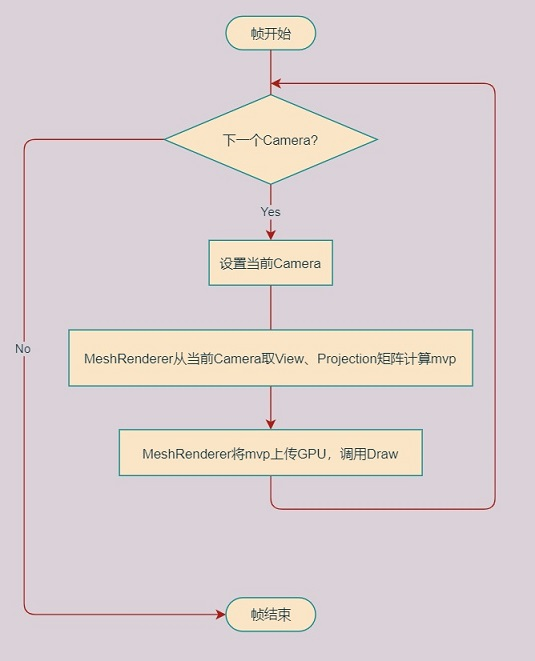

## 10.2 多相机渲染

```bash
CLion项目文件位于 samples\camera\two_camera
```

相机的作用就是提供View、Projection这两个矩阵，MeshRenderer拿到这两个矩阵和模型世界坐标相乘得到mvp，传入GPU。

多相机渲染，就是要遍历多个相机，用当前 index 相机的View、Projection矩阵，提供给MeshRenderer拿去做计算。

```bash
我们日常说 相机渲染，是仿照现实照相机的说法，其实引擎中的Camera只是提供矩阵，实际通知GPU渲染是在MeshRenderer中。
```

多相机渲染流程图如下：



### 1.管理多Camera

用`std::vector`容器存储多个Camera，当Camera构造时存入容器，当Camera析构时从容器移除。

并添加遍历接口，设置当前Camera。

```c++
///file:source/renderer/camera.h line:50

public:
    /// 遍历所有Camera
    /// \param func
    static void Foreach(std::function<void()> func);

    /// 遍历all_camera_时，轮到的那个Camera。
    /// \return
    static Camera* current_camera(){return current_camera_;}

private:
    static std::vector<Camera*> all_camera_;//每一帧遍历所有Camera，设置current_camera_
    static Camera* current_camera_;
```

```c++
///file:source/renderer/camera.cpp line:51

void Camera::Foreach(std::function<void()> func) {
    for (auto iter=all_camera_.begin();iter!=all_camera_.end();iter++){
        current_camera_=*iter;
        current_camera_->Clear();
        func();
    }
}
```

### 2.遍历Camera

上一节实例中，从Camera获取到View、Projection矩阵后，调用MeshRenderer接口设置矩阵。

```c++
///file:samples/camera/perspective_camera/source/main.cpp line:105

mesh_renderer->SetView(camera->view_mat4());
mesh_renderer->SetProjection(camera->projection_mat4());
mesh_renderer->Render();
```

现在有了static接口`Camera::current_camera()` 获取当前相机，就可以直接在 MeshRenderer内部获取矩阵数据。

修改 `main.cpp` 中代码如下，遍历所有相机：

```c++
///file:source/main.cpp line:119

//遍历所有相机，每个相机的View Projection，都用来做一次渲染。
Camera::Foreach([&](){
    mesh_renderer->Render();
});
```

修改 `mesh_renderer.cpp` ，在 `render()` 开始时，从当前相机获取矩阵。

```c++
///file:source/renderer/mesh_renderer.cpp line:43

//从当前Camera获取View Projection
auto current_camera=Camera::current_camera();
if (current_camera== nullptr){
    return;
}
glm::mat4 view=current_camera->view_mat4();
glm::mat4 projection=current_camera->projection_mat4();
```

### 3.实例

再创建一个Camera，测试2个Camera的渲染效果。
复制第一个Camera的代码，修改坐标x和指向x，和第一个Camera有一点偏移，不然MeshRenderer 2次渲染在相同位置就重叠了。

```c++
///file:source/main.cpp line:85

//创建相机2 GameObject
auto go_camera_2=new GameObject("main_camera");
//挂上 Transform 组件
auto transform_camera_2=dynamic_cast<Transform*>(go_camera_2->AddComponent("Transform"));
transform_camera_2->set_position(glm::vec3(5, 0, 10));
//挂上 Camera 组件
auto camera_2=dynamic_cast<Camera*>(go_camera_2->AddComponent("Camera"));
//第二个相机不能清除之前的颜色。不然用第一个相机矩阵渲染的物体就被清除 没了。
camera_2->set_clear_flag(GL_DEPTH_BUFFER_BIT);
```

<font color=red>注意：遍历Camera的时候，会调用Clear()清屏，默认clear_flag_ 清除颜色数据和深度数据。

第二个Camera如果不修改 clear_flag_，那就会清除第一个Camera时所渲染的画面。

所以第二个Camera仅需清除深度数据，或者什么都不清除。</font>

运行测试如图：


中间的是原来的相机，左边的图是新相机矩阵渲染出来的，因为是透视相机，能看出来边缘有点拉伸。
