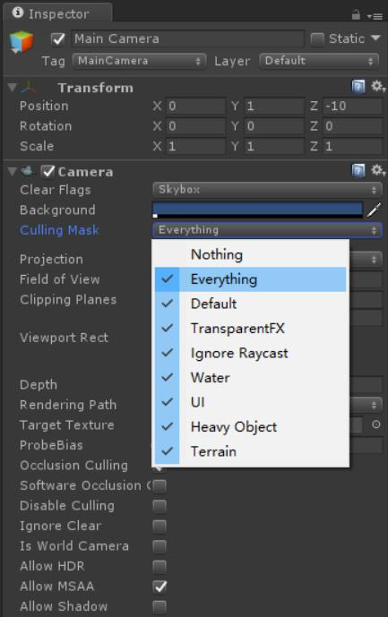
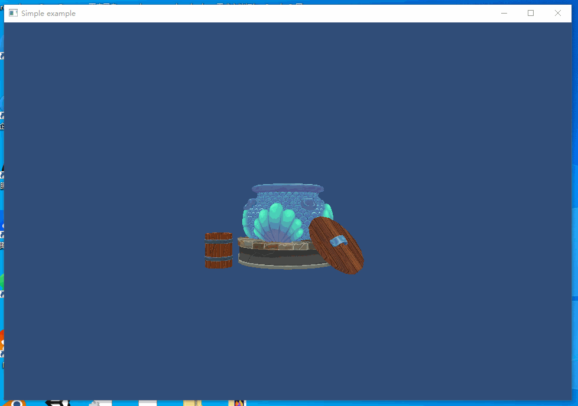

## 10.4 CullingMask

```bash
CLion项目文件位于 samples\camera\cullingmask
```

在前两小节实例中，对同一个物体，使用了2个相机的View、Projection矩阵，在MeshRenderer中渲染了2次。

然而实际项目中，一个物体一般只渲染一次，游戏中有场景相机和UI相机，场景物体只使用场景相机矩阵进行渲染，UI只使用UI相机矩阵进行渲染。

我们需要一个标志，标记Camera矩阵可用于哪些物体渲染。

Unity Camera的 CullingMask 就是这个标志。



### 1. CullingMask渲染分层

Unity GameObject可以指定Layer，如果某个相机可以用于这个GameObject渲染，就在相机的CullingMask里勾上对应的Layer。

为了实现这个功能，需要做以下修改：

1. GameObject 新增 layer 成员变量。
2. Camera 增加 culling_mask 成员变量。
3. MeshRenderer 渲染之前判断 Camera.culling_mask 是否包含 GameObject.layer。

下面一一来看。

<b>1.1 GameObject 新增 layer 成员变量</b>

因为Layer 数量有限，所以用 `unsigned char` 1个字节存储即可。

```c++
///file:source/component/game_object.h line:46

unsigned char layer_;//将物体分不同的层，用于相机分层、物理碰撞分层等。
```

`layer_` 默认值为0x01 。

<b>1.2 Camera 增加 culling_mask 成员变量</b>

```c++
///file:source/renderer/camera.h line:77

unsigned char culling_mask_;//控制渲染哪些Layer的物体
```

`culling_mask_` 默认值为0x01 。

<b>1.3 MeshRenderer 判断是否渲染</b>

```c++
///file:source/renderer/mesh_renderer.cpp line:46

//判断相机的 culling_mask 是否包含当前物体 layer
if ((current_camera->culling_mask() & game_object()->layer()) == 0x00){
    return;
}
```

使用`与运算`，判断 Camera.culling_mask 是否包含 GameObject.layer。

### 2. 实例测试

在`main.cpp`，现有2个Camera、1个MeshRenderer。默认状态下Camera.culling_mask 和 GameObject.layer 是相同的，即默认创建的物体都会被渲染。

现在进行修改，设置第二个相机的 Layer，开进行测试。

```c++
///file:source/main.cpp line:91

camera_2->set_culling_mask(0x02);
```

这样进行设置后，`camera_2` 的 culling_mask(0x02)就不包含 现有的MeshRenderer Layer(0x01),现在只有`camera_1`生效，结果如下：

