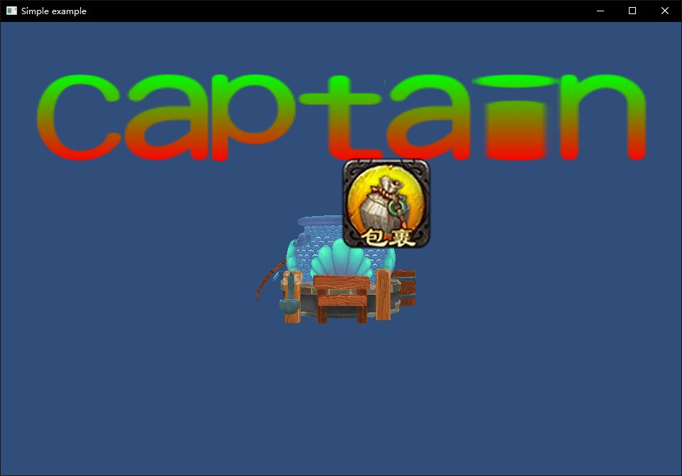

## 14.2 UIImage

上一节创建的图片，将其封装一下，就是`UIImage`的简单实现。

创建代码文件`source/ui/ui_image.cpp`存放`UIImage`实现。

核心代码如下：

```c++
//file:source/ui/ui_image.cpp line:30

void UIImage::Update() {
    Component::Update();
    if(texture2D_== nullptr){
        return;
    }
    MeshFilter* mesh_filter=dynamic_cast<MeshFilter*>(game_object()->GetComponent("MeshFilter"));
    if(mesh_filter== nullptr){
        //创建 MeshFilter
        std::vector<MeshFilter::Vertex> vertex_vector={
                { {0.f, 0.0f, 0.0f}, {1.0f,1.0f,1.0f,1.0f},   {0.f, 0.f} },
                { {texture2D_->width(), 0.0f, 0.0f}, {1.0f,1.0f,1.0f,1.0f},   {1.f, 0.f} },
                { {texture2D_->width(),  texture2D_->height(), 0.0f}, {1.0f,1.0f,1.0f,1.0f},   {1.f, 1.f} },
                { {0.f,  texture2D_->height(), 0.0f}, {1.0f,1.0f,1.0f,1.0f},   {0.f, 1.f} }
        };
        std::vector<unsigned short> index_vector={
                0,1,2,
                0,2,3
        };
        mesh_filter=dynamic_cast<MeshFilter*>(game_object()->AddComponent("MeshFilter"));
        mesh_filter->CreateMesh(vertex_vector,index_vector);

        //创建 Material
        auto material=new Material();//设置材质
        material->Parse("material/ui_image.mat");
        material->SetTexture("u_diffuse_texture", texture2D_);

        //挂上 MeshRenderer 组件
        auto mesh_renderer=dynamic_cast<MeshRenderer*>(game_object()->AddComponent("MeshRenderer"));
        mesh_renderer->SetMaterial(material);
    }
}
```

逻辑很简单，就是构建顶点数据给`MeshFilter`，解析材质文件创建`Material`，创建`Texture2D`，然后挂上`MeshRenderer`开始渲染。

唯一需要注意的就是：构造顶点数据时，坐标需要按照图片实际尺寸。

测试结果如下图。


