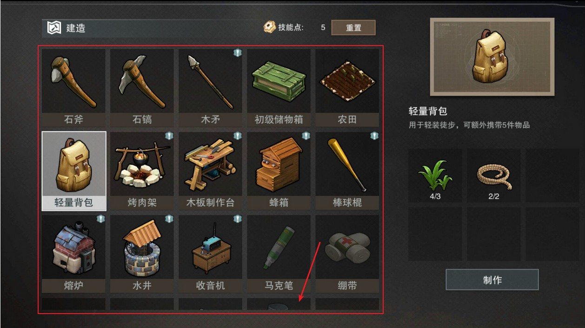
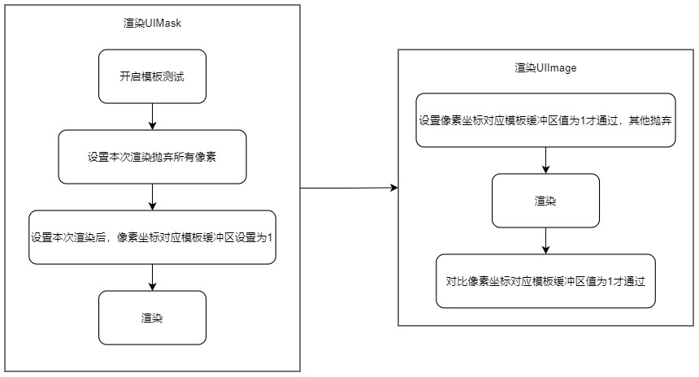
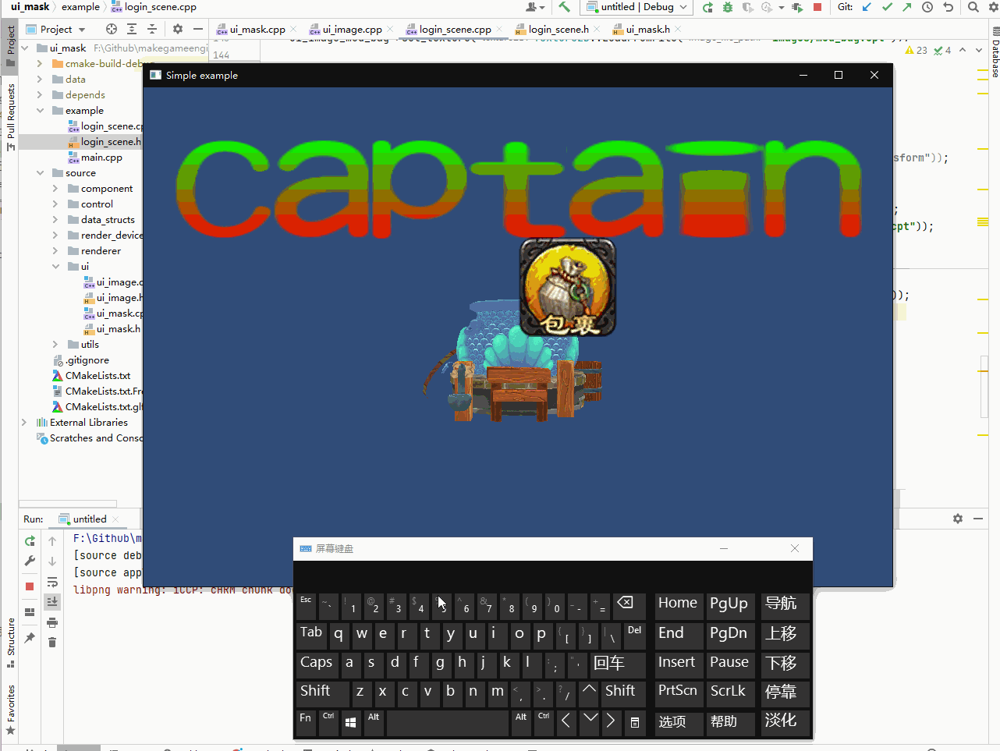

## 14.3 UIMask

```bash
CLion项目文件位于 samples\gui\ui_mask
```

在我指定的范围内显示(不显示)，这就是`UIMask`。

`UIMask`用的最多的地方就是`ScrollView`，背包就是一个`ScrollView`。



上图背包，最下面一排道具显示了一点，剩下的被裁掉了没显示。

这是因为有一个红框范围的`UIMask`。

### 1. UIMask原理

`OpenGL`里有很多测试，`DepthTest`、`AlphaTest`、`StencilTest`，`UIMask`就依赖于`StencilTest`，即模板测试。

GPU中有一个二维数组缓冲区，尺寸等于屏幕尺寸，每个像素对应数组的一个值。

`UIMask`渲染前开启模板测试，并设置为值为1，那么在片段Shader之后，UIMask图片每个像素对应的数组中的值都设置为了1。
`UIImage`渲染前设置像素对应模板值为1的才通过，那么在片段Shader之后，与像素对应模板值对比，为1的通过，也就是`UIMask`图片范围内的才会通过。

这样`UIMask`就限定了`UIImage`的显示范围。

流程如下：



### 2. UIMask实现

`UIMask`也是渲染一张图片，因为要用图片来限定范围，所以代码和`UIImage`差不多。

最大的差别在渲染之前要开启模板测试，并进行一些设置。

那么首先创建`UIMask`类，复制`UIImage`的代码就行了。

渲染之前的代码如下：

```c++
//file:source/ui/ui_mask.cpp line:66

/// 渲染之前
void UIMask::OnPreRender() {
    Component::OnPreRender();
    RenderDevice::instance()->Enable(RenderDevice::STENCIL_TEST);//开启模版测试
    glClearStencil(0);__CHECK_GL_ERROR__//设置默认模版值 0
    glStencilFunc(GL_NEVER, 0x0, 0xFF);__CHECK_GL_ERROR__//通通不通过模版测试。
    glStencilOp(GL_INCR, GL_INCR, GL_INCR);__CHECK_GL_ERROR__//像素的模版值 0+1 = 1
}
```

### 3. UIImage修改

对 `UIImage`做修改，渲染前设置像素对应模板值为1的才通过。

```c++
//file:source/ui/ui_image.cpp line:61

/// 渲染之前
void UIImage::OnPreRender() {
    Component::OnPreRender();
    glStencilFunc(GL_EQUAL, 0x1, 0xFF);//等于1 通过测试 ,就是上次绘制的图 的范围 才通过测试。
    glStencilOp(GL_KEEP, GL_KEEP, GL_KEEP);//没有通过测试的，保留原来的，也就是保留上一次的值。
}
```

### 4. 测试

在`LoginScene::CreateUI`原来的`UIImage`之后，再创建`UIMask`，以一张圆形的图片作为范围限定。


将`UIMask`设置为`UIImage`子物体。

之所以设置为子物体，是因为要让`UIMask`先于`UIImage`渲染，而`GameObject`是以树结构存储，后序遍历。

```c++
//file:example/login_scene.cpp line:120

/// 创建UI
void LoginScene::CreateUI() {
    ......

    //创建 GameObject
    auto go_ui_image=new GameObject("image_mod_bag");
    go_ui_image->set_layer(0x02);
    //挂上 Transform 组件
    go_ui_image->AddComponent("Transform");
    //挂上 UIImage 组件
    auto ui_image_mod_bag=dynamic_cast<UIImage*>(go_ui_image->AddComponent("UIImage"));
    ui_image_mod_bag->set_texture(Texture2D::LoadFromFile("images/mod_bag.cpt"));

    //创建 GameObject
    auto go_ui_mask=new GameObject("mask_mod_bag");
    go_ui_mask->set_layer(0x02);
    go_ui_mask->SetParent(go_ui_image);
    //挂上 Transform 组件
    auto transform_ui_mask=dynamic_cast<Transform*>(go_ui_mask->AddComponent("Transform"));
//    transform_ui_mask->set_position(glm::vec3(-50.f,0.f,0.f));
    //挂上 UIMask 组件
    auto ui_mask_mod_bag=dynamic_cast<UIMask*>(go_ui_mask->AddComponent("UIMask"));
    ui_mask_mod_bag->set_texture(Texture2D::LoadFromFile("images/mod_bag_mask.cpt"));
}
```

在`LoginScene::Update()`中，判断按键`A`，来启用/禁用`UIMask`。

```c++
//file:example/login_scene.cpp line:161

void LoginScene::Update() {
    ......

    if(Input::GetKeyUp(KEY_CODE_A)){
        auto go_ui_mask = GameObject::Find("mask_mod_bag");
        go_ui_mask->set_active(!go_ui_mask->active());
    }

    ......
}
```

实际效果如下图。

