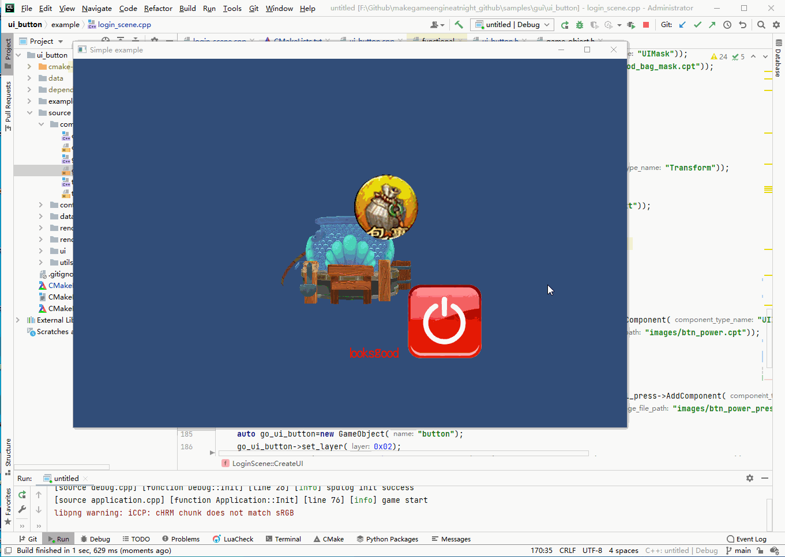

### 14.5 UIButton

```bash
CLion项目文件位于 samples\gui\ui_button
```

按钮，简单实现就是一张可以点击的图片，即`UIImage`+`Input`。

### 1. UIButton实现

做了一个简单的实现。

```c++
//file:source/ui/ui_button.h line:13

class UIButton : public Component {
public:
    UIButton();
    ~UIButton();

    void set_image_normal(UIImage* image){image_normal_=image;}
public:
    void Update() override;
    /// 渲染之前
    void OnPreRender() override;

    void OnPostRender() override;

private:
    UIImage* image_normal_;//普通状态显示图片
};
```

设计将`UIImage`作为子节点，所以这里保存为成员变量，在`Update`里同步为父节点坐标。

```c++
//file:source/ui/ui_button.cpp line:31

void UIButton::Update() {
    Component::Update();

    if(image_normal_== nullptr){
        return;
    }

    Transform* transform_image_normal=dynamic_cast<Transform*>(image_normal_->game_object()->GetComponent("Transform"));
    Transform* transform=dynamic_cast<Transform*>(game_object()->GetComponent("Transform"));
    transform_image_normal->set_position(transform->position());

    if(Input::GetMouseButtonDown(MOUSE_BUTTON_LEFT)){
        auto transform_position=transform->position();
        auto mouse_position=Input::mousePosition();
        mouse_position.x=mouse_position.x-Screen::width()/2;
        mouse_position.y=Screen::height()/2-mouse_position.y;
        float image_normal_width=image_normal_->texture2D()->width();
        float image_normal_height=image_normal_->texture2D()->height();
        if((mouse_position.x>transform_position.x && mouse_position.x<transform_position.x+image_normal_width)&&
            (mouse_position.y>transform_position.y && mouse_position.y<transform_position.y+image_normal_height)){
            //隐藏
            DEBUG_LOG_INFO("click button:{}",glm::to_string(mouse_position));
        }
    }
}
```

在`Update()`里，通过`Input::mousePosition()`获取鼠标坐标，然后判断鼠标左键按下。

如果在按钮图片范围内，就触发了按钮按下的事件：输出Log。

需要提一下的是，`Input::mousePosition()`获取鼠标坐标是以屏幕左上角为零点的，而按钮、图片都是以屏幕中心为零点的，需要做转换。

### 2. 测试

在`LoginScene::CreateUI()`中，创建`UIButton`。

```c++
//file:example/login_scene.cpp line:172

void LoginScene::CreateUI() {
    ......

    //创建 GameObject
    auto go_button_image_normal=new GameObject("btn_power");
    go_button_image_normal->set_layer(0x02);
    go_button_image_normal->AddComponent("Transform");
    auto ui_image_button_image_normal=dynamic_cast<UIImage*>(go_button_image_normal->AddComponent("UIImage"));
    ui_image_button_image_normal->set_texture(Texture2D::LoadFromFile("images/btn_power.cpt"));

    //创建 GameObject
    auto go_ui_button=new GameObject("button");
    go_ui_button->set_layer(0x02);
    //挂上 Transform 组件
    auto transform_ui_button =dynamic_cast<Transform*>(go_ui_button->AddComponent("Transform"));
    transform_ui_button->set_position({100.f,-200.f,0});
    //挂上 UIButton 组件
    auto ui_button=dynamic_cast<UIButton*>(go_ui_button->AddComponent("UIButton"));
    ui_button->set_image_normal(ui_image_button_image_normal);
}
```

测试结果如下：

