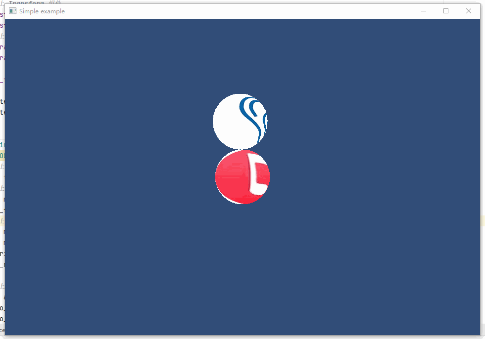

## 14.2 播放3D音效

    CLion项目文件位于 samples\audio\audio_source_3d

3D游戏中既包括2D音效，也有大量3D音效。

背景音乐、UI音效等不论处于哪个方位声音都不会变化的就使用2D音效，而类似枪声、环境音等，需要听声辨位的，就需要做3D处理。

实现3D音效需要2个组件：音源、听者。

下面来实现这2个组件，然后将它们组合，编写实例测试。

###1. 音源

音源需要2个东西：声音数据(AudioClip)、声音控制器(AudioSource)

#####1.1 声音数据(AudioClip)

fmod提供了`FMOD_SOUND`来管理声音数据，我这里创建`AudioClip`对其进行封装。
实现接口`AudioClip::LoadFromFile`加载声音文件，创建`FMOD_SOUND`实例交由`AudioClip`托管，最终返回`AudioClip`实例。

```c++
///file:source/audio/audio_clip.cpp line:18

/// 加载音效文件，创建AudioClip实例。
/// \param audio_file_path
/// \return
AudioClip * AudioClip::LoadFromFile(std::string audio_file_path) {
    FMOD_SOUND* fmod_sound;
    FMOD_RESULT result = Audio::CreateSound((Application::data_path() + audio_file_path).c_str(), FMOD_DEFAULT,
                                nullptr, &fmod_sound);
    if(result!=FMOD_OK){
        spdlog::error("");
        return nullptr;
    }

    AudioClip* audio_clip=new AudioClip();
    audio_clip->fmod_sound_=fmod_sound;
    return audio_clip;
}
```

#####1.2 声音控制器(AudioSource)

有了声音数据(AudioClip)后，还需要对其进行控制播放、暂停、设置循环、设置3D等操作，所以创建声音控制器`AudioSource`实现这些接口。

```c++
///file:source/audio/audio_source.cpp line:20
/// 设置为3D/2D音乐
/// \param mode_3d
void AudioSource::Set3DMode(bool mode_3d) {
    if(mode_3d){
        fmod_mode_=fmod_mode_ | FMOD_3D;
    }else{
        if(fmod_mode_&FMOD_3D){
            fmod_mode_=fmod_mode_ ^ FMOD_3D;
        }
    }
    FMOD_RESULT result=FMOD_Channel_SetMode(fmod_channel_,fmod_mode_);
    if(result!=FMOD_OK){
        spdlog::error("AudioSource::Set3DMode FMOD_Channel_SetMode result:{}",result);
    }
}

void AudioSource::Play() {
    if(audio_clip_== nullptr){
        spdlog::error("AudioSource::Play audio_clip_== nullptr");
        return;
    }
    if(audio_clip_->fmod_sound()==nullptr){
        spdlog::error("AudioSource::Play audio_clip_->fmod_sound()==nullptr");
        return;
    }
    FMOD_RESULT result;
    FMOD_BOOL paused=false;
    //判断音效是否暂停
    result = FMOD_Channel_GetPaused(fmod_channel_, &paused);//音效播放完毕后，channel被回收，返回 FMOD_ERR_INVALID_HANDLE
    switch(result){
        case FMOD_OK:
            if(paused){
                result= FMOD_Channel_SetPaused(fmod_channel_, false);
            }
            break;
        case FMOD_ERR_INVALID_PARAM://channel默认是nullptr，非法参数。
        case FMOD_ERR_INVALID_HANDLE://音效播放完毕后，channel被回收。
        case FMOD_ERR_CHANNEL_STOLEN://音效播放完毕后，channel被回收且被分配给其他Sound。
            //播放音效
            result = Audio::PlaySound(audio_clip_->fmod_sound(), nullptr, false, &fmod_channel_);
            break;
    }
}

void AudioSource::Pause() {
    FMOD_RESULT result;
    FMOD_BOOL paused=false;
    //判断音效是否暂停
    result = FMOD_Channel_GetPaused(fmod_channel_, &paused);//音效播放完毕后，channel被回收，返回 FMOD_ERR_INVALID_HANDLE
    if(result==FMOD_OK){
        if(!paused){
            result= FMOD_Channel_SetPaused(fmod_channel_, true);//暂停播放
        }
        return;
    }
    spdlog::error("AudioSource::Paused FMOD_Channel_GetPaused result:{}",result);
}

void AudioSource::Stop() {
    FMOD_RESULT result;
    FMOD_BOOL paused=false;
    result = FMOD_Channel_Stop(fmod_channel_);
    if(result==FMOD_OK){
        return;
    }
    spdlog::error("AudioSource::Stop FMOD_Channel_Stop result:{}",result);
}

bool AudioSource::Paused() {
    FMOD_RESULT result;
    FMOD_BOOL paused=false;
    //判断音效是否暂停
    result = FMOD_Channel_GetPaused(fmod_channel_, &paused);//音效播放完毕后，channel被回收，返回 FMOD_ERR_INVALID_HANDLE
    if(result==FMOD_OK){
        return paused;
    }
    spdlog::error("AudioSource::Paused FMOD_Channel_GetPaused result:{}",result);
    return true;
}

void AudioSource::SetLoop(bool mode_loop) {
    if(mode_loop){
        fmod_mode_=fmod_mode_ | FMOD_LOOP_NORMAL;
    }else{
        if(fmod_mode_&FMOD_LOOP_NORMAL){
            fmod_mode_=fmod_mode_ ^ FMOD_LOOP_NORMAL;
        }
    }

    FMOD_RESULT result=FMOD_Channel_SetMode(fmod_channel_,fmod_mode_);
    if(result!=FMOD_OK){
        spdlog::error("AudioSource::SetLoop FMOD_Channel_SetMode result:{}",result);
    }
}

void AudioSource::Update() {
    Component::Update();

    if(fmod_mode_ ^ FMOD_3D){
        auto component_transform=game_object()->GetComponent("Transform");
        auto transform=dynamic_cast<Transform*>(component_transform);
        if(!transform){
            return;
        }
        auto pos=transform->position();
        FMOD_VECTOR audio_source_pos = {  pos.x, pos.y, pos.z };
        FMOD_VECTOR vel = {  0.0f, 0.0f, 0.0f };
        FMOD_Channel_Set3DAttributes(fmod_channel_, &audio_source_pos,  &vel);
    }
}
```

当然还有设置3D属性，fmod提供接口`FMOD_Channel_Set3DAttributes`来设置`FMOD_CHANNEL`为3D/2D，在`Update()`里传入`Transform`记录的坐标，这样音源就有了3D位置属性。

###2. 听者

fmod提供接口 `FMOD_System_Set3DListenerAttributes` 设置听者的3D坐标，我将其封装在`Audio::Set3DListenerAttributes`。

创建听者组件`AudioListener`，在`Update()`里不断向fmod 提交新的坐标。

```c++
///file:source/audio/audio_listener.cpp line:25

void AudioListener::Update() {
    Component::Update();
    auto component_transform=game_object()->GetComponent("Transform");
    auto transform=dynamic_cast<Transform*>(component_transform);
    if(!transform){
        return;
    }
    auto pos=transform->position();

    FMOD_VECTOR vel = {  0.0f, 0.0f, 0.0f };
    FMOD_VECTOR audio_listener_pos = {  pos.x, pos.y, pos.z };
    FMOD_VECTOR forward = {  0.0f, 0.0f, 1.0f };
    FMOD_VECTOR up = {  0.0f, 1.0f, 0.0f };
    Audio::Set3DListenerAttributes(listener_id_,&audio_listener_pos,&vel,&forward,&up);
}
```

###3. 实例测试3D音效

在example实例的 `LoginScene` 创建2个球，分别挂上`AudioSource`、`AudioListener`组件，让听者绕着音源旋转，代码如下：

```c++
///file:example/login_scene.cpp line:52

/// 创建音源
void LoginScene::CreateAudioSource() {
    GameObject* go=new GameObject("audio_source_bgm");
    //挂上 Transform 组件
    auto transform =dynamic_cast<Transform*>(go->AddComponent("Transform"));
    //挂上 MeshFilter 组件
    auto mesh_filter=dynamic_cast<MeshFilter*>(go->AddComponent("MeshFilter"));
    mesh_filter->LoadMesh("model/sphere.mesh");
    //挂上 MeshRenderer 组件
    auto mesh_renderer=dynamic_cast<MeshRenderer*>(go->AddComponent("MeshRenderer"));
    auto material =new Material();//设置材质
    material->Parse("material/sphere_audio_source_3d_music.mat");
    mesh_renderer->SetMaterial(material);

    //挂上AudioSource
    auto audio_source=dynamic_cast<AudioSource*>(go->AddComponent("AudioSource"));
    audio_source->set_audio_clip(AudioClip::LoadFromFile("audio/war_bgm.wav"));
    audio_source->Play();
    audio_source->Set3DMode(true);
    audio_source->SetLoop(true);
}
/// 创建听者
void LoginScene::CreateAudioListener() {
    GameObject* go=new GameObject("Player");
    transform_player_ =dynamic_cast<Transform*>(go->AddComponent("Transform"));
    transform_player_->set_position({2.0f,0.0,0.0});
    auto mesh_filter=dynamic_cast<MeshFilter*>(go->AddComponent("MeshFilter"));
    mesh_filter->LoadMesh("model/sphere.mesh");
    auto mesh_renderer=dynamic_cast<MeshRenderer*>(go->AddComponent("MeshRenderer"));
    auto material =new Material();//设置材质
    material->Parse("material/sphere_audio_source_3d_listener.mat");
    mesh_renderer->SetMaterial(material);

    //挂上AudioListener
    go->AddComponent("AudioListener");
}


void LoginScene::Update() {
    ......

    //控制Player移动
    glm::mat4 rotate_mat4=glm::rotate(glm::mat4(1.0f),glm::radians(Time::delta_time()*60),glm::vec3(0.0f,0.0f,1.0f));
    glm::vec4 old_pos=glm::vec4(transform_player_->position(),1.0f);
    glm::vec4 new_pos=rotate_mat4*old_pos;//旋转矩阵 * 原来的坐标 = 以零点做旋转。
    transform_player_->set_position(glm::vec3(new_pos));
}
```

运行画面：



运行实例 带上耳机听一下效果吧！