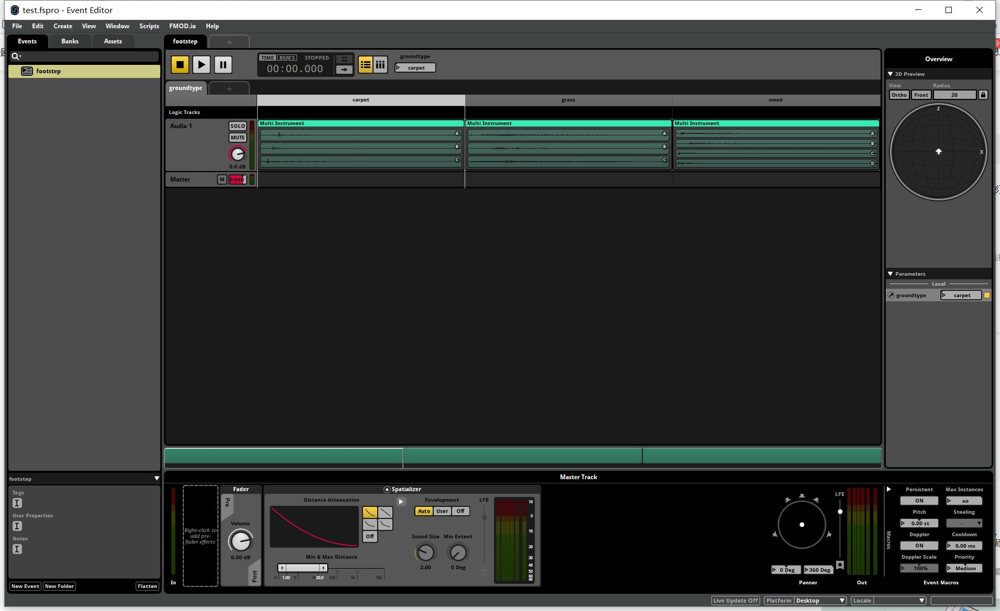
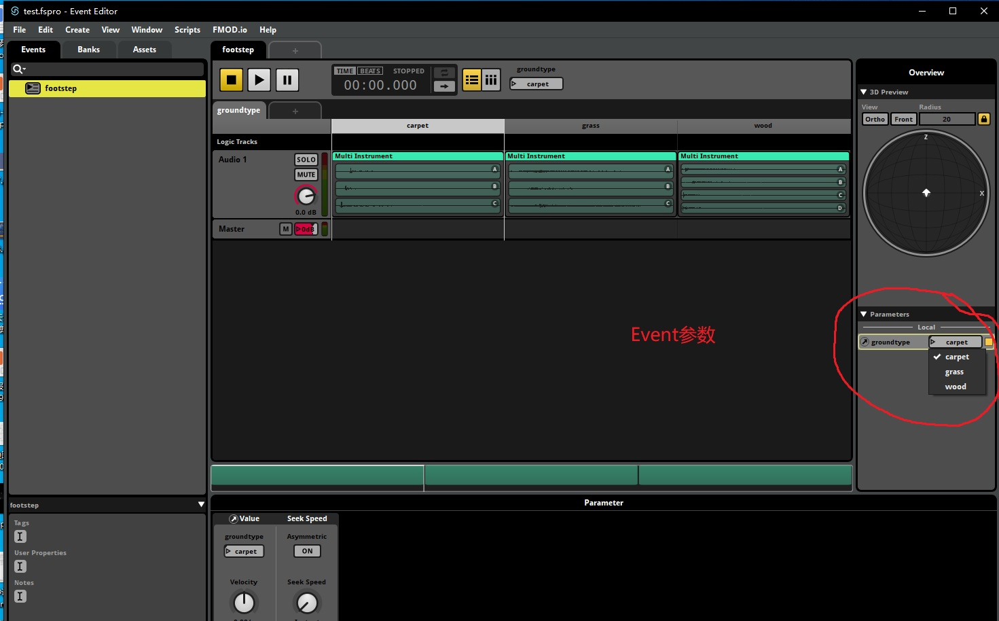
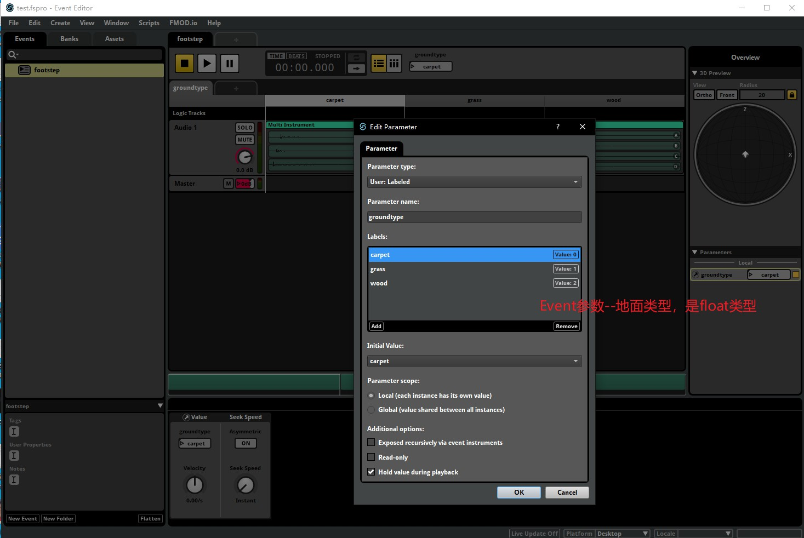

## 14.3 使用FMOD Studio音频引擎

```bash
CLion项目文件位于 samples/audio/load_bank
```

前面两小节介绍了如何使用FMOD提供的库，来解析播放音频文件，并实现了类似Unity中的AudioSource组件。

但是这仅仅是FMOD Studio提供的基础功能，作为一款商用音频引擎，FMOD提供了音频解析、编辑、打包整个流程。

更为主要的是，FMOD通过Event的形式，将音频的效果配置工作完全交给了策划，程序只需要播放Event即可。

隔离不同工种之间的联系，将音频工作流水线化，这是大型项目所必备的。

FMOD Studio分为两部分：音频编辑器和解析库。

我这里通过一个小项目，根据地面类型，切换不同的脚步声，来分别介绍这两部分。

### 1. 使用FMOD Studio编辑音频

在FMOD Studio中，可以创建项目、加载音效文件、创建Event、设置切换音频条件参数、设置混音效果。



上图是打开项目的主界面图。

本小节用到的FMOD Studio项目制作以及打包bank全过程，已经录制了视频在B站：

```bash
https://www.bilibili.com/video/BV1yv411K7kU
```

项目文件存放在：

```bash
files\audio\load_bank\test\test.fspro
```


### 2. 编写API 加载bank并播放

<font color=red>注意：使用FMOD Studio打包bank并播放的形式，和前2节直接播放wav文件不提供兼容，只能选一种使用。

在`CMakeList.txt`中添加了预处理器`USE_FMOD_STUDIO`，用来标记是否使用FMOD Studio打包bank并播放。</font>

```c++
///file:samples/audio/load_bank/CMakeLists.txt line:5

add_definitions(-D USE_FMOD_STUDIO)#是否使用fmod studio，加载bank文件的形式。
```

为此创建新的结构 `AudioStudio` 来封装FMOD Studio的相关接口。

对FMOD Studio加载bank并播放，按照下图流程走：


#### 2.1 初始化FMOD Studio

首先调用API `FMOD_Studio_System_Create` 创建 `FMOD_STUDIO_SYSTEM`。
然后调用API `FMOD_Studio_System_Initialize` 进行初始化。

```c++
///file:source/audio/studio/audio_studio.cpp line:11

/// 初始化FMOD Studio
FMOD_RESULT AudioStudio::Init() {
    FMOD_RESULT result=FMOD_Studio_System_Create(&system_, FMOD_VERSION);
    if(result!=FMOD_OK){
        return result;
    }
    result=FMOD_Studio_System_Initialize(system_, 1024, FMOD_STUDIO_INIT_NORMAL, FMOD_INIT_NORMAL, nullptr);
    if(result!=FMOD_OK){
        return result;
    }
    return FMOD_OK;
}
```

#### 2.2 加载bank

调用`FMOD_Studio_System_LoadBankFile`就可以加载bank文件了。

```c++
///file:source/audio/studio/audio_studio.cpp line:30

/// 加载 bank 文件
/// \param file_name
/// \return
FMOD_RESULT AudioStudio::LoadBankFile(string file_name) {
    string bank_path=Application::data_path()+file_name;
    FMOD_STUDIO_BANK* bank= nullptr;
    return FMOD_Studio_System_LoadBankFile(system_, bank_path.c_str(), FMOD_STUDIO_LOAD_BANK_NORMAL, &bank);
}
```

#### 2.3 创建Event实例

Event就是一个音效，只不过这个音效包含：一个或多个音频文件、混音、参数等信息。

创建Event实例后，就可以对其进行播放暂停，以及更高级的调整参数操作。

这里创建新的结构 `AudioStudioEvent` 来封装Event实例的相关操作。

```c++
///file:source/audio/studio/audio_studio.cpp line:38

/// 获取Event实例，如果没有就创建。
/// \param event_path
/// \return
AudioStudioEvent* AudioStudio::CreateEventInstance(const char *event_path) {
    FMOD_STUDIO_EVENTDESCRIPTION* event_description= nullptr;
    FMOD_RESULT result= FMOD_Studio_System_GetEvent(system_, event_path, &event_description);
    if(result!=FMOD_OK){
        DEBUG_LOG_ERROR("FMOD_Studio_System_GetEvent result:{},event_path:{}",result,event_path);
        return nullptr;
    }
    FMOD_STUDIO_EVENTINSTANCE* event_instance=nullptr;
    result= FMOD_Studio_EventDescription_CreateInstance(event_description,&event_instance);
    if(result!=FMOD_OK){
        DEBUG_LOG_ERROR("FMOD_Studio_EventDescription_CreateInstance result:{},event_path:{}",result,event_path);
        return nullptr;
    }
    AudioStudioEvent* audio_studio_event=new AudioStudioEvent();
    audio_studio_event->set_event_instance(event_instance);
    return audio_studio_event;
}
```

这里其实分了2步：

1. 调用`FMOD_Studio_System_GetEvent` 通过Event名，获取`FMOD_STUDIO_EVENTDESCRIPTION`Event描述。
2. 调用`FMOD_Studio_EventDescription_CreateInstance`创建Event实例。

然后将Event实例，交给`AudioStudioEvent`。

#### 2.4 播放Event实例

Event实例的播放、暂停、设置参数操作，都在`AudioStudioEvent`中进行。

调用`FMOD_Studio_EventInstance_Start`即可对Event实例进行播放。

```c++
///file:source/audio/studio/audio_studio_event.cpp line:23

/// 播放Event实例
void AudioStudioEvent::Start() {
    if(event_instance_== nullptr){
        DEBUG_LOG_ERROR("event_instance_== nullptr");
        return;
    }
    FMOD_RESULT result=FMOD_Studio_EventInstance_Start(event_instance_);
    if(result!=FMOD_OK){
        DEBUG_LOG_ERROR("FMOD_Studio_EventInstance_Start result:{}",result);
        return;
    }
}
```

如果只是播放音效，那么在这里就已经可以了。

不过这次的项目是，根据地面类型，切换不同的脚步声，在FMOD编辑器中已经添加好了地面类型这个参数，所以要继续对Event实例设置参数。

#### 2.5 设置Event参数

设置Event参数后，FMOD就可以根据参数，对Event进行逻辑修改，例如：切换到其他的音频文件、修改音量、调整播放速度、设置3D坐标等。

本节例子中，根据Event参数切换到不同的脚步声音。





上图是Event参数--groundtype(地面类型)，其实是一个float型。

FMOD提供接口`FMOD_Studio_EventInstance_SetParameterByName`来设置Event参数。

```c++
///file:source/audio/studio/audio_studio_event.cpp line:14

/// 设置Event参数
/// \param name
/// \param value
/// \param ignore_seek_speed
/// \return
FMOD_RESULT AudioStudioEvent::SetParameterByName(const char *name, float value, bool ignore_seek_speed) {
    return FMOD_Studio_EventInstance_SetParameterByName(event_instance_,name,value,ignore_seek_speed);
}
```

#### 2.6 设置Event 3D坐标与听者坐标

因为是3D音效，所以需要对Event设置3D属性，即3D坐标。

```c++
///file:source/audio/studio/audio_studio_event.cpp line:18

/// 设置Event 3D属性
/// \param x
/// \param y
/// \param z
/// \return
FMOD_RESULT AudioStudioEvent::Set3DAttribute(float x,float y,float z){
    FMOD_3D_ATTRIBUTES attributes = { { x,y,z } };
    return FMOD_Studio_EventInstance_Set3DAttributes(event_instance_,&attributes);
}
```

然后还需要设置听者的坐标。

```c++
///file:source/audio/studio/audio_studio.cpp line:56

/// 设置听者属性
/// \param x
/// \param y
/// \param z
void AudioStudio::setListenerAttributes(float x, float y, float z) {
    FMOD_3D_ATTRIBUTES attributes = { { x,y,z } };
    attributes.forward.z = 1.0f;
    attributes.up.y = 1.0f;
    FMOD_Studio_System_SetListenerAttributes(system_,0,&attributes,0);
}
```

### 3. 编写example代码

现在FMOD Studio项目也有了，也封装好了接口到`AudioStudio`、 `AudioStudioEvent`。

按照视频中教程，导出bank文件后，就可以进行测试了。

#### 3.1 加载bank并创建Event实例

去掉上一节代码中的AudioSource组件，现在改为创建Event了。

```c++
///file:example/login_scene.cpp line:48

void LoginScene::CreateAudioSource() {
    ......

    //加载bank
    AudioStudio::LoadBankFile("audio/test.bank");
    AudioStudio::LoadBankFile("audio/test.strings.bank");
    audio_studio_event_=AudioStudio::CreateEventInstance("event:/footstep");
}
```

#### 3.2 播放Event实例

```c++
///file:example/login_scene.cpp line:102

void LoginScene::Update() {
    ......

    //播放Event实例
    if(Input::GetKeyUp(KEY_CODE_S)){
        audio_studio_event_->Start();
    }

    //按键盘1、2、3设置参数值，切换不同的地面类型，播放不同的脚步声
    if(Input::GetKeyUp(KEY_CODE_1)){
        audio_studio_event_->SetParameterByName("groundtype",0.0f);
    }else if(Input::GetKeyUp(KEY_CODE_2)){
        audio_studio_event_->SetParameterByName("groundtype",1.0f);
    }else if(Input::GetKeyUp(KEY_CODE_3)){
        audio_studio_event_->SetParameterByName("groundtype",2.0f);
    }

    ......

    //设置听者位置
    glm::mat4 rotate_mat4=glm::rotate(glm::mat4(1.0f),glm::radians(Time::delta_time()*60),glm::vec3(0.0f,0.0f,1.0f));
    glm::vec4 old_pos=glm::vec4(transform_player_->position(),1.0f);
    glm::vec4 new_pos=rotate_mat4*old_pos;//旋转矩阵 * 原来的坐标 = 以零点做旋转。
    transform_player_->set_position(glm::vec3(new_pos));
    auto player_pos=transform_player_->position();
    AudioStudio::setListenerAttributes(player_pos.x,player_pos.y,player_pos.z);
}
```

### 4. 运行example

按键 `s` 播放Event
按键 `1`切换水泥地面
按键 `2`切换草地
按键 `3`切换木质地板

测试视频：

<iframe 
    width="800" 
    height="450" 
    src="https://player.bilibili.com/player.html?aid=292686527&bvid=BV1xf4y1H7oQ&cid=399330856&page=1" 
    frameborder="0"  
    allowfullscreen> 
</iframe>

