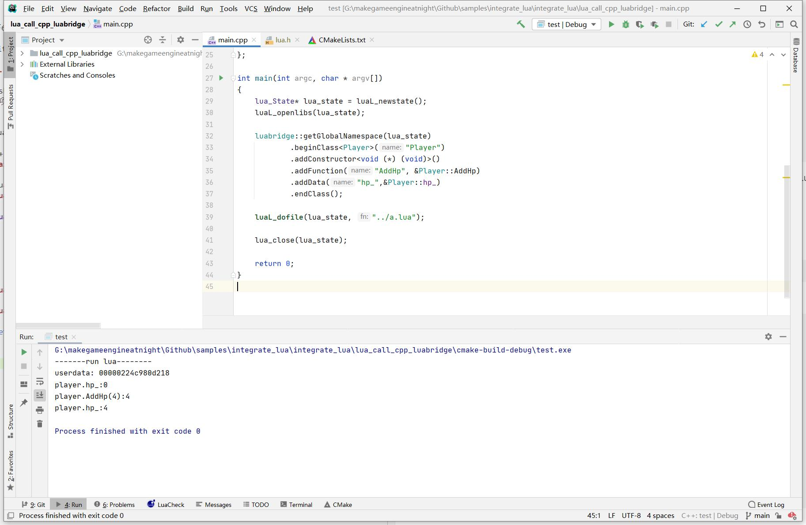

## 17. 嵌入Lua

引擎支持Lua的目的，主要就是为了热更新。

C++与Lua交互，手写代码会很麻烦，下面是C++向Lua注册类的流程。


### 1. 手写代码注册C++到Lua

```bash
CLion项目文件位于 samples\integrate_lua\integrate_lua\lua_call_cpp_wrap
```

下面用一个简单例子，将`Player`注册到lua中，来看看到底多复杂。

```c++
class Player
{
public:
    int AddHp(int add)
    {
        hp_+=add;
        return hp_;
    }

    int hp_=0;
};
```

执行的lua文件如下：

```lua
local player = Player()
print(player)
print("player.hp_:" .. player.hp_)
print("player.AddHp(4):" .. player:AddHp(4))
print("player.hp_:" .. player.hp_)
```

下面编写注册代码。
由于Lua只能与C交互，所以C++的类函数，都要写一个对应的C函数。

```c++
static int CreatePlayer(lua_State* L)
{
    Player** pData = (Player**)lua_newuserdata(L, sizeof(Player*));
    *pData = new Player();
    luaL_getmetatable(L, "Player");
    lua_setmetatable(L, -2);
    return 1;
}

static int DestroyPlayer(lua_State* L)
{
    delete *(Player**)lua_topointer(L, 1);
    return 0;
}

static int CallAddHp(lua_State* L)
{
    Player* pPlayer = *(Player**)lua_topointer(L, 1);
    lua_pushnumber(L, pPlayer->AddHp(lua_tonumber(L, 2)));
    return 1;
}

static int lua_index(lua_State* L)
{
    Player* pPlayer = *(Player**)lua_topointer(L, 1);

    if (strcmp(lua_tostring(L, 2), "hp_") == 0)
    {
        lua_pushnumber(L, pPlayer->hp_);
    }
    else if (strcmp(lua_tostring(L, 2), "AddHp") == 0)
    {
        lua_pushcfunction(L, CallAddHp);
    }
    else
    {
        return 0;
    }
    return 1;
}

int main(int argc, char * argv[])
{
    lua_State *L = luaL_newstate();
    luaopen_base(L);

    lua_pushcfunction(L, CreatePlayer);
    lua_setglobal(L, "Player");

    luaL_newmetatable(L, "Player");

    lua_pushstring(L, "__gc");
    lua_pushcfunction(L, DestroyPlayer);
    lua_settable(L, -3);

    lua_pushstring(L, "__index");
    lua_pushcfunction(L, lua_index);
    lua_settable(L, -3);

    lua_pop(L, 1);

    luaL_dofile(L, "a.lua");

    lua_close(L);

    return 0;
}
```


需要写60行代码,才能注册一个 10 行的类到Lua，实际上这个例子都是我复制的，因为我根本不会用Lua的API。

还好Github上有很多绑定库可以用，这里选择`LuaBridge`。

### 2. 使用LuaBridge注册C++类到Lua

```bash
CLion项目文件位于 samples\integrate_lua\integrate_lua\lua_call_cpp_luabridge
```

引入LuaBridge库之后，只需要6行代码，就可以将Player注册到Lua中。

```c++
int main(int argc, char * argv[])
{
    lua_State* lua_state = luaL_newstate();
    luaL_openlibs(lua_state);

    luabridge::getGlobalNamespace(lua_state)
            .beginClass<Player>("Player")
            .addConstructor<void (*) (void)>()
            .addFunction("AddHp", &Player::AddHp)
            .addData("hp_",&Player::hp_)
            .endClass();

    luaL_dofile(lua_state, "a.lua");

    lua_close(lua_state);

    return 0;
}
```

