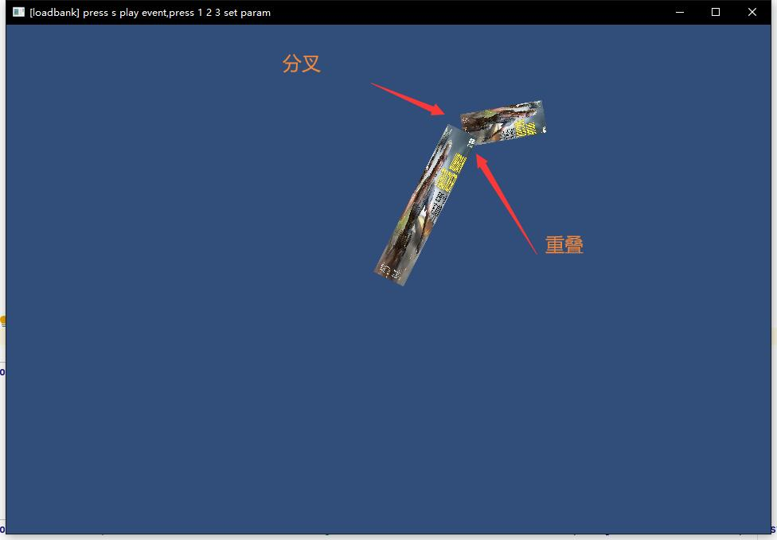
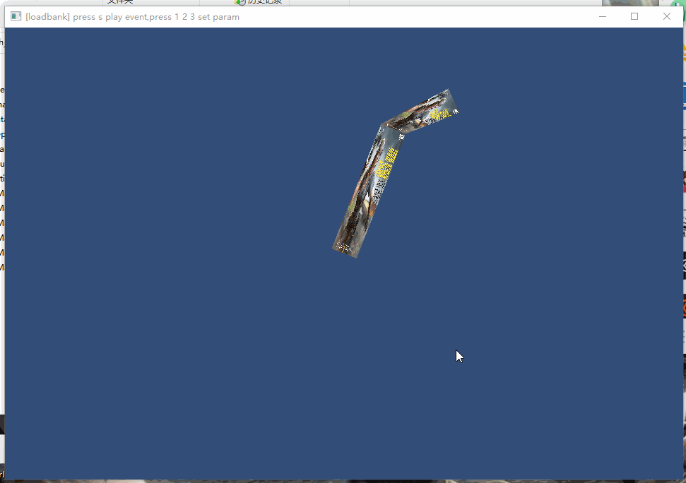
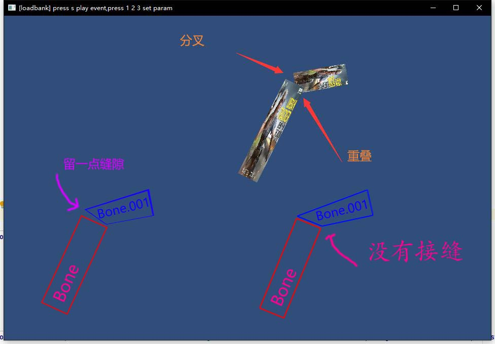

## 19.2 骨骼权重

在上一节手动创建Mesh，为每一个顶点指定了关联的骨骼，解析骨骼动画数据后，成功让顶点跟随骨骼动起来了。

这就实现了传说中的骨骼动画。

不过还是有点小问题，如下图：



骨骼接缝处有分叉和重叠，这在游戏中就被称之为：<font color=red>穿模</font>。

### 1. 完美的效果

那如何做出完美的效果呢，就像下图我画出来的。


没有接缝，其实就是说，Bone.001的底部 2个顶点，和 Bone 的顶部两个顶点重合。

也就是说， Bone.001的底部 2个顶点，是跟随 Bone 在运动，而不是跟随 Bone.001 在运动。

这就很简单了，只要在构造Mesh的时候，设置这两个顶点跟随第一个骨骼 运动就行。

```lua
--file:example/login_scene.lua line:50

local vertex_relate_bone_index_vec=sol2.convert_sequence_uchar({--顶点关联的骨骼序号
    0, 0, 0, 0,
    0, 0, 1, 1    --原来是 1,1,1,1 修改为 0,0,1,1。注意对应顶点索引。
})
```

效果如图：



### 2. 骨骼权重

前面说的，顶点跟随哪个骨骼运动，这说的就是骨骼权重。

Bone.001的底部 2个顶点，跟随 Bone 在运动，说明这两个顶点在 Bone 这根骨骼上的权重是1，在 Bone.001 这根骨骼上的权重是0.

那我现在要留一点缝隙，但是又没有最初那么大的缝隙，要怎么做？



很直接就想到了，Bone.001左下角这个顶点，不能完全跟随 Bone，也不能完全跟随 Bone.001，而是同时受到两者影响。

这个时候就要对多个骨骼分配权重。

按照图中缝隙的大小与最初的分叉大小，大概确定了以下骨骼权重：

```bash
Bone: 0.7
Bone.001: 0.3
```

因为从图来看，还是靠近Bone多一些，所以 Bone 的权重多一些。

### 3. 实现骨骼权重

我们先用 Bone 的矩阵作用于顶点，算出坐标 pos_by_bone。

然后再用 Bone.001 的矩阵作用于顶点，算出坐标 pos_by_bone_0_0_1。

然后分别乘以权重，再相加。

```bash
pos_by_bone * 0.7 + pos_by_bone_0_0_1 * 0.3
```

就这样得到了新的顶点坐标。

下面来写代码吧。


