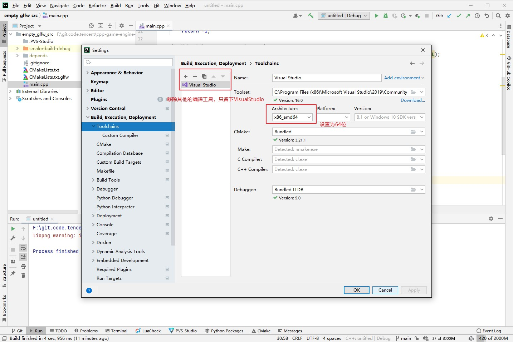
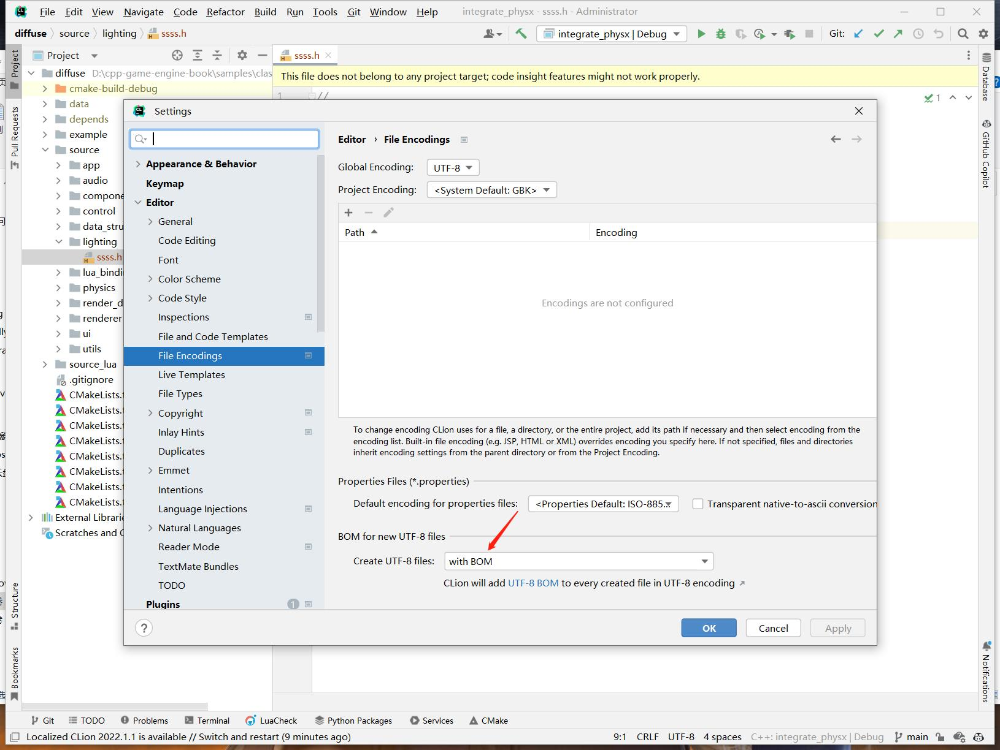
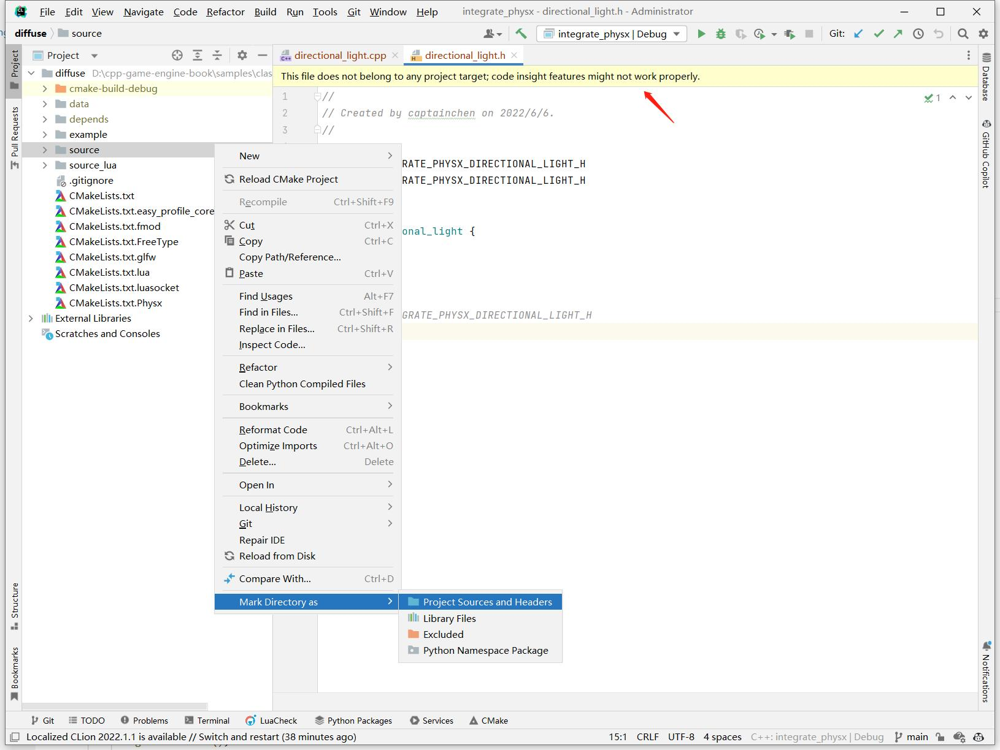
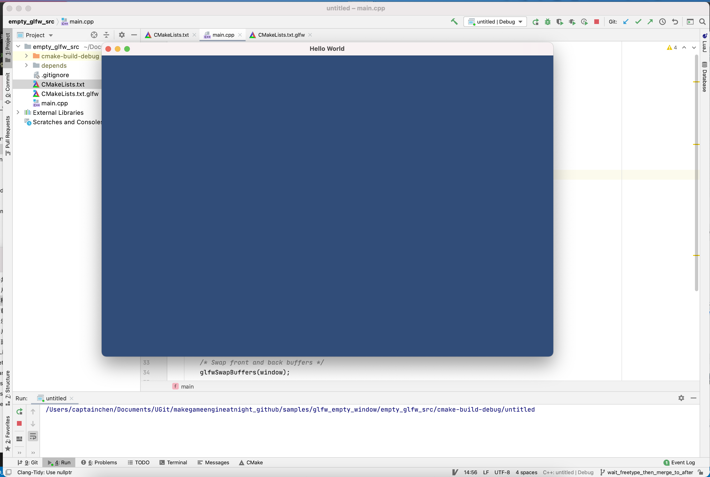
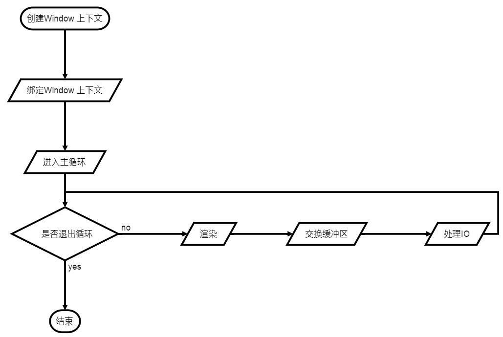

## 2.2 搭建Opengl开发环境

```c
CLion项目文件位于 samples\glfw_empty_window\empty_glfw_src
```

如果要自己一行一行代码去创建opengl环境，比较麻烦，opengl官网推荐了很多开源库，几行代码就可以创建opengl环境。

我这里选择 glfw 。

### 1. 配置开发环境

随书实例都只支持64位，所以如果是Windows系统，务必确保是64位。

随书实例使用CLion开发，编译器是VisualStudio2019/XCode，按照下面的顺序安装对应软件。

1. Windows安装VisualStudio2019，Mac安装Xcode。
2. 安装CLion。下载地址: `https://www.jetbrains.com/clion/`

打开CLion，找到编译器设置，移除多余编译器，只保留VisualStudio，并且设置为64位。



将新文件编码设置为`UTF-8 with Bom` 。



如果遇到下面的警告：

```lua
This file does not belong to any project target;code insight features might not work properly.
```

说明CLion没有识别到代码文件，按下图操作，将代码文件夹标记为源代码文件夹。



### 2.运行CLion项目

用CLion打开文章开头的项目，所有代码都在 `main.cpp` 中。

```c++
//main.cpp
#include <glad/gl.h>
#define GLFW_INCLUDE_NONE
#include <GLFW/glfw3.h>

int main(void)
{
    GLFWwindow* window;

    /* 初始化glfw */
    if (!glfwInit())
        return -1;

    /* 创建一个Window 和 OpenGL上下文 */
    window = glfwCreateWindow(960, 640, "Hello World", NULL, NULL);
    if (!window)
    {
        //创建失败就退出
        glfwTerminate();
        return -1;
    }

    /* 激活上面创建的OpenGL上下文 */
    glfwMakeContextCurrent(window);
    gladLoadGL(glfwGetProcAddress);

    /* 进入游戏引擎主循环 */
    while (!glfwWindowShouldClose(window))
    {
        /* Render here */
        glClear(GL_COLOR_BUFFER_BIT|GL_DEPTH_BUFFER_BIT);
        glClearColor(49.f/255,77.f/255,121.f/255,1.f);

        /* Swap front and back buffers */
        glfwSwapBuffers(window);

        /* 处理鼠标 键盘事件 */
        glfwPollEvents();
    }

    glfwTerminate();
    return 0;
}
```


运行，得到一个空的OpenGL窗口(Unity蓝)。




### 3.这就是OpenGL

上面得到的蓝色窗口，就是OpenGL的 `Hello World！`，在这上面慢慢进行扩展，就进入到更绚丽的游戏世界。

仔细观察代码，理解OpenGL的工作流程。



### 4.参考文档

glfw官方教程

    https://www.glfw.org/documentation.html