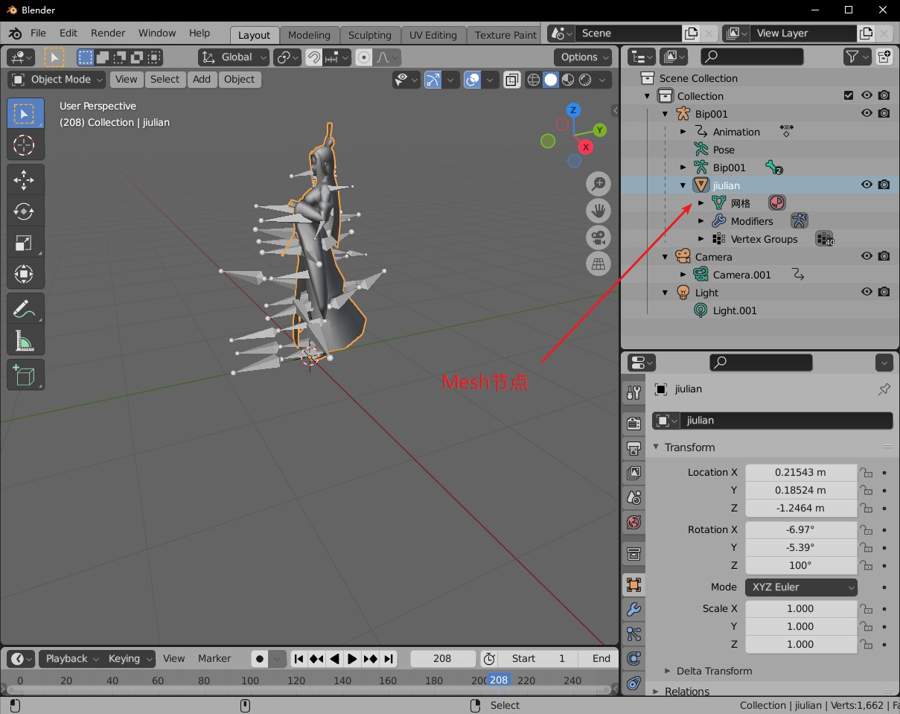
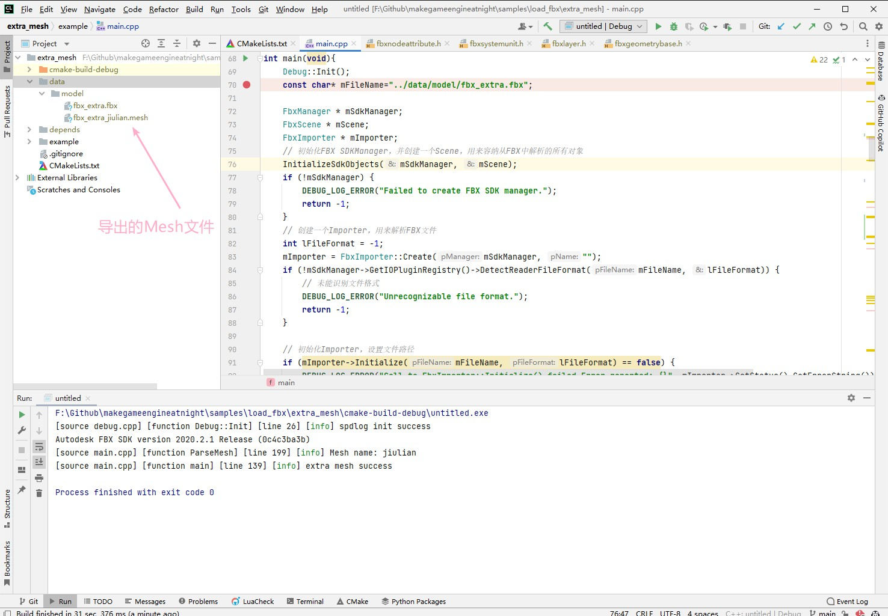
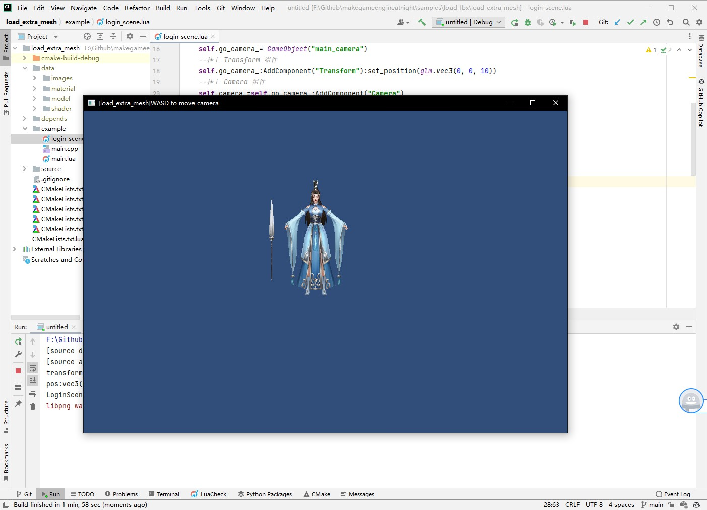

## 20.1 导出Mesh

```bash
CLion项目文件位于 samples\load_fbx\extra_mesh
```

FBX文件中以节点组织数据，节点可以是Camera、Light、Mesh等类型，所以要导出Mesh需要按照如下步骤。

1. 初始化FBX SDK
2. 遍历节点，找到Mesh节点
3. 从Mesh节点读取顶点数据

### 1. 初始化FBX SDK

```c++
//file:example/main.cpp line:72

int main(void){
    Debug::Init();
    const char* mFileName="../data/model/fbx_extra.fbx";

    FbxManager * mSdkManager;
    FbxScene * mScene;
    FbxImporter * mImporter;
    // 初始化FBX SDKManager，并创建一个Scene，用来容纳从FBX中解析的所有对象
    InitializeSdkObjects(mSdkManager, mScene);
    if (!mSdkManager) {
        DEBUG_LOG_ERROR("Failed to create FBX SDK manager.");
        return -1;
    }
    // 创建一个Importer，用来解析FBX文件
    int lFileFormat = -1;
    mImporter = FbxImporter::Create(mSdkManager, "");
    if (!mSdkManager->GetIOPluginRegistry()->DetectReaderFileFormat(mFileName, lFileFormat)) {
        // 未能识别文件格式
        DEBUG_LOG_ERROR("Unrecognizable file format.");
        return -1;
    }

    // 初始化Importer，设置文件路径
    if (mImporter->Initialize(mFileName, lFileFormat) == false) {
        DEBUG_LOG_ERROR("Call to FbxImporter::Initialize() failed.Error reported: {}", mImporter->GetStatus().GetErrorString());
        return -1;
    }

    // 将FBX文件解析导入到Scene中
    bool lResult = mImporter->Import(mScene);
    if (!lResult) {
        DEBUG_LOG_ERROR("Call to FbxImporter::Import() failed.Error reported: {}", mImporter->GetStatus().GetErrorString());
    }

    // 检查Scene完整性
    FbxStatus status;
    FbxArray<FbxString *> details;
    FbxSceneCheckUtility sceneCheck(FbxCast<FbxScene>(mScene), &status, &details);
    bool lNotify = (!sceneCheck.Validate(FbxSceneCheckUtility::eCkeckData) && details.GetCount() > 0) ||
                   (mImporter->GetStatus().GetCode() != FbxStatus::eSuccess);
    //输出错误信息
    if (lNotify) {
        return LogSceneCheckError(mImporter, details);
    }

    // 转换坐标系为右手坐标系。
    FbxAxisSystem SceneAxisSystem = mScene->GetGlobalSettings().GetAxisSystem();
    FbxAxisSystem OurAxisSystem(FbxAxisSystem::eYAxis, FbxAxisSystem::eParityOdd, FbxAxisSystem::eRightHanded);
    if (SceneAxisSystem != OurAxisSystem) {
        OurAxisSystem.ConvertScene(mScene);
    }

    // 转换单元长度
    FbxSystemUnit SceneSystemUnit = mScene->GetGlobalSettings().GetSystemUnit();
    if (SceneSystemUnit.GetScaleFactor() != 1.0) {
        // 例子中用的是厘米，所以这里也要转换
        FbxSystemUnit::cm.ConvertScene(mScene);
    }

    // 转换曲面到三角形
    FbxGeometryConverter lGeomConverter(mSdkManager);
    try {
        lGeomConverter.Triangulate(mScene, /*replace*/true);
    } catch (std::runtime_error) {
        DEBUG_LOG_ERROR("Scene integrity verification failed.\n");
        return -1;
    }

    // 递归解析节点
    ParseNode(mScene->GetRootNode());

    DEBUG_LOG_INFO("extra mesh success");

    return 0;
}
```

### 2. 遍历找到Mesh节点

以项目使用的`../data/model/fbx_extra.fbx`为例，在Blender中导入，看到节点结构如下：



Mesh就是在`jiulian`这个节点上。

在代码中遍历所有节点，然后判断节点属性是`FbxNodeAttribute::eMesh`，就可以从节点上获取Mesh。

```c++
//file:example/main.cpp line:172

/// 递归解析节点
/// @param pNode 节点
void ParseNode(FbxNode * pNode){
    // 获取节点属性
    FbxNodeAttribute* lNodeAttribute = pNode->GetNodeAttribute();
    if (lNodeAttribute){
        // 节点是Mesh
        if (lNodeAttribute->GetAttributeType() == FbxNodeAttribute::eMesh) {
            FbxMesh * lMesh = pNode->GetMesh();
            if (lMesh && !lMesh->GetUserDataPtr()) {
                ParseMesh(lMesh);
            }
        }
    }

    // 递归解析子节点
    const int lChildCount = pNode->GetChildCount();
    for (int lChildIndex = 0; lChildIndex < lChildCount; ++lChildIndex) {
        ParseNode(pNode->GetChild(lChildIndex));
    }
}
```

### 3.从Mesh节点读取顶点数据并导出

仍然使用之前定义的Mesh文件格式，为了方便，封装一下。

```c++
//file:example/main.cpp line:12

namespace Engine{
    //顶点
    struct Vertex{
        glm::vec3 position_;
        glm::vec4 color_;
        glm::vec2 uv_;
    };

    //Mesh文件头
    struct MeshFileHead{
        char type_[4];//文件类型文件头
        char name_[32];//名字
        unsigned short vertex_num_;//顶点个数
        unsigned short vertex_index_num_;//索引个数
    };

    //Mesh文件
    struct MeshFile{
        MeshFileHead head_;
        Vertex *vertex_;
        unsigned short *index_;

        MeshFile(){
            vertex_ = nullptr;
            index_ = nullptr;
        }

        ~MeshFile(){
            if(vertex_ != nullptr){
                delete [] vertex_;
                vertex_ = nullptr;
            }
            if(index_ != nullptr){
                delete [] index_;
                index_ = nullptr;
            }
        }

        // 写入文件
        void Write(const char* filePath){
            std::ofstream file(filePath, std::ios::binary);
            if(file.is_open()){
                file.write(reinterpret_cast<char*>(&head_), sizeof(head_));
                file.write(reinterpret_cast<char*>(vertex_), sizeof(Vertex) * head_.vertex_num_);
                file.write(reinterpret_cast<char*>(index_), sizeof(unsigned short) * head_.vertex_index_num_);
                file.close();
            }
        }
    };
}
```

找到了Mesh节点后，就可以从Mesh节点获取多边形数据。

在初始化的时候已经将多边形转换成了三角形，所以从每个多边形里，可以获取到3个顶点以及对应的索引。

```c++
//file:example/main.cpp line:194

/// 解析Mesh
/// @param pMesh Mesh 对象
void ParseMesh(const FbxMesh* pMesh){
    FbxNode* lNode = pMesh->GetNode();
    if (!lNode){
        DEBUG_LOG_ERROR("Mesh has no node.");
        return;
    }
    DEBUG_LOG_INFO("Mesh name: {}", lNode->GetName());

    // 获取Mesh多边形个数，对游戏来说就是三角形面数。
    const int lPolygonCount = pMesh->GetPolygonCount();
    // 是否有UV数据？
    bool mHasUV = pMesh->GetElementUVCount() > 0;
    bool mAllByControlPoint = true;
    FbxGeometryElement::EMappingMode lUVMappingMode = FbxGeometryElement::eNone;
    if (mHasUV) {
        lUVMappingMode = pMesh->GetElementUV(0)->GetMappingMode();
        if (lUVMappingMode == FbxGeometryElement::eNone) {
            mHasUV = false;
        }
        if (mHasUV && lUVMappingMode != FbxGeometryElement::eByControlPoint) {
            mAllByControlPoint = false;
        }
    }

    // 最终顶点个数到底是多少？
    // 如果只有一套UV，即UV映射方式是按实际顶点个数(FbxGeometryElement::eByControlPoint)，那么就是实际顶点个数。
    // 如果有多套UV，那么一个顶点在不同的多边形里，会对应不同的UV坐标，即UV映射方式是按多边形(eByPolygonVertex)，那么顶点个数是多边形数*3.
    int lPolygonVertexCount = mAllByControlPoint?pMesh->GetControlPointsCount():lPolygonCount * 3;
    // 创建数组存放所有顶点坐标。
    float * lVertices = new float[lPolygonVertexCount * 3];
    // 创建数组存放索引数据，数组长度=面数*3.
    unsigned short * lIndices = new unsigned short[lPolygonCount * 3];
    // 获取多套UV名字
    float * lUVs = NULL;
    FbxStringList lUVNames;
    pMesh->GetUVSetNames(lUVNames);
    const char * lUVName = NULL;
    if (mHasUV && lUVNames.GetCount()) {
        // 创建数组存放UV数据
        lUVs = new float[lPolygonVertexCount * 2];
        // 暂时只使用第一套UV。
        lUVName = lUVNames[0];
    }
    // 实际顶点数据。
    const FbxVector4 * lControlPoints = pMesh->GetControlPoints();

    // 遍历所有三角面，遍历每个面的三个顶点，解析顶点坐标、UV坐标数据。
    int lVertexCount = 0;
    for (int lPolygonIndex = 0; lPolygonIndex < lPolygonCount; ++lPolygonIndex) {
        // 三角面，3个顶点
        for (int lVerticeIndex = 0; lVerticeIndex < 3; ++lVerticeIndex) {
            // 传入面索引，以及当前面的第几个顶点，获取顶点索引。
            const int lControlPointIndex = pMesh->GetPolygonVertex(lPolygonIndex, lVerticeIndex);
            if (lControlPointIndex >= 0) {
                // 因为设定一个顶点有多套UV，所以每个三角面与其他面相邻的共享的顶点，尽管实际上是同一个点(ControlPoint),因为有不同的UV，所以还是算不同的顶点。
                lIndices[lVertexCount] = static_cast<unsigned short>(lVertexCount);
                // 获取当前顶点索引对应的实际顶点。
                FbxVector4 lCurrentVertex = lControlPoints[lControlPointIndex];
                // 将顶点坐标从FbxVector4转为float数组
                lVertices[lVertexCount * 3] = static_cast<float>(lCurrentVertex[0]);
                lVertices[lVertexCount * 3 + 1] = static_cast<float>(lCurrentVertex[1]);
                lVertices[lVertexCount * 3 + 2] = static_cast<float>(lCurrentVertex[2]);

                if (mHasUV) {
                    // 获取当前顶点在指定UV层的UV坐标，前面说过，一个顶点可能有多套UV。
                    bool lUnmappedUV;
                    FbxVector2 lCurrentUV;
                    pMesh->GetPolygonVertexUV(lPolygonIndex, lVerticeIndex, lUVName, lCurrentUV, lUnmappedUV);
                    // 将UV坐标从FbxVector2转为float数组
                    lUVs[lVertexCount * 2] = static_cast<float>(lCurrentUV[0]);
                    lUVs[lVertexCount * 2 + 1] = static_cast<float>(lCurrentUV[1]);
                }
            }
            ++lVertexCount;
        }
    }


    // 创建引擎Mesh文件，从FBX中解析数据填充到里面。
    Engine::MeshFile mesh_file;
    // 构造引擎Mesh结构，设置文件头
    strcpy(mesh_file.head_.type_,"Mesh");
    strcpy(mesh_file.head_.name_,lNode->GetName());
    mesh_file.head_.vertex_num_ = lVertexCount;
    mesh_file.head_.vertex_index_num_ = lVertexCount;
    mesh_file.vertex_ = new Engine::Vertex[mesh_file.head_.vertex_num_];
    mesh_file.index_ = new unsigned short[mesh_file.head_.vertex_index_num_];
    // 填充顶点坐标、color、UV坐标。
    for (int i = 0; i < lVertexCount; ++i) {
        mesh_file.vertex_[i].position_ = glm::vec3(lVertices[i * 3], lVertices[i * 3+1], lVertices[i * 3+2]);
        mesh_file.vertex_[i].color_ = glm::vec4(1.0f);
        mesh_file.vertex_[i].uv_ = glm::vec2(lUVs[i * 2], lUVs[i * 2 + 1]);
    }
    // 填充索引
    mesh_file.index_=lIndices;
    // 写入文件
    mesh_file.Write(fmt::format("../data/model/fbx_extra_{}.mesh", mesh_file.head_.name_).c_str());
}
```

###4.测试

项目里自带了一个FBX，直接运行可以导出顶点数据到Mesh文件，如下图。



加载出来看看。

```bash
CLion项目文件位于 samples\load_fbx\load_extra_mesh
```

