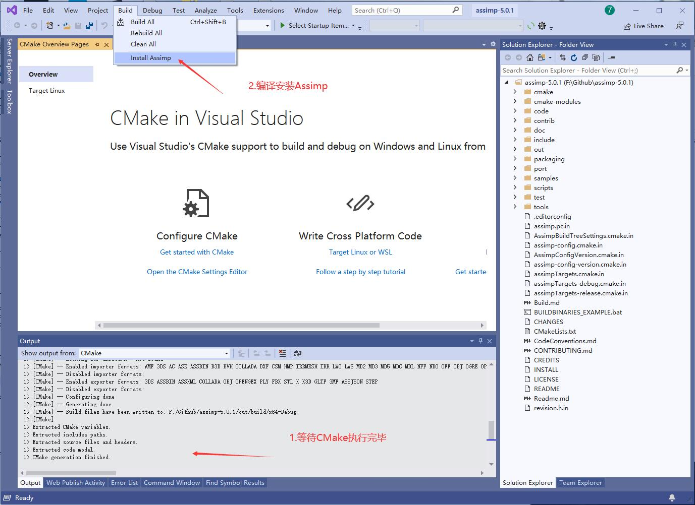
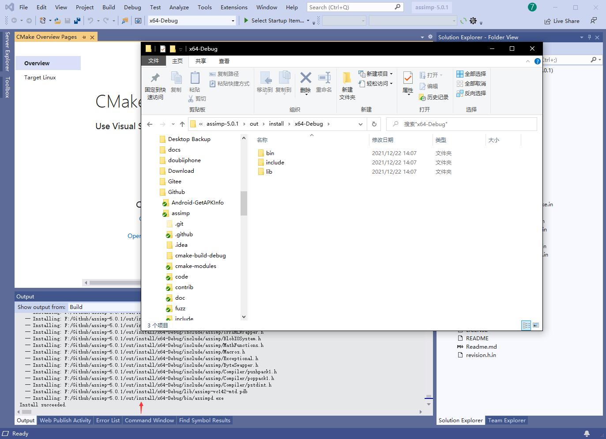

## 20. 解析FBX文件

介绍完了骨骼蒙皮动画之后，是不是感觉自己学了个寂寞？

只介绍从Blender导出数据，但是工作中用Blender很少，网上也很少找到Blender的项目资源。

不过这都不是问题，前面介绍Blender只是为了让你理解骨骼蒙皮动画的原理，实际项目很少从Blender导出模型。

游戏开发一般都是从建模软件导出FBX，导入到引擎中转换成引擎所需的格式。

这一章节介绍使用Assimp将建模软件导出的FBX，转换成引擎所需的格式。

虽然介绍的是FBX，但是其他模型格式也都支持。

### 1. Assimp简介


Assimp是一个模型转换库，支持多达40多种格式互相转换，例如将FBX转OBJ，将OBJ转FBX等等。

我这里用Assimp解析FBX，提取顶点、骨骼动画、权重数据，转换为引擎自定义格式。

官网：`https://www.assimp.org/`

Github:`https://github.com/assimp/assimp`

### 2. Assimp编译

最新的版本编译不通过，而且Assimp也不支持CLion编译，所以下载`v5.0.1`用VS2019编译。

下载地址:`https://github.com/assimp/assimp/releases/tag/v5.0.1`

用VS2019打开文件夹，等待CMake执行完毕后，执行Install。



完毕后，在`assimp-5.0.1\out\install\x64-Debug`找到头文件、lib、dll文件，就可以给项目使用了。



参考资料：

```text
OpenGL ES 学习教程(六) 使用开源库 Assimp 将 Obj 模型 转换成自己的格式
https://blog.csdn.net/huutu/article/details/50154875

OpenGL ES 学习教程(十一) Skin Mesh (骨骼动画)
https://blog.csdn.net/huutu/article/details/50727100
```