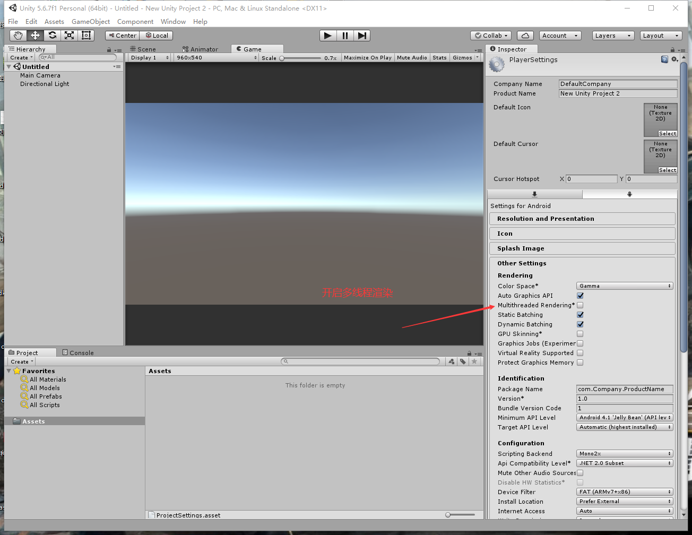
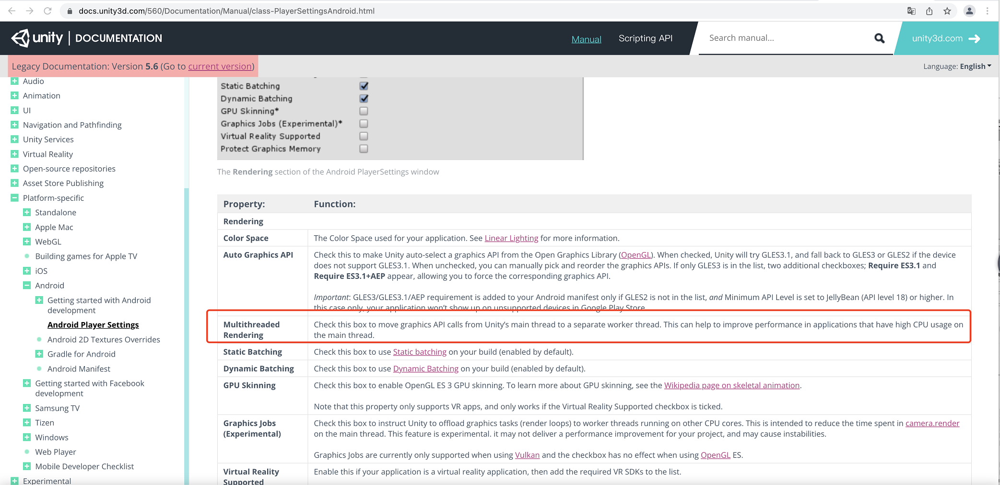
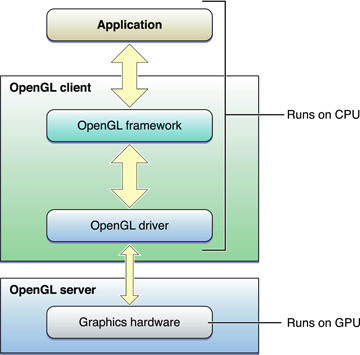

## 21. 多线程渲染

多线程渲染是指单独开一个线程来做OpenGL API调用。

Unity在设置里可以开启多线程渲染。

之前的章节所有的OpenGL API调用都是在主线程中，貌似也没什么问题，很流畅，那为什么要单独开一个线程来做OpenGL API调用？

Unity对多线程渲染的解释里说道，将对OpenGL API的调用移到单独的线程中，可以缓解主线程压力，提高游戏性能。

### 1. 为什么做多线程？

CPU与GPU是一种CS架构，什么是CS架构？

CS架构即Client-Server，调用OpenGL API可以等同于客户端向服务器发送一条协议，而且调用之后必须等结果返回。

大家都知道，客户端发送网络消息是在单独的网络线程的，因为网络是很慢的，如果在主线程里面等结果，那游戏就是一卡一卡的。

我猜你想说用异步API呀，抱歉，OpenGL没有这种功能，所有的OpenGL API都是阻塞式的。

多线程渲染也和多线程网络一样。

### 2. 如何做多线程渲染？

以最简单的绘制三角形为例，简化的流程如下：

单独开一个线程来做OpenGL API调用后，流程图如下：

在主线程中，不再直接调用OpenGL API进行绘制，而是将绘制代码放在渲染线程中。

在主线程中需要渲染时，向渲染线程发送命令，并附带上所需的参数。

例如绘制三角形时，发送命令`DrawArray`，然后附带顶点数据、GPUProgramID。

### 3. 什么时候需要多线程渲染？

多线程渲染和减少DrawCall同属于对CPU的优化，并不会减少渲染量，GPU负载没有变化。

多线程渲染让程序复杂度上升，不易理解，增加了维护难度。

如果项目CPU端没有压力，没有必要做多线程渲染。

如果你的设备CPU核心数少，在游戏运行时CPU核心都已经满载，那多开一个线程就是负优化。

总结就是：DrawCall量大、设备CPU核心多、主线程吃力的情况使用多线程渲染有效。