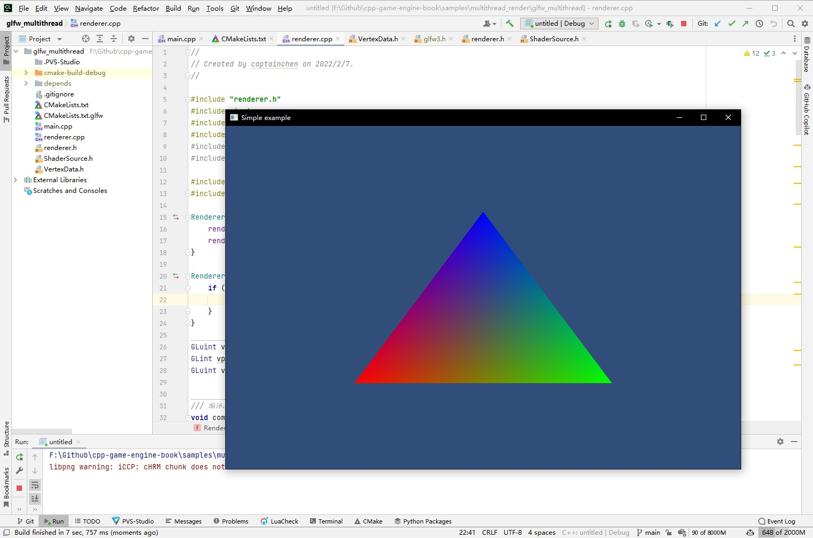

## 21.1 GLFW多线程渲染

```bash
CLion项目文件位于 samples\multithread_render\glfw_multithread
```

整个引擎是基于GLFW的，首先要考虑的就是GLFW是否支持多线程渲染。

在谷歌一番后，找到了相关的答案。

GLFW包括了OpenGL图形库与操作系统的一些处理，操作系统的处理一般在主线程中，例如Window的窗口创建与消息循环，而OpenGL并没有限定在哪个线程进行处理。

所以本书中的多线程渲染方案是：主线程跑逻辑代码，另创建渲染线程跑OpenGL。

本小节就是来测试GLFW如何实现这种多线程渲染方案，用最简单的三角形项目。

### 1. 主线程

主线程里主要干这些事情：

1. 创建Window
2. 处理逻辑

```c++
//file:main.cpp

#include <stdlib.h>
#include <stdio.h>
#define GLFW_INCLUDE_NONE
#include <GLFW/glfw3.h>
#include "renderer.h"

static void error_callback(int error, const char* description) {
    fprintf(stderr, "GLFW Error: %s\n", description);
}

int main(void) {
    //设置错误回调
    glfwSetErrorCallback(error_callback);

    if (!glfwInit())
        exit(EXIT_FAILURE);

    glfwWindowHint(GLFW_CONTEXT_VERSION_MAJOR, 2);
    glfwWindowHint(GLFW_CONTEXT_VERSION_MINOR, 0);

    //创建窗口
    GLFWwindow* window = glfwCreateWindow(960, 640, "Simple example", NULL, NULL);
    if (!window)
    {
        glfwTerminate();
        exit(EXIT_FAILURE);
    }

    Renderer* render=new Renderer(window);

    while (!glfwWindowShouldClose(window))
    {
        //非渲染相关的API，例如处理系统事件，就放到主线程中。
        glfwPollEvents();
    }

    delete render;

    glfwDestroyWindow(window);
    glfwTerminate();
    exit(EXIT_SUCCESS);
}
```

代码中，创建Window之后，实例化了`Renderer`对象，并传入了`window`，`Renderer`就管理者渲染线程。

`glfwInit` `glfwCreateWindow` `glfwPollEvents` 这些和操作系统消息循环相关的，就放在主线程。

### 2. 渲染线程

在创建`Renderer`实例时，就会创建一个渲染线程，渲染线程立即启动，并开始编译Shader、渲染三角形。

简单说就是把原来在主线程中渲染三角形的代码，挪到了渲染线程中执行。

```c++
//file:renderer.cpp

#include "renderer.h"
#include <iostream>
#include <glm/glm.hpp>
#include <glm/gtc/matrix_transform.hpp>
#include <glm/gtx/transform2.hpp>
#include <glm/gtx/euler_angles.hpp>

#include "VertexData.h"
#include "ShaderSource.h"

Renderer::Renderer(GLFWwindow *window):window_(window) {
    render_thread_ = std::thread(&Renderer::RenderMain, this);//创建渲染线程，并指定渲染函数入口。
    render_thread_.detach();
}

Renderer::~Renderer() {
    if (render_thread_.joinable()) {
        render_thread_.join();//等待渲染线程结束
    }
}

GLuint vertex_shader, fragment_shader, program;
GLint mvp_location, vpos_location, vcol_location;


/// 编译、链接Shader
void compile_shader() {
    //创建顶点Shader
    vertex_shader = glCreateShader(GL_VERTEX_SHADER);
    //指定Shader源码
    glShaderSource(vertex_shader, 1, &vertex_shader_text, NULL);
    //编译Shader
    glCompileShader(vertex_shader);
    
    ......
}


void Renderer::RenderMain() {
    //渲染相关的API调用需要放到渲染线程中。
    glfwMakeContextCurrent(window_);

    gladLoadGL(glfwGetProcAddress);
    glfwSwapInterval(1);

    compile_shader();

    //获取shader属性ID
    mvp_location = glGetUniformLocation(program, "u_mvp");
    vpos_location = glGetAttribLocation(program, "a_pos");
    vcol_location = glGetAttribLocation(program, "a_color");

    while (!glfwWindowShouldClose(window_))
    {
        float ratio;
        int width, height;
        glm::mat4 model,view, projection, mvp;

        //获取画面宽高
        glfwGetFramebufferSize(window_, &width, &height);
        ratio = width / (float) height;

        glViewport(0, 0, width, height);

        glClear(GL_COLOR_BUFFER_BIT|GL_DEPTH_BUFFER_BIT);
        glClearColor(49.f/255,77.f/255,121.f/255,1.f);

        //坐标系变换
        glm::mat4 trans = glm::translate(glm::vec3(0,0,0)); //不移动顶点坐标;
        glm::mat4 rotation = glm::eulerAngleYXZ(glm::radians(0.f), glm::radians(0.f), glm::radians(0.f)); //使用欧拉角旋转;
        glm::mat4 scale = glm::scale(glm::vec3(2.0f, 2.0f, 2.0f)); //缩放;
        model = trans*scale*rotation;

        view = glm::lookAt(glm::vec3(0, 0, 10), glm::vec3(0, 0,0), glm::vec3(0, 1, 0));

        projection=glm::perspective(glm::radians(60.f),ratio,1.f,1000.f);

        mvp=projection*view*model;

        //指定GPU程序(就是指定顶点着色器、片段着色器)
        glUseProgram(program);
        {
            //启用顶点Shader属性(a_pos)，指定与顶点坐标数据进行关联
            glEnableVertexAttribArray(vpos_location);
            glVertexAttribPointer(vpos_location, 3, GL_FLOAT, false, sizeof(glm::vec3), kPositions);

            //启用顶点Shader属性(a_color)，指定与顶点颜色数据进行关联
            glEnableVertexAttribArray(vcol_location);
            glVertexAttribPointer(vcol_location, 3, GL_FLOAT, false, sizeof(glm::vec4), kColors);

            //上传mvp矩阵
            glUniformMatrix4fv(mvp_location, 1, GL_FALSE, &mvp[0][0]);

            //上传顶点数据并进行绘制
            glDrawArrays(GL_TRIANGLES, 0, 3);
        }

        glfwSwapBuffers(window_);
    }
}
```

代码结构和`《3.1 画个三角形》`基本一致。

### 3. 测试

测试结果也与`《3.1 画个三角形》`一致。

