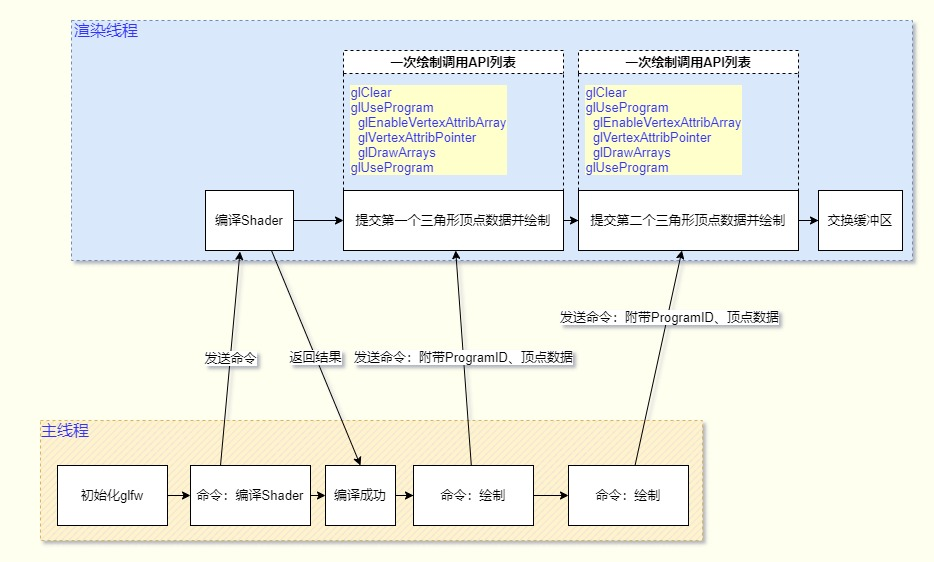

## 21.1 基于任务队列的多线程渲染

上一节测试了GLFW对多线程的支持，证实了在单独子线程调用OpenGL API渲染是可行的。

那么这一节就来对其进行细化，将渲染三角形这一目标，拆分多个子任务，主线程以命令的形式与渲染线程进行通信。

任务可以拆分为任务命令和任务参数。

* 案例一

    你在蹲坑，发现没有纸了，打电话叫你老婆拿纸，这是一个任务。

    任务命令：拿纸

    任务参数：无

    你是主线程，发出命令。

    老婆是渲染线程，接受命令，执行，给你结果。

    这是一个阻塞式任务，你(主线程)必须等老婆(渲染线程)执行任务(拿纸)，返回结果(给你纸)。

    就如下面图中的`编译Shader`命令。

    

* 案例二

    你在外面闲逛，你老婆打电话过来叫你去买一斤西瓜，这是一个任务。

    任务命令：买东西

    任务参数有2个：物品：西瓜 重量：一斤

    老婆是主线程，发出命令并带参数。

    你是渲染线程，接受命令，解析参数，执行。

    买西瓜是比较复杂的操作，要去多个店里询问，比价，拿西瓜，称重，最后付款，才算完成了买西瓜这个任务。

    老婆(主线程)不管这些步骤，她只要发命令，然后等结果。

    这是一个非阻塞任务，老婆不会一直等你买瓜回去，她可能在打王者荣耀。

    等你买好瓜到家，老婆又发出命令，让你去切瓜。

    主线程发出渲染命令后，也不会等渲染结果，而是转身就去执行其他逻辑。

    就如案例一图中的`绘制`命令。

* 案例三
    
    你老婆在蹲坑，没有纸了，打电话叫你拿纸，叫你买一斤西瓜，然后再去拿两个顺丰快递，然后再去取1000块钱。

    第一个是阻塞任务，然后几个都是非阻塞任务。

    命令太多，参数太多，人到中年，记忆力衰退，你记不住了。
    
    你需要一个任务队列来保存这些任务，然后从任务队列里面取任务来做。

    就如同下图，`编译shader`是阻塞性任务，完成之后才能去做`绘制`这个非阻塞任务。

    

那么案例三是我们所需要的，来看下如何实现。

### 1. 渲染任务


1. 使用spscqueue，逻辑线程向队列添加任务，渲染线程读取任务就就执行。
2. 帧开始与结束的特殊任务，渲染线程拿到结束的任务后，将一个变量设置为帧结束，这样逻辑线程就可以自旋锁等待，然后执行下一个函数，这就是WaitForPresent。

就简单说一下屏幕后期处理的原理，是要等这一帧渲染之后，从FBO拿到渲染的结果，然后再做修改法相、饱和度 这种。

并不是说一个opengl api就一个task，大部分时候都是多个api一起使用，例如编译shader，有很多api调用，但是可以作为一个task，然后这个task接受的参数就是shader源码。

```c++
/// 编译、链接Shader
void compile_shader()
{
    //创建顶点Shader
    vertex_shader = glCreateShader(GL_VERTEX_SHADER);
    //指定Shader源码
    glShaderSource(vertex_shader, 1, &vertex_shader_text, NULL);
    //编译Shader
    glCompileShader(vertex_shader);
    //获取编译结果
    GLint compile_status=GL_FALSE;
    glGetShaderiv(vertex_shader, GL_COMPILE_STATUS, &compile_status);
    if (compile_status == GL_FALSE)
    {
        GLchar message[256];
        glGetShaderInfoLog(vertex_shader, sizeof(message), 0, message);
        std::cout<<"compile vs error:"<<message<<std::endl;
    }

    //创建片段Shader
    fragment_shader = glCreateShader(GL_FRAGMENT_SHADER);
    //指定Shader源码
    glShaderSource(fragment_shader, 1, &fragment_shader_text, NULL);
    //编译Shader
    glCompileShader(fragment_shader);
    //获取编译结果
    compile_status=GL_FALSE;
    glGetShaderiv(fragment_shader, GL_COMPILE_STATUS, &compile_status);
    if (compile_status == GL_FALSE)
    {
        GLchar message[256];
        glGetShaderInfoLog(fragment_shader, sizeof(message), 0, message);
        std::cout<<"compile fs error:"<<message<<std::endl;
    }


    //创建GPU程序
    program = glCreateProgram();
    //附加Shader
    glAttachShader(program, vertex_shader);
    glAttachShader(program, fragment_shader);
    //Link
    glLinkProgram(program);
    //获取编译结果
    GLint link_status=GL_FALSE;
    glGetProgramiv(program, GL_LINK_STATUS, &link_status);
    if (link_status == GL_FALSE)
    {
        GLchar message[256];
        glGetProgramInfoLog(program, sizeof(message), 0, message);
        std::cout<<"link error:"<<message<<std::endl;
    }
}
```