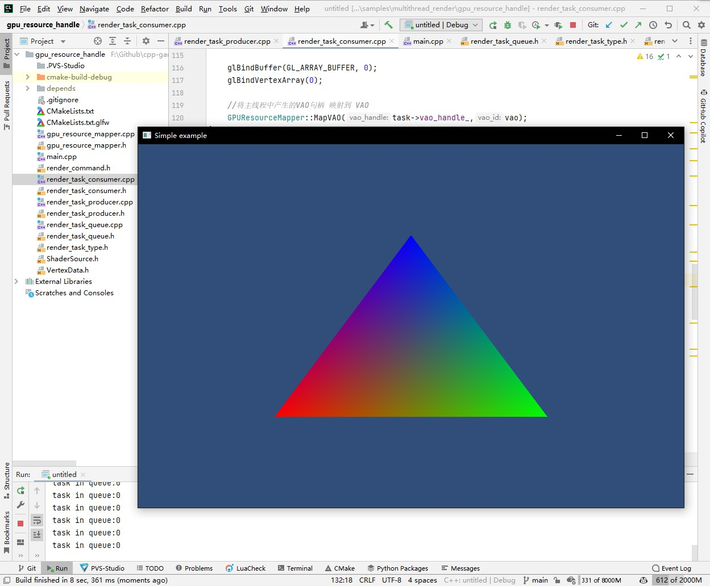

## 21.3 完全异步的多线程渲染模型

```bash
CLion项目文件位于 samples\multithread_render\gpu_resource_handle
```

当我沿用上一节的多线程渲染模型继续往下开发时，遇到了一个无法解决的问题。

为了性能，需要尽可能的将渲染任务设置为非阻塞的，非阻塞任务意味着我无法从渲染线程获得反馈。

以创建VAO为例，主线程发出创建VAO非阻塞任务，然后我没办法使用它，因为想使用它就需要VAO的ID。

这就是GPU资源管理问题。

这让我想起了以前在游戏中写的资源异步加载，每个加载任务都会创建一个Handle与之对应，这种设计模式也可以照搬到多线程渲染。

下面看下基于Handle的多线程同步模式。

### 1. 基于Handle的同步模型原理

仍然以创建VAO为例，主线程发出创建VAO非阻塞任务时，先创建一个VAO Handle。渲染线程创建VAO后，将Handle与VAO ID映射起来，存放到HashMap中。

主线程发出使用VAO非阻塞任务时，携带Handle作为参数。渲染线程拿到Handle，从HashMap找到对应的VAO ID，去使用。

### 2. 映射关系管理

我这里使用自增的Index来作为Handle，每一种GPU资源都分配单独的Index。

```c++
//file:gpu_resource_mapper.h

#ifndef UNTITLED_GPU_RESOURCE_MAPPER_H
#define UNTITLED_GPU_RESOURCE_MAPPER_H

#include <unordered_map>
#include <glad/gl.h>

/// GPU资源管理，负责管理GPU资源ID与其在引擎逻辑ID的映射关系。
class GPUResourceMapper {
public:
    /// 生成Shader程序句柄
    /// \return
    static unsigned int GenerateShaderProgramHandle(){
        return ++shader_program_index_;
    }

    /// 生成VAO句柄
    /// \return
    static unsigned int GenerateVAOHandle(){
        return ++vao_index_;
    }

    /// 映射Shader程序
    /// \param shader_program_handle
    /// \param shader_program_id
    static void MapShaderProgram(unsigned int shader_program_handle, GLuint shader_program_id){
        shader_program_map_[shader_program_handle] = shader_program_id;
    }

    /// 映射VAO
    /// \param vao_handle
    /// \param vao_id
    static void MapVAO(unsigned int vao_handle, GLuint vao_id){
        vao_map_[vao_handle] = vao_id;
    }

    /// 获取Shader程序
    /// \param shader_program_handle
    /// \return
    static GLuint GetShaderProgram(unsigned int shader_program_handle){
        return shader_program_map_[shader_program_handle];
    }

    /// 获取VAO
    /// \param vao_handle
    /// \return
    static GLuint GetVAO(unsigned int vao_handle){
        return vao_map_[vao_handle];
    }

private:
    static unsigned int shader_program_index_;//Shader程序索引
    static unsigned int vao_index_;//VAO索引

    static std::unordered_map<unsigned int, GLuint> shader_program_map_;//Shader程序映射表
    static std::unordered_map<unsigned int, GLuint> vao_map_;//VAO映射表
};


#endif //UNTITLED_GPU_RESOURCE_MAPPER_H

```

### 3. 生成Handle

对创建VAO任务结构进行改造，删除需要回传的参数，新增VAO句柄字段 `vao_handle_`。

```c++
//file:render_task_type.h line:53

/// 创建VAO任务
class RenderTaskCreateVAO: public RenderTaskBase{
public:
    RenderTaskCreateVAO(){
        render_command_=RenderCommand::CREATE_VAO;
    }
    ~RenderTaskCreateVAO(){}
public:
    unsigned int shader_program_handle_=0;//着色器程序句柄
    const void* positions_=nullptr;//顶点位置
    GLsizei   positions_stride_=0;//顶点数据大小
    const void* colors_=nullptr;//顶点颜色
    GLsizei   colors_stride_=0;//颜色数据大小
    unsigned int vao_handle_=0;//VAO句柄
};
```

在主线程创建VAO任务时，先生成VAO Handle，将其作为任务参数。

```c++
//file:main.cpp line:50

int main(void)
{
    ......

    //创建缓冲区任务
    vao_handle_=GPUResourceMapper::GenerateVAOHandle();
    RenderTaskProducer::ProduceRenderTaskCreateVAO(shader_program_handle_, kPositions, sizeof(glm::vec3), kColors,
                                                   sizeof(glm::vec4), vao_handle_);

    ......
}
```

### 4. Handle映射到GPU资源

渲染线程创建VAO之后，将VAO Handle映射到VAO ID。

```c++
//file:render_task_consumer.cpp line:92

/// 创建VAO
/// \param task_base
void RenderTaskConsumer::CreateVAO(RenderTaskBase* task_base){
    RenderTaskCreateVAO* task= dynamic_cast<RenderTaskCreateVAO*>(task_base);
    //从映射表中，获取Shader程序句柄
    GLuint shader_program= GPUResourceMapper::GetShaderProgram(task->shader_program_handle_);
    GLuint vbo_pos,vbo_color,vao;

    glGenVertexArrays(1, &vao);
    glGenBuffers(1, &vbo_pos);
    glGenBuffers(1, &vbo_color);

    GLint attribute_pos_location = glGetAttribLocation(shader_program, "a_pos");
    GLint attribute_col_location = glGetAttribLocation(shader_program, "a_color");

    glBindVertexArray(vao);
    glBindBuffer(GL_ARRAY_BUFFER, vbo_pos);
    glBufferData(GL_ARRAY_BUFFER, sizeof(kPositions), kPositions, GL_STATIC_DRAW);
    glVertexAttribPointer(attribute_pos_location, 3, GL_FLOAT, false, sizeof(glm::vec3), (void*)0);
    glEnableVertexAttribArray(attribute_pos_location);//启用顶点Shader属性(a_pos)，指定与顶点坐标数据进行关联

    glBindBuffer(GL_ARRAY_BUFFER, vbo_color);
    glBufferData(GL_ARRAY_BUFFER, sizeof(kColors), kColors, GL_STATIC_DRAW);
    glVertexAttribPointer(attribute_col_location, 3, GL_FLOAT, false, sizeof(glm::vec4), (void*)0);
    glEnableVertexAttribArray(attribute_col_location);//启用顶点Shader属性(a_color)，指定与顶点颜色数据进行关联

    glBindBuffer(GL_ARRAY_BUFFER, 0);
    glBindVertexArray(0);

    //将主线程中产生的VAO句柄 映射到 VAO
    GPUResourceMapper::MapVAO(task->vao_handle_,vao);
}
```

### 5. 使用Handle

当绘制三角形任务时，带上VAO Handle作为参数。

```c++
//file:main.cpp line:74

void Render(){
    //绘制任务
    RenderTaskProducer::ProduceRenderTaskDrawArray(shader_program_handle_, vao_handle_);
}
```

在渲染线程中，由VAO Handle找到VAO ID，然后再绑定进行绘制。

```c++
//file:render_task_consumer.cpp line:127

/// 绘制
/// \param task_base
/// \param projection
/// \param view
void RenderTaskConsumer::DrawArray(RenderTaskBase* task_base, glm::mat4& projection, glm::mat4& view){
    RenderTaskDrawArray* task= dynamic_cast<RenderTaskDrawArray*>(task_base);

    //从映射表中，获取Shader程序句柄
    GLuint shader_program= GPUResourceMapper::GetShaderProgram(task->shader_program_handle_);
    //从映射表中，获取VAO
    GLuint vao= GPUResourceMapper::GetVAO(task->vao_handle_);

    //指定Shader程序
    glUseProgram(shader_program);
    {
        glBindVertexArray(vao);

        //上传顶点数据并进行绘制
        glDrawArrays(GL_TRIANGLES, 0, 3);
    }
}
```

### 6. 测试

