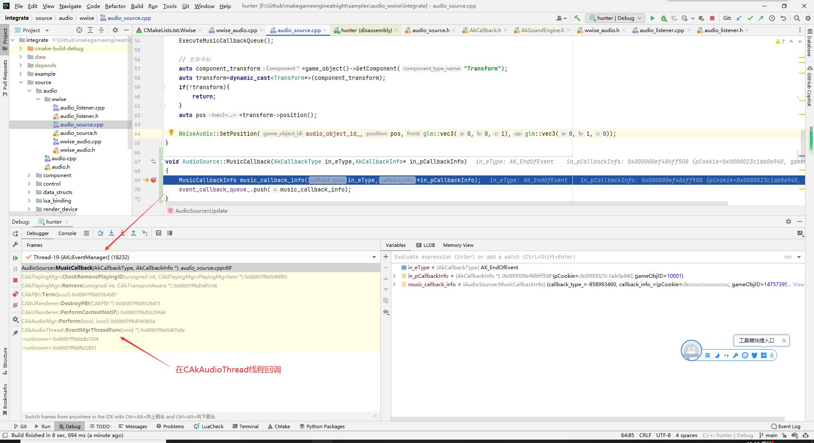

## 22.4 封装Wwise播放3D音效

```bash
CLion项目文件位于 samples\audio_wwise\integrate
```

这一节介绍`AudioSource`、`AudioListener`对Wwise API的封装。

+ AudioSource
  
  音源，提供创建、播放、停止、设置回调等接口，是对Wwise Event的封装。

+ AudioListener
  
  听者。

在`22.2 Wwise制作音效导出SoundBank`这一节，制作了一个死亡音效并导出了SoundBank，这一节就用这个死亡音效来作为实例播放。

### 1. AudioSource

Wwise提供了接口 `AK::SoundEngine::PostEvent`来触发Event播放音效，并且返回 `AkPlayingID` 来作为当前正在播放的Event的Handle。

所以在AudioSource里，主要是提供对Event的播放，以及后续对`AkPlayingID`的后续操作。


```c++
//file:source/audio/wwise/audio_source.h

class AudioSource:public Component {
public:
    AudioSource();
    ~AudioSource();

    /// 设置Event名
    void SetEvent(const std::string &event_name);

    /// 设置实时控制参数
    void SetRTPCValue(const std::string &realtime_parameter_control_name, float value);

    /// 播放
    void Play();

    /// 停止
    void Stop();

    /// 设置音效播放完成回调
    /// @param callback 回调函数，如果是lua传入，使用普通function就行
    void set_event_end_callback(std::function<void(void)> callback){
        event_end_callback_ = callback;
    }

private:
    void Awake() override;
    void Update() override;

private:
    AkGameObjectID audio_object_id_;
    std::string event_name_;
    AkPlayingID playing_id_;

    std::function<void()> event_end_callback_;//AudioSource实例播放结束回调

    /********************  回调处理  ********************/
public:
    /// Event回调，静态函数
    /// \param in_eType Event类型。
    /// \param in_pCookie 回调参数，在PostEvent设置的，原样返回。
    static void MusicCallback(AkCallbackType in_eType,AkCallbackInfo* in_pCallbackInfo);

    /// 处理AudioSource回调队列
    static void ExecuteMusicCallbackQueue();
private:
    /// Event回调信息
    class MusicCallbackInfo{
    public:
        MusicCallbackInfo(AkCallbackType callback_type, AkCallbackInfo callback_info)
                :callback_type_(callback_type), callback_info_(callback_info){}
        ~MusicCallbackInfo(){}

        AkCallbackType callback_type_;//回调类型，停止、暂停、退出等事件枚举
        AkCallbackInfo callback_info_;//回调参数，包括音频对象ID、透传参数。
    };

    static rigtorp::SPSCQueue<MusicCallbackInfo> event_callback_queue_;//AudioSource回调队列，单线程写单线程读，线程安全。
};
```

`SetEvent` `Play` `Stop` 这几个API都挺简单的，就是调用上一节介绍的WwiseAudio 对应函数。

需要详细介绍的是：

<font color=red>播放音效设置的事件监听回调，回调函数是在Wwise线程，不是在主线程。</font>



那么需要用一个多线程共享队列来存储事件回调，然后在主线程Update从队列中取出事件回调来处理。

```c++
//file:source/audio/wwise/audio_source.h line:60

private:
    /// Event回调信息
    class MusicCallbackInfo{
    public:
        MusicCallbackInfo(AkCallbackType callback_type, AkCallbackInfo callback_info)
                :callback_type_(callback_type), callback_info_(callback_info){}
        ~MusicCallbackInfo(){}

        AkCallbackType callback_type_;//回调类型，停止、暂停、退出等事件枚举
        AkCallbackInfo callback_info_;//回调参数，包括音频对象ID、透传参数。
    };

    static rigtorp::SPSCQueue<MusicCallbackInfo> event_callback_queue_;//AudioSource回调队列，单线程写单线程读，线程安全。
```

这里引入`rigtorp::SPSCQueue`这个库，它是多线程安全的，支持一个生产者，一个消费者同时访问。

当Wwise调用回调函数时，实例化 `MusicCallbackInfo`，然后存入`event_callback_queue_`。

```c++
//file:source/audio/wwise/audio_source.cpp line:67

/// Event回调，静态函数
/// \param in_eType Event类型。
/// \param in_pCookie 回调参数，在PostEvent设置的，原样返回。
void AudioSource::MusicCallback(AkCallbackType in_eType,AkCallbackInfo* in_pCallbackInfo)
{
    MusicCallbackInfo music_callback_info(in_eType,*in_pCallbackInfo);
    event_callback_queue_.push(music_callback_info);
}

/// 处理AudioSource回调队列
void AudioSource::ExecuteMusicCallbackQueue() {
    while (event_callback_queue_.front()){
        MusicCallbackInfo* music_callback_info = event_callback_queue_.front();

        AudioSource* audio_source=(AudioSource*)music_callback_info->callback_info_.pCookie;
        if(music_callback_info->callback_type_ == AK_EndOfEvent){
            DEBUG_LOG_INFO("end event: {}",audio_source->event_name_);
            if(audio_source->event_end_callback_){
                audio_source->event_end_callback_();
            }
        }
        event_callback_queue_.pop();
    }
}
```

然后在主线程Update时，从队列中取出，再处理。

```c++
//file:source/audio/wwise/audio_source.cpp line:54

void AudioSource::Update() {
    Component::Update();

    // 处理Event
    ExecuteMusicCallbackQueue();
    ......
}
```

另外需要在Update里面更新Wwise GameObject的坐标以及朝向，不然得不到3D音效。

### 2. AudioListener

AudioListener只是一个坐标抽象表示，所以只需要创建Wwise GameObject。

也需要在Update里面更新Wwise GameObject的坐标以及朝向。

```c++
//file:source/audio/wwise/audio_listener.cpp

void AudioListener::Awake() {
    audio_listener_object_id_=WwiseAudio::GeneratorGameObjectID();
    WwiseAudio::CreateAudioObject(audio_listener_object_id_,game_object()->name().c_str());
    WwiseAudio::SetDefaultListeners(audio_listener_object_id_);
}

void AudioListener::Update() {
    Component::Update();
    auto component_transform=game_object()->GetComponent("Transform");
    auto transform=dynamic_cast<Transform*>(component_transform);
    if(!transform){
        return;
    }
    auto pos=transform->position();
    // 设置Wwise GameObject位置、朝向
    WwiseAudio::SetPosition(audio_listener_object_id_,pos,glm::vec3(0,0,1),glm::vec3(0,1,0));
}
```

### 3. 实例播放3D音效

在`22.2 Wwise制作音效导出SoundBank`这一节，制作了的死亡音效。

现在测试加载了导出的Bank，并创建`AudioSource`、`AudioListener`实例，触发Event播放音效。

在实例中，创建了一个怪物，附加了`AudioSource`并指定了Event。

创建了多个怪物坐标，当按下键盘空格之后设置到新坐标，然后触发Event播放音效，这样可以对比听出3D的效果。

具体代码如下：

```lua
--file:example/game_scene.lua

GameScene={
    go_camera_ui_,--摄像机UI
    go_ui_image_,--UI图片

    listener_go_,--Listener
    monster_go_,--怪物
    monster_pos_array_,--怪物位置
    monster_pos_index_,--怪物位置索引
}

-- ......

-- public:
function GameScene:Awake()
    -- 加载Init.bank文件
    WwiseAudio.LoadBank("Init.bnk")
    -- 加载游戏音效bank文件
    WwiseAudio.LoadBank("fight.bnk")

    --创建Listener
    self.listener_go_=GameObject("listener")
    self.listener_go_:AddComponent("Transform")
    self.listener_go_:AddComponent("AudioListener")
    self.listener_go_:GetComponent("Transform"):set_position(glm.vec3(0,0,0))

    -- 创建怪物
    self.monster_go_=GameObject("monster")
    self.monster_go_:AddComponent("Transform"):set_position(glm.vec3(0,0,0))
    self.monster_go_:AddComponent("AudioSource")
    self.monster_go_:GetComponent("AudioSource"):SetEvent("die")
    self.monster_go_:GetComponent("AudioSource"):set_event_end_callback(function()
        print("audio monster die end")
    end)

    -- 每次播放都改变怪物坐标
    self.monster_pos_array_={
        glm.vec3(10,0,0),
        glm.vec3(10,10,0),
        glm.vec3(0,10,0),
        glm.vec3(-10,10,0),
        glm.vec3(-10,0,0)
    }
    self.monster_pos_index_=1

    self:CreateUI()
end

-- ......

function GameScene:CreateUI()
    -- 创建UI相机 GameObject
    self.go_camera_ui_=GameObject("ui_camera")
    -- 挂上 Transform 组件
    local transform_camera_ui=self.go_camera_ui_:AddComponent("Transform")
    transform_camera_ui:set_position(glm.vec3(0, 0, 10))
    -- 挂上 Camera 组件
    local camera_ui=self.go_camera_ui_:AddComponent("UICamera")
    -- 设置正交相机
    camera_ui:SetView(glm.vec3(0, 0, 0), glm.vec3(0, 1, 0))
    camera_ui:SetOrthographic(-Screen.width()/2,Screen.width()/2,-Screen.height()/2,Screen.height()/2,-100,100)

    -- 创建 UIImage
    self.go_ui_image_=GameObject("image")
    self.go_ui_image_:AddComponent("Transform"):set_position(glm.vec3(-480, -320, 0))
    -- 挂上 UIImage 组件
    local ui_image_mod_bag=self.go_ui_image_:AddComponent("UIImage")
    ui_image_mod_bag:set_texture(Texture2D.LoadFromFile("images/need_head_phone.cpt"))
end

function GameScene:Update()
    --print("GameScene:Update")
    if Input.GetKeyUp(KeyCode.KEY_CODE_SPACE) then
        print("GameScene:Update KEY_CODE_SPACE")
        self.monster_go_:GetComponent("Transform"):set_position(self.monster_pos_array_[self.monster_pos_index_])
        self.monster_go_:GetComponent("AudioSource"):Play()

        self.monster_pos_index_=(self.monster_pos_index_%(#self.monster_pos_array_))+1
    end
end
```

带上耳机，注意听视频中声音的位置。

<iframe 
    width="800" 
    height="450" 
    src="https://player.bilibili.com/player.html?aid=593102910&bvid=BV16q4y1y742&cid=480734407&page=1" 
    frameborder="0"
    allowfullscreen> 
</iframe>

B站观看：`https://www.bilibili.com/video/BV16q4y1y742`


