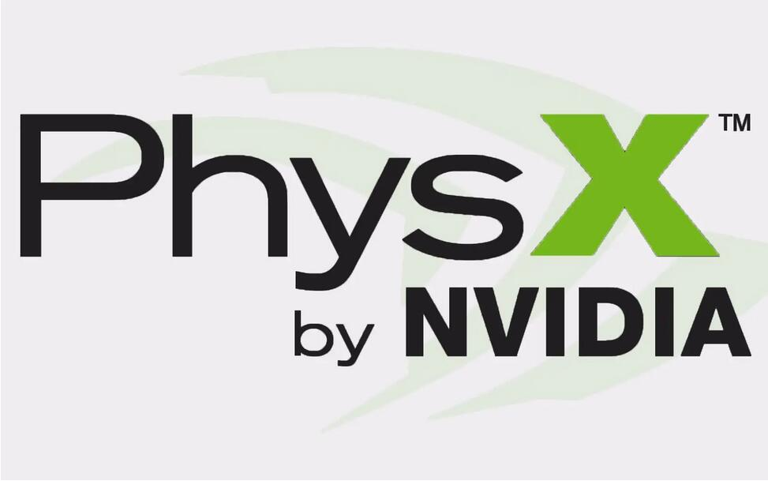
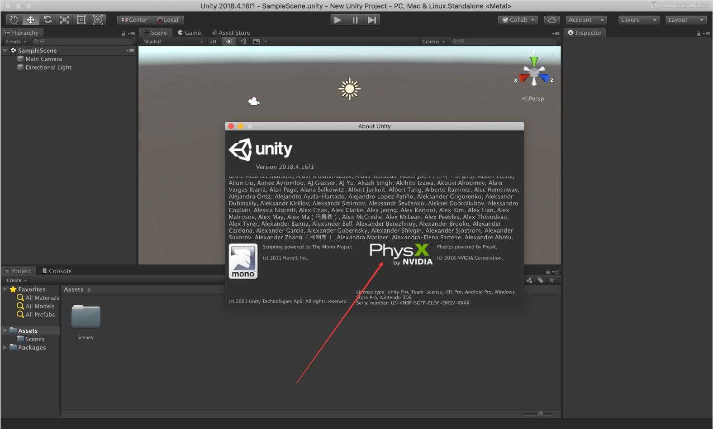
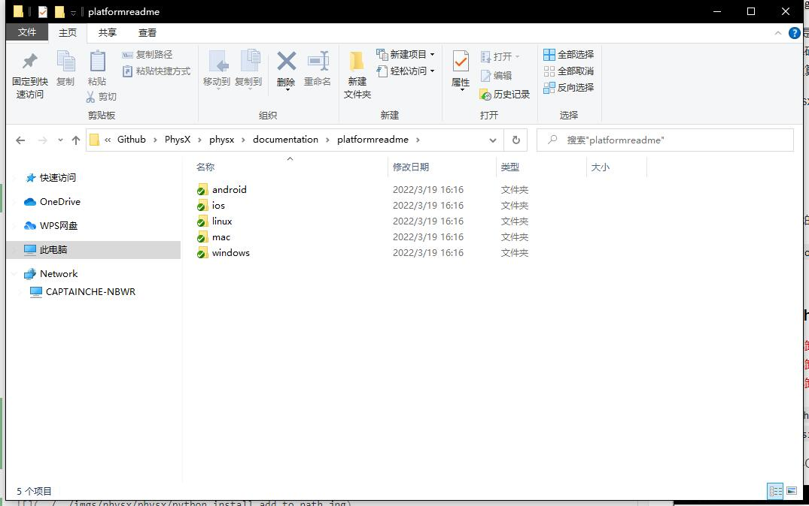
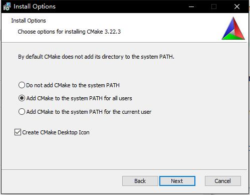
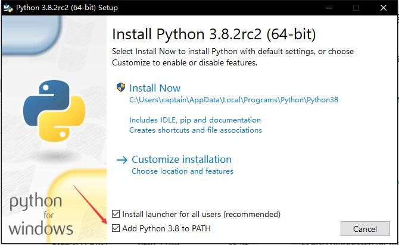
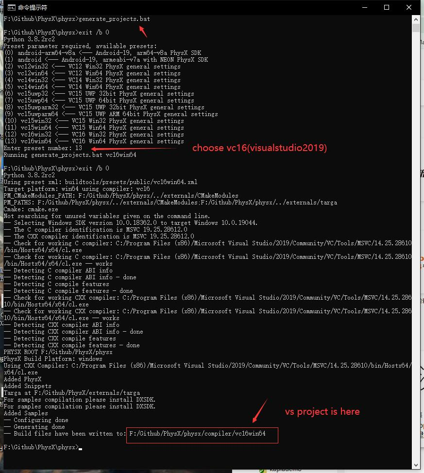
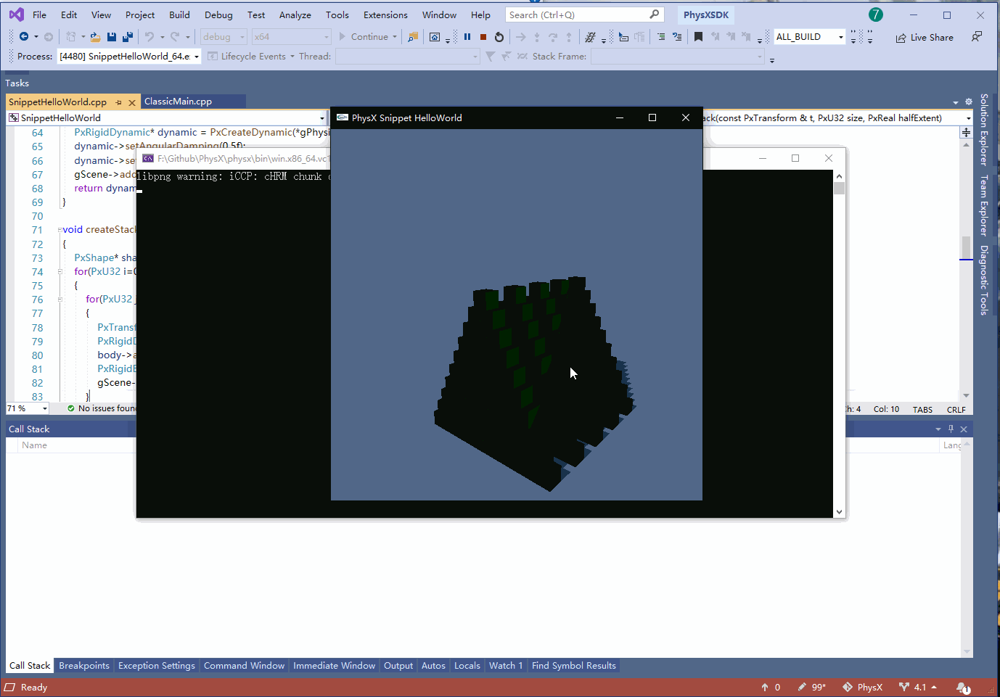
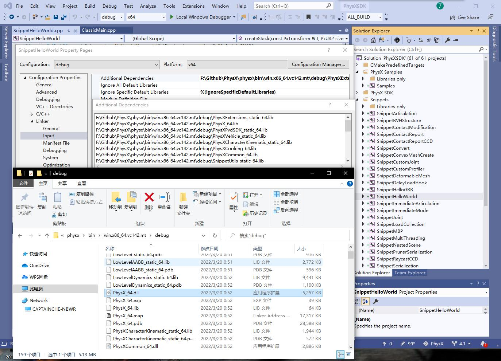

## 22. Physx物理引擎



Unity中的碰撞 、射线检测、载具等物理相关功能都是Physx物理引擎提供的。



### 1. 物理引擎介绍

物理引擎就是干物理相关的事情。

车子能向前移动，是因为发动机提供动力，车轮与地面之间有摩擦力。
人能站在地面，是因为受到往下的重力，人与地面可以简单看成刚体而不至于人穿透地面。
衣服会遮住身体，也是因为受到往下的重力，不然别人就会看到你的啤酒肚。

在游戏中，借助物理引擎进行物体之间的力运算，来获取正确的结果。
不过想用计算机来模拟真实世界的表现是不可能的。
当你将一个钉子敲进墙里面，这中间有多少个物体发生了力运算？从大的来看，是一个钉子与墙之间的挤压。小一点来看，是分子之间。再小一点，原子、质子、夸克……
一克铁估计有150万亿亿个铁原子，钉钉子这么个动作，就至少有150万亿亿个单位需要参与物理运算，什么计算机这么牛逼？

所以物理引擎做的是物理仿真，就是尽量做到真实效果。

在游戏里面，钉子只会被看作一个圆柱体，墙只会看作立方体，不会在往下去追求分子、原子之间的力。

衣服可能也就是一个圆柱体，所以在游戏中能看到各种奇怪的表现，例如反重力裙子、反重力头发、人物鬼畜等。


### 2. Physx物理引擎

目前市面上的物理引擎主要有：bullet、havok、Physx。

Physx是NVIDIA家的，现在开源了，有大腿谁不抱，Unity中用的就是physx，UE好像也是，所以我也来用这个。

Physx官网：`https://developer.nvidia.com/physx-sdk`

Physx Github：`https://github.com/NVIDIAGameWorks/PhysX`

Physx功能非常多，而且是NVIDIA家的，在GPU运算方面能做很多事情，不过对游戏来说，就只用到里面的基础物理功能，做个碰撞检测之类的，复杂一点的用到载具系统，再复杂一点的布料运算，GPU运算几乎是不会去碰，游戏毕竟是要跨平台的。

所以我们也只学一点Physx简单的就行了，学个碰撞检测就行，载具后面有需求再看Physx的实例吧。

### 3. 编译Physx

参考Physx自带的文档，每个平台都有单独的文档。



先把工程克隆下来，从我的仓库克隆吧，我修复了一点bug。

Github:`https://github.com/ThisisGame/PhysX`

然后编译是分平台的。

#### 3.1 Windows编译Physx

<font color=red>先把电脑上的杀毒软件都卸载掉!!!</font>
<font color=red>先把电脑上的杀毒软件都卸载掉!!!</font>
<font color=red>先把电脑上的杀毒软件都卸载掉!!!</font>

安装CMake:`https://github.com/Kitware/CMake/releases/download/v3.22.3/cmake-3.22.3-windows-x86_64.msi`

注意勾选第二个选项，将CMake添加到环境变量。



安装Python:`https://www.python.org/ftp/python/3.8.2/python-3.8.2rc2-amd64.exe`



注意勾选最后的选项，将Python添加到环境变量。

运行`generate_projects.bat`，输入`13`选择VisualStudio2019编译。



生成的VS工程存放在`physx\compiler\vc16win64`。


可能会出现错误`No CMAKE_C_COMPILER could be found`，如下：

```bash
I:\Github Repositories\PhysX\physx>generate_projects.bat

I:\Github Repositories\PhysX\physx>exit /b 0
Preset parameter required, available presets:
(0) android <--- Android-19, armeabi-v7a with NEON PhysX SDK
(1) vc12win32 <--- VC12 Win32 PhysX general settings
(2) vc12win64 <--- VC12 Win64 PhysX general settings
(3) vc14win32 <--- VC14 Win32 PhysX general settings
(4) vc14win64 <--- VC14 Win64 PhysX general settings
(5) vc15uwp32 <--- VC15 UWP 32bit PhysX general settings
(6) vc15uwp64 <--- VC15 UWP 64bit PhysX general settings
(7) vc15uwparm32 <--- VC15 UWP 32bit PhysX general settings
(8) vc15uwparm64 <--- VC15 UWP ARM 64bit PhysX general settings
(9) vc15win32 <--- VC15 Win32 PhysX general settings
(10) vc15win64 <--- VC15 Win64 PhysX general settings
Enter preset number: 10
Running generate_projects.bat vc15win64

I:\Github Repositories\PhysX\physx>exit /b 0
Using preset xml: buildtools/presets/public/vc15win64.xml
Target platform: win64 using compiler: vc15
PM_CMakeModules_PATH: I:/Github Repositories/PhysX/physx/../externals/CMakeModules
PM_PATHS: I:/Github Repositories/PhysX/physx/../externals/CMakeModules;I:/Github Repositories/PhysX/physx/../externals/targa
Cmake: cmake.exe
Not searching for unused variables given on the command line.
-- Selecting Windows SDK version 10.0.17763.0 to target Windows 10.0.17134.
-- The C compiler identification is unknown
-- The CXX compiler identification is unknown
CMake Error at CMakeLists.txt:34 (project):
  No CMAKE_C_COMPILER could be found.


CMake Error at CMakeLists.txt:34 (project):
  No CMAKE_CXX_COMPILER could be found.


-- Configuring incomplete, errors occurred!
See also "I:/Github Repositories/PhysX/physx/compiler/vc15win64/CMakeFiles/CMakeOutput.log".
See also "I:/Github Repositories/PhysX/physx/compiler/vc15win64/CMakeFiles/CMakeError.log".
```

大概率是杀毒软件的问题，<font color=red>先把电脑上的杀毒软件都卸载掉!!!</font>

用vs2019打开`PhysXSDK.sln`，编译整个解决方案，运行`SnippetHelloWorld`,按空格发射炮弹。



在项目属性中，可以找到生成的Physx动态库存放在`physx\bin\win.x86_64.vc142.mt\debug`。



#### 3.2 MacOS编译Physx

