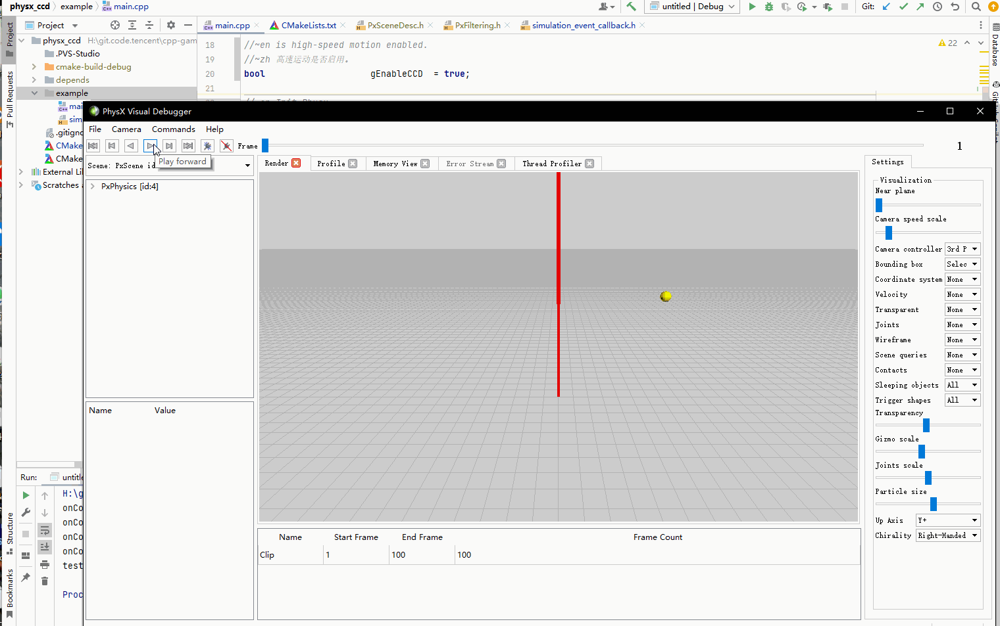
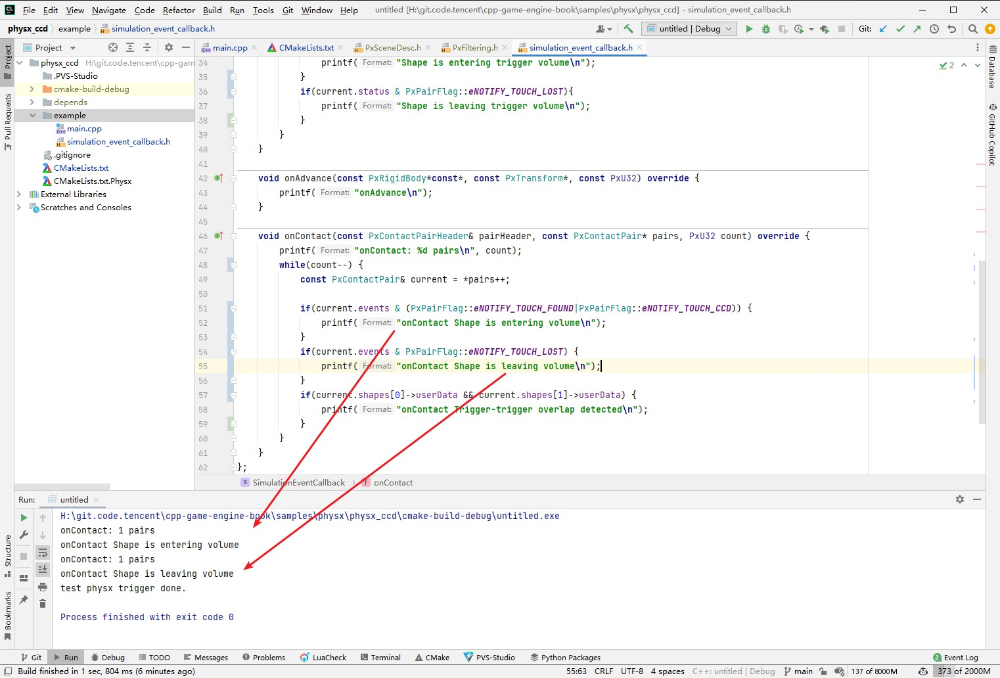
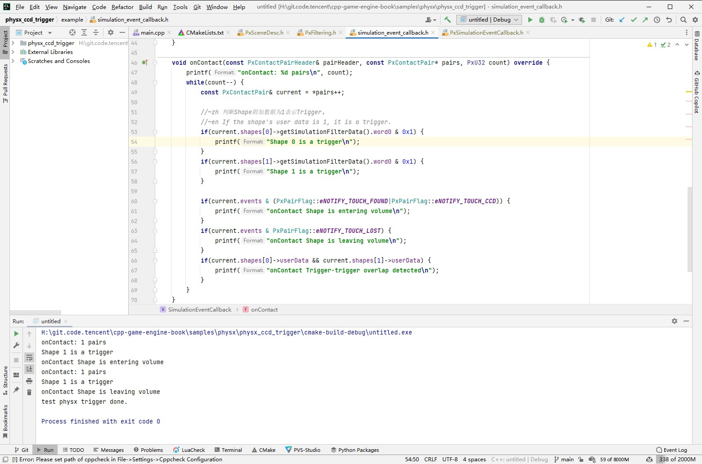
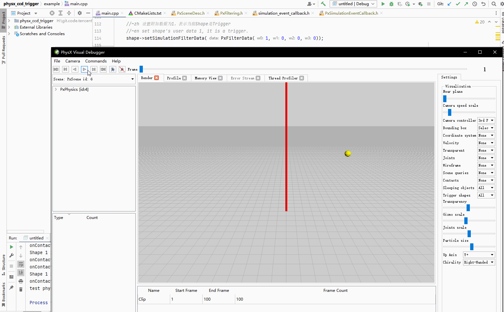

## 22.4 连续碰撞检测

```bash
CLion项目文件位于 samples\physx\physx_ccd
```

在枪战类游戏会遇到一个问题，子弹穿透。

子弹速度极快，当子弹飞向敌人，会发现physx判定为没有碰撞发生。

以上一小节的项目，将速度乘以10，测试发现小球不再被墙体反弹，而是直接穿过去。

```c++
//~zh 创建小球，并添加到场景中
//~en Create ball,add to scene.
void CreateBall(){
    //~en Create RigidBody,pos is (10,0,0)
    //~zh 创建刚体，坐标是 (10,0,0)
    PxRigidDynamic* body = gPhysics->createRigidDynamic(PxTransform(PxVec3(10, 5, 0)));
    
    //body->setLinearVelocity(PxVec3(-14.0f, 0.0f, 0.0f));
    body->setLinearVelocity(PxVec3(-140.0f, 0.0f, 0.0f));//high-speed
    ......
}
```


那为什么会出现这种问题？

我们知道游戏引擎其实就是一个while循环，每一次循环里，先在`Update()`函数里处理游戏逻辑，然后在`Render()`函数去处理渲染任务。

Physx作为物理模块集成到引擎后，也要遵守这个规则，将处理Physx逻辑放在`FixUpdate()`函数里面。

<font color=red>

FixUpdate() 函数是固定速率的。

这个固定速率是说一段时间内保证调用固定次数，例如一秒钟保证调用60次，不是说每一次调用间隔固定时间。

如果Update()、Render() 耗时很长，那么这一帧就多调用几次FixUpdate()。

</font>

Update()、Render()、FixUpdate()组成了游戏的一帧。

按30帧的渲染帧率，每一帧之间间隔了0.33秒。

以100米/s的子弹速度，前后两帧子弹位移了33米。

前一帧子弹在敌人前面，子弹与敌人碰撞盒子没有相交，判定没有碰撞。

后一帧子弹飞行了33米，又到了敌人后面，子弹与敌人的碰撞盒子又没有相交，还是判定没有碰撞。

常用的解决办法是，从子弹当前位置向上一个位置打射线，检测射线是否打到了敌人的碰撞盒子。

Physx也提供了解决方案 -- 连续碰撞检测(Continuous Collision Detection，简称CCD)。

### 1. 启用CCD

启用CCD分为2步，对场景启用CCD，对高速运动物体启用CCD。下面分别来看。

#### 1. 对场景启用CCD

```c++
//file:example/main.cpp line:43

//~zh 设置在碰撞发生时，Physx需要做的事情
//~en Set the actions when collision occurs,Physx needs to do.
static	PxFilterFlags SimulationFilterShader(PxFilterObjectAttributes attributes0, PxFilterData filterData0,PxFilterObjectAttributes attributes1, PxFilterData filterData1,PxPairFlags& pairFlags, const void* constantBlock, PxU32 constantBlockSize) {

    //~zh eNOTIFY_TOUCH_FOUND:当碰撞发生时处理回调。 eNOTIFY_TOUCH_LOST:当碰撞结束时处理回调。
    //~en eNOTIFY_TOUCH_FOUND:When collision occurs,process callback. eNOTIFY_TOUCH_LOST:When collision ends,process callback.
    pairFlags = PxPairFlag::eCONTACT_DEFAULT | PxPairFlag::eNOTIFY_TOUCH_FOUND | PxPairFlag::eNOTIFY_TOUCH_LOST;

    if(gEnableCCD){
        //~zh 场景启用CCD后，还需要指定碰撞时使用CCD，并且处理回调。
        //~en When the scene is enabled CCD, you need to specify the collision to use CCD and handle the callback.
        pairFlags |= PxPairFlag::eDETECT_CCD_CONTACT|PxPairFlag::eNOTIFY_TOUCH_CCD;
    }
    return PxFilterFlags();
}

//~en Create Scene
//~zh 创建Scene
void CreateScene(){
    ......

    if(gEnableCCD){
        //~zh 启用CCD
        //~en Enable CCD
        sceneDesc.flags |= PxSceneFlag::eENABLE_CCD;
    }

    ......
}
```

对场景启用CCD后，还需要在 `SimulationFilterShader` 中指定碰撞时使用CCD，并且处理回调。

#### 2. 对高速运动小球启用CCD

```c++
//file:example/main.cpp line:114

//~zh 创建小球，并添加到场景中
//~en Create ball,add to scene.
void CreateBall(){
    //~en Create RigidBody,pos is (10,0,0)
    //~zh 创建刚体，坐标是 (10,0,0)
    PxRigidDynamic* body = gPhysics->createRigidDynamic(PxTransform(PxVec3(10, 5, 0)));
    body->setLinearVelocity(PxVec3(-140.0f, 0.0f, 0.0f));

    if(gEnableCCD){
        //~en enable continuous collision detection due to high-speed motion.
        //~zh 对高速运动，开启连续碰撞检测。
        body->setRigidBodyFlag(PxRigidBodyFlag::eENABLE_CCD, true);
    }

    ......
}
```

### 2. 在回调中检测Flag

在 `SimulationFilterShader` 中指定了 `PxPairFlag`，表示需要处理进入碰撞、解除碰撞的回调。

在回调中，将 `event` 与指定的Flag对比，来区分进入碰撞、解除碰撞。

```c++
//file:example/simulation_event_callback.h line:46

//~en SimulationEventCallback is a PxSimulationEventCallback that is used to receive events from the PhysX SDK.
//~zh SimulationEventCallback 是一个用于从 PhysX SDK 接收事件的 PxSimulationEventCallback。
class SimulationEventCallback: public PxSimulationEventCallback {
public:
    ......

    void onContact(const PxContactPairHeader& pairHeader, const PxContactPair* pairs, PxU32 count) override {
		printf("onContact: %d pairs\n", count);
        while(count--) {
            const PxContactPair& current = *pairs++;

            if(current.events & (PxPairFlag::eNOTIFY_TOUCH_FOUND|PxPairFlag::eNOTIFY_TOUCH_CCD)) {
                printf("onContact Shape is entering volume\n");
            }
            if(current.events & PxPairFlag::eNOTIFY_TOUCH_LOST) {
                printf("onContact Shape is leaving volume\n");
            }
            ......
        }
    }
};
```

### 3. 测试CCD

启用CCD。

```c++
//file:example/main.cpp line:20

//~en is high-speed motion enabled.
//~zh 高速运动是否启用。
bool                    gEnableCCD  = true;
```

开启PVD，运行项目测试。



可以看到小球高速撞向墙壁，并且被反弹。



也输出了进入碰撞、解除碰撞的Log。


### 4. CCD Trigger

```bash
CLion项目文件位于 samples\physx\physx_ccd_trigger
```

上面连续碰撞检测可以了，那Trigger该怎么弄呢？

下面代码直接给墙壁指定为 `PxShapeFlag::eTRIGGER_SHAPE` 是不行的:

```
PxShape* shape = gPhysics->createShape(PxBoxGeometry(halfExtent), *wallMaterial,false,PxShapeFlag::eVISUALIZATION | PxShapeFlag::eTRIGGER_SHAPE);
```

因为CCD不支持Trigger。

我想了一下，Trigger其实也是走的碰撞检测逻辑，只不过碰撞检测完之后，没有去执行碰撞这个行为。

Shape对象可以附带一些信息，在墙的Shape附带信息里面设置一个1，就可以表示这是Trigger。

```c++
//file:example/main.cpp line:98

//~en Create wall,add to scene.
//~zh 创建墙，并添加到场景中
void CreateWall(){
    ......

    //~en Create wall shape.
    //~zh 创建墙体形状
    const PxVec3 halfExtent(0.1f, 10.0f, 10.0f);
    PxShape* shape = gPhysics->createShape(PxBoxGeometry(halfExtent), *wallMaterial);

    //~zh 设置附加数据为1，表示当前Shape是Trigger
    //~en set shape's user data 1, it is a trigger.
    shape->setSimulationFilterData(PxFilterData(1,0,0,0));

    ......
}
```

然后我只要在 `SimulationFilterShader` 中,指定不执行碰撞行为就可以了。

```c++
//file:example/main.cpp line:44

//~zh 设置在碰撞发生时，Physx需要做的事情
//~en Set the actions when collision occurs,Physx needs to do.
static	PxFilterFlags SimulationFilterShader(PxFilterObjectAttributes attributes0, PxFilterData filterData0,PxFilterObjectAttributes attributes1, PxFilterData filterData1,PxPairFlags& pairFlags, const void* constantBlock, PxU32 constantBlockSize) {

    //~zh eNOTIFY_TOUCH_FOUND:当碰撞发生时处理回调。 eNOTIFY_TOUCH_LOST:当碰撞结束时处理回调。
    //~en eNOTIFY_TOUCH_FOUND:When collision occurs,process callback. eNOTIFY_TOUCH_LOST:When collision ends,process callback.
    pairFlags = PxPairFlag::eSOLVE_CONTACT | PxPairFlag::eDETECT_DISCRETE_CONTACT | PxPairFlag::eNOTIFY_TOUCH_FOUND | PxPairFlag::eNOTIFY_TOUCH_LOST;

    //~zh Trigger的意思就是不处理物理碰撞，只是触发一个回调函数。
    //~en Trigger means that the physical collision is not processed,only a callback function is triggered.
    bool isTrigger=filterData0.word0==1 || filterData1.word0==1;
    if(isTrigger) {
        pairFlags = pairFlags ^ PxPairFlag::eSOLVE_CONTACT;
    }
    ......
}
```

然后在回调里面也对附加数据进行判断，来判定是不是Trigger，来输出不同的Log。

```c++
//file:example/simulation_event_callback.h line:46

//~en SimulationEventCallback is a PxSimulationEventCallback that is used to receive events from the PhysX SDK.
//~zh SimulationEventCallback 是一个用于从 PhysX SDK 接收事件的 PxSimulationEventCallback。
class SimulationEventCallback: public PxSimulationEventCallback {
public:
    ......

    void onContact(const PxContactPairHeader& pairHeader, const PxContactPair* pairs, PxU32 count) override {
		printf("onContact: %d pairs\n", count);
        while(count--) {
            const PxContactPair& current = *pairs++;

            //~zh 判断Shape附加数据为1表示Trigger。
            //~en If the shape's user data is 1, it is a trigger.
            if(current.shapes[0]->getSimulationFilterData().word0 & 0x1) {
                printf("Shape 0 is a trigger\n");
            }
            if(current.shapes[1]->getSimulationFilterData().word0 & 0x1) {
                printf("Shape 1 is a trigger\n");
            }

            if(current.events & (PxPairFlag::eNOTIFY_TOUCH_FOUND|PxPairFlag::eNOTIFY_TOUCH_CCD)) {
                printf("onContact Shape is entering volume\n");
            }
            if(current.events & (PxPairFlag::eNOTIFY_TOUCH_LOST)) {
                printf("onContact Shape is leaving volume\n");
            }
        }
    }
};
```

运行项目测试，输出了Trigger的Log。



在PVD中看到小球穿墙而过。



