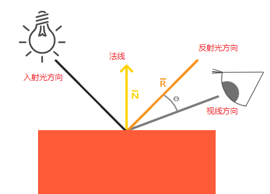
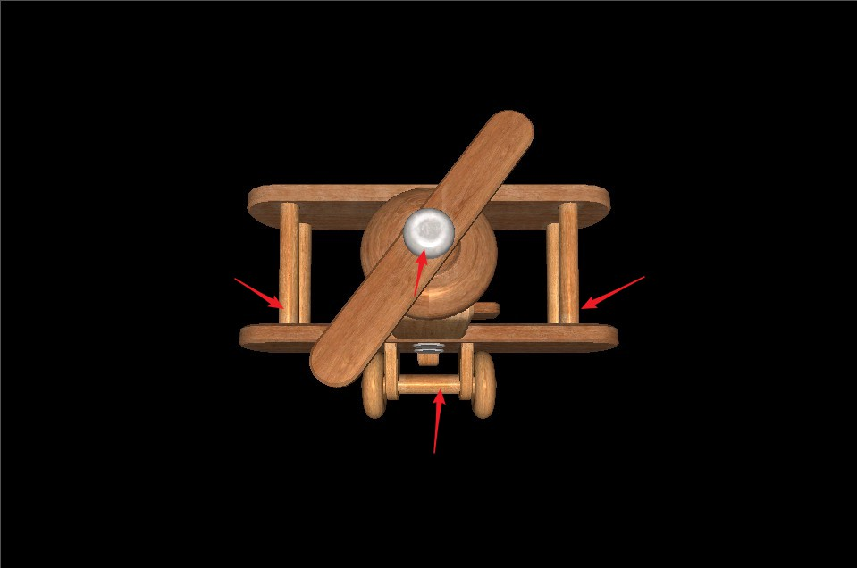

## 23.3 镜面高光光照模型

```bash
CLion项目文件位于 samples\classic_lighting\specular_highlight
```

拿着手电筒，举高到眼镜位置，站在镜子前面，会看到镜子特别亮。

这是因为人看的方向，和电筒光的方向相同，镜子会将手电筒的光完全反射到眼镜里。

这种某一个区域，比其他的地方更特别亮，这个区域被称为高光区域，这种现象就称之为镜面高光。

### 1. 现实世界的镜面高光

用灯，照射到公仔上，会发现拳套上，有高光区域。

当灯位置改变，这个高光区域会移动到其他地方。

<iframe
    width="800" 
    height="450" 
    src="https://player.bilibili.com/player.html??aid=301217402&bvid=BV1bF411P7rc&cid=780258674&page=1" 
    frameborder="0"  
    allowfullscreen>
</iframe>

当人走动，这个高光区域也会移动。

这说明高光的效果，和灯的位置、眼睛的位置有关系。

<iframe
    width="800" 
    height="450" 
    src="https://player.bilibili.com/player.html?aid=428643507&bvid=BV1rG411n7yC&cid=780259314&page=1" 
    frameborder="0"  
    allowfullscreen>
</iframe>

同一个公仔，会发现布料区域，亮度很均匀，不会出现某一块特别亮的情况。

这说明高光的效果，和物体表面材质有关系。

#### 1.1 微平面模型

为什么布料不会出现强反射光，而拳套会出现？

微平面理论认为：世界上不存在百分百的平面，达到微观尺度后，物体表面都是由n个细小的镜面组成的。

粗糙的表面，如公仔的布料，这些细小镜面朝向乱七八糟，就导致了光子射向表面时，被反射到了四面八方。


光滑的表面，如玩偶的拳套，这些细小镜面朝向一致，就导致光子射向表面后，朝一个方向反弹。


### 2.镜面高光光照模型

前面说过了，人之所以能看见东西，是因为光子从光源发射后，击中了物体表面，然后反弹到人眼睛中，然后大脑生成了亮的区域。

当光子击中某个区域反弹，人眼正好位于它反弹的路线，那么此时，这个区域就是最亮的。




镜面高光受到3个因素影响：
1. 灯位置
2. 眼睛位置
3. 物体表面材质反光能力

在上一节漫反射中，已经引入了灯位置，根据灯光方向 与 法线方向 ，计算其Cos值作为受光强度。

现在还需要引入眼睛位置、物体表面材质反光能力。

首先计算光的反射方向，然后计算眼睛的视线方向，求两者的夹角Cos值。

夹角越小，人眼看到的越亮。

这就是镜面高光光照模型。

下面来看片段着色器中具体的实现。

```glsl
//file:data/shader/specular_highlight.frag 

#version 330 core

uniform sampler2D u_diffuse_texture;//颜色纹理

uniform vec3 u_ambient_light_color;//环境光
uniform float u_ambient_light_intensity;//环境光强度

uniform vec3 u_light_pos;
uniform vec3 u_light_color;
uniform float u_light_intensity;

//specular(镜面高光)
uniform vec3 u_view_pos;//眼睛的位置
uniform float u_specular_highlight_intensity;//镜面高光强度
uniform float u_specular_highlight_shininess;//物体反光度，越高反光能力越强，高光点越小。

in vec4 v_color;//顶点色
in vec2 v_uv;
in vec3 v_normal;
in vec3 v_frag_pos;

layout(location = 0) out vec4 o_fragColor;
void main()
{
    //ambient(环境光)
    vec3 ambient_color = u_ambient_light_color * u_ambient_light_intensity * texture(u_diffuse_texture,v_uv).rgb;

    //diffuse(漫反射)
    vec3 normal=normalize(v_normal);
    vec3 light_dir=normalize(u_light_pos - v_frag_pos);
    float diffuse_intensity = max(dot(normal,light_dir),0.0);
    vec3 diffuse_color = u_light_color * diffuse_intensity * u_light_intensity * texture(u_diffuse_texture,v_uv).rgb;

    //specular(镜面高光)
    vec3 reflect_dir=reflect(-light_dir,v_normal);//计算反射光的方向向量
    vec3 view_dir=normalize(u_view_pos-v_frag_pos);//计算视线方向向量
    float cos_value=max(dot(view_dir,reflect_dir),0.0);//计算反射光与视线的夹角cos值
    float spec=pow(cos_value,u_specular_highlight_shininess);//用反光度做次方，计算得到高光值。
    vec3 specular_color = u_light_color * spec * u_specular_highlight_intensity * texture(u_diffuse_texture,v_uv).rgb;

    o_fragColor = vec4(ambient_color + diffuse_color + specular_color,1.0);
}
```

### 3. 设置视角、灯光位置、物体表面参数

设置相机位置：

```lua
--file:example/login_scene.lua line:49

--- 创建主相机
function LoginScene:CreateMainCamera()
    --创建相机1 GameObject
    self.go_camera_= GameObject.new("main_camera")
    --挂上 Transform 组件
    self.go_camera_:AddComponent(Transform):set_position(glm.vec3(0, 0, 10))
    self.go_camera_:GetComponent(Transform):set_rotation(glm.vec3(0, 0, 0))
    --挂上 Camera 组件
    self.camera_=self.go_camera_:AddComponent(Camera)
    --设置为黑色背景
    self.camera_:set_clear_color(0,0,0,1)
end
```

设置灯光位置、物体反射参数：

```lua
--file:example/login_scene.lua line:96

function LoginScene:Update()
    ......

    --设置灯光位置、颜色、强度
    self.material_:SetUniform3f("u_light_pos",glm.vec3(0,0,20))
    self.material_:SetUniform3f("u_light_color",glm.vec3(1.0,1.0,1.0))
    self.material_:SetUniform1f("u_light_intensity",1.0)

    --设置观察者世界坐标(即相机位置)
    local camera_position=self.go_camera_:GetComponent(Transform):position()
    self.material_:SetUniform3f("u_view_pos",camera_position)
    --设置物体反射度、高光强度
    self.material_:SetUniform1f("u_specular_highlight_intensity",1.0)
    self.material_:SetUniform1f("u_specular_highlight_shininess",32.0)

    ......
end
```


### 3. 测试


因为设置的灯光 和 相机，是同一方向的，都位于模型正前方。

所以看到正前方多出高光区域。



### 4. 效果分解

在片段着色器最后的颜色叠加代码，可以单独输出环境光照、Diffuse、高光颜色，来对效果进行分解。


单独输出高光颜色时，如 Specular highlight only 图所示，显示了高光区域。