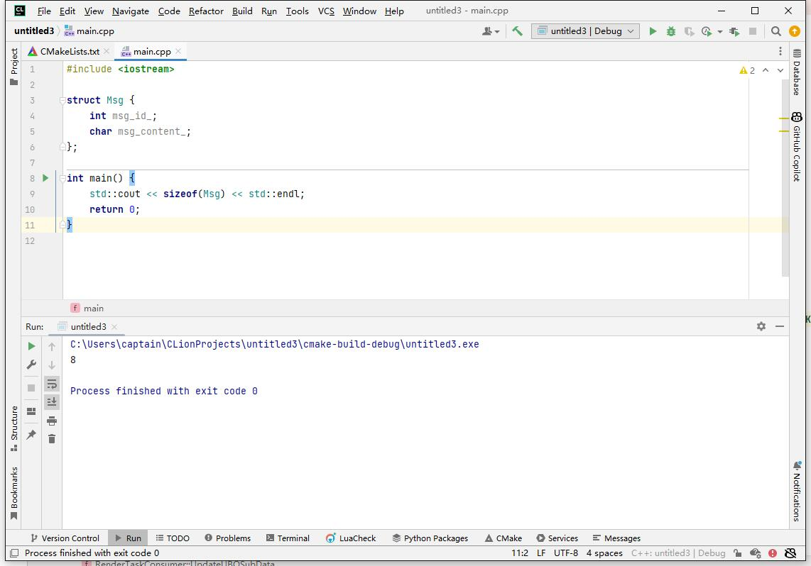
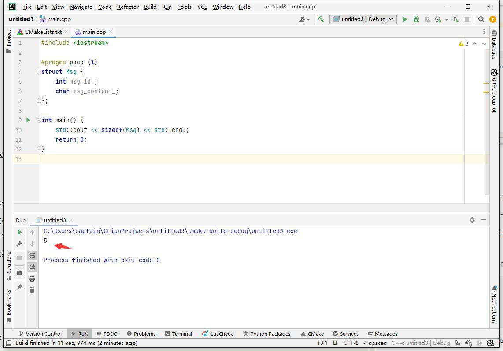
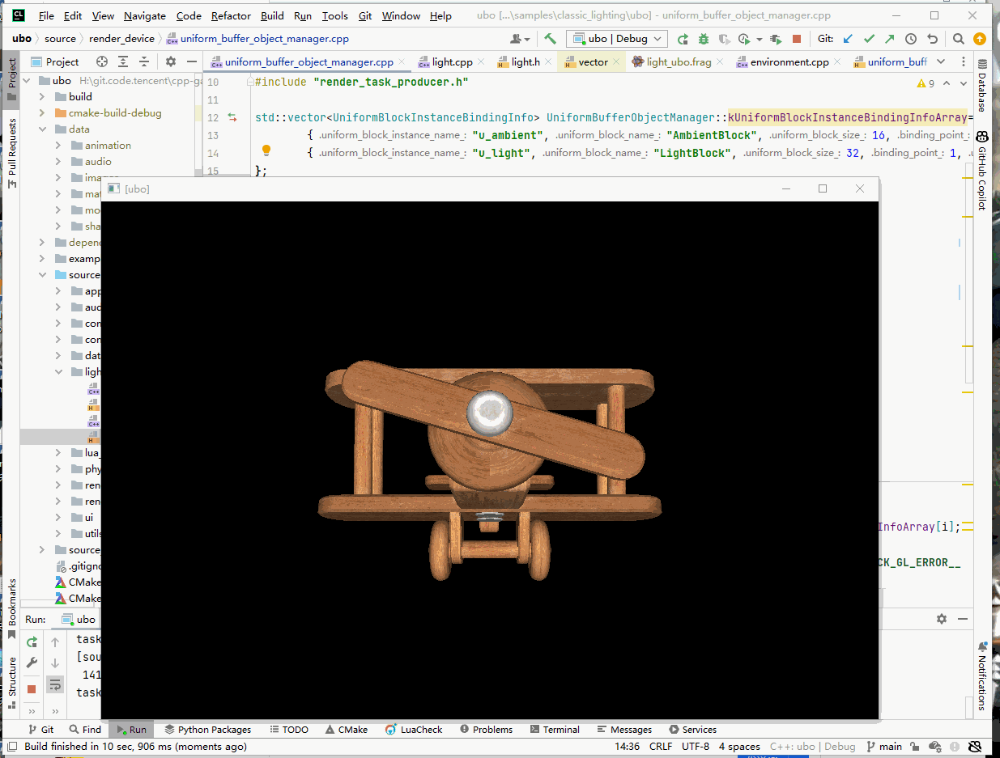
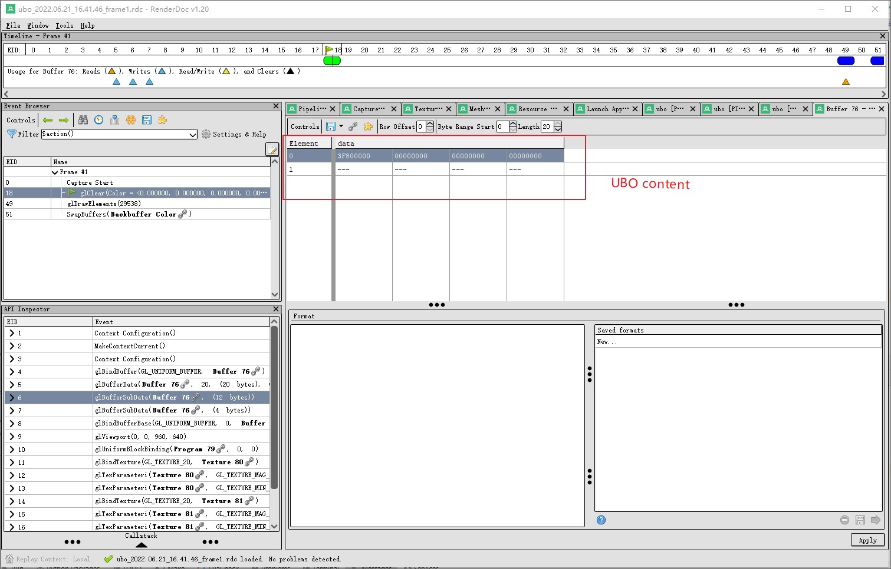
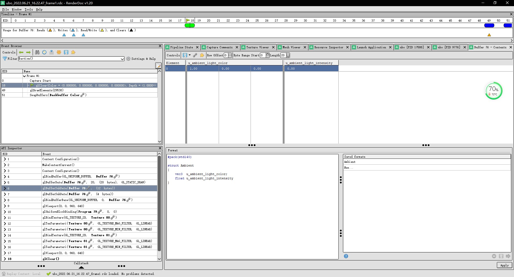
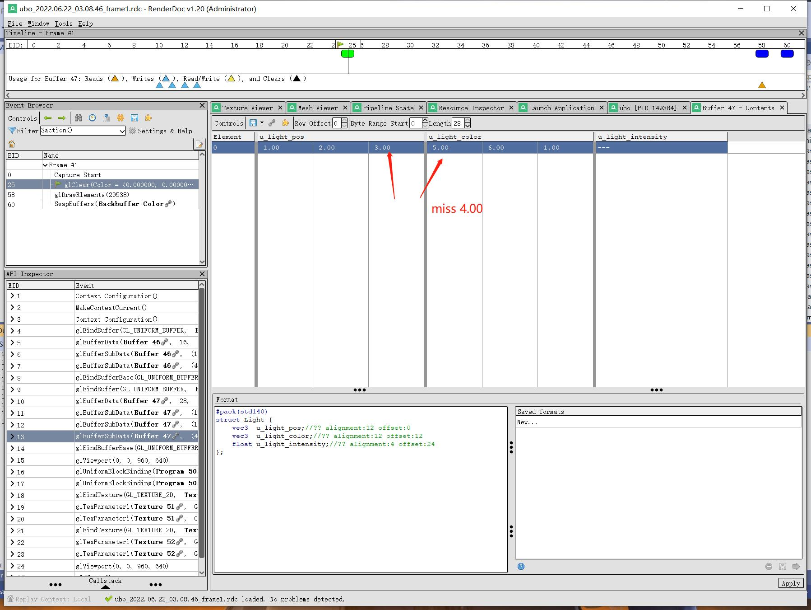

## 23.6 Uniform Buffer Object

```bash
CLion项目文件位于 samples\classic_lighting\ubo
```

你有没有和我一样，觉得很奇怪。

场景中只有一个相机，为什么每渲染一个物体，都需要上传一次MVP矩阵？

`u_view`  `u_projection` 作为静态变量不行吗？

```c++
//file:source/renderer/mesh_renderer.cpp line:123

void MeshRenderer::Render() {
    ......

    shader->Active();
    {
        ......

        //上传mvp矩阵
        RenderTaskProducer::ProduceRenderTaskSetUniformMatrix4fv(shader_program_handle, "u_model", false,model);
        RenderTaskProducer::ProduceRenderTaskSetUniformMatrix4fv(shader_program_handle, "u_view", false,view);
        RenderTaskProducer::ProduceRenderTaskSetUniformMatrix4fv(shader_program_handle, "u_projection", false,projection);

        //上传Texture
        ......
    }
}
```

整个游戏场景中所有的模型，都是使用相同的环境光，为什么每一帧、绘制每个模型都要设置一次环境光参数？

环境光参数作为静态变量不行吗？

```c++
Environment::Environment():
    ambient_color_(glm::vec3(1.0f, 1.0f, 1.0f)),ambient_color_intensity_(1.0f) {
}

void Environment::Update() {
    GameObject::Foreach([this](GameObject* game_object){
        if(game_object->active()==false){
            return;
        }
        MeshRenderer* mesh_renderer=game_object->GetComponent<MeshRenderer>();
        if(mesh_renderer== nullptr){
            return;
        }
        Material* material = mesh_renderer->material();
        material->SetUniform3f("u_ambient.light_color",ambient_color_);
        material->SetUniform1f("u_ambient.light_intensity",ambient_color_intensity_);
    });
}
```

这一节，就来解决这个疑问。

### 1. Uniform的作用范围

在顶点着色器中，使用 `uniform` 修饰了MVP 3个矩阵。

```glsl
//file:data/shader/light_ubo.vert

#version 330 core

uniform mat4 u_model;
uniform mat4 u_view;
uniform mat4 u_projection;

......
```

GPU程序是并行的，`uniform` 修饰的变量，表示在这一次绘制中，是唯一的、不变的。

但是它不是跨GPU程序的。

当这一次绘制完成后，`uniform`变量就无效了。

使用相同Shader，再绘制另一个物体，需要重新设置。

`uniform`变量类似于C++的成员变量，类实例A 中的成员变量，不能作用到 类实例B。

在C++中，可以使用 static 变量，让它全局生效。

或者申请一块内存buffer，使用指针访问，只要不删除，那这块内存buffer也是全局生效的。

在OpenGL里，也可以申请这样一块Buffer，用来存储 `uniform`变量，它叫做 Uniform Buffer Object，简称UBO。

### 2 定义UBO结构

UBO是一个Buffer，它对应的结构在glsl中称之为 Uniform Block，例如下面代码：

```glsl
layout (std140) uniform ExampleBlock
{
    float value;
    vec3  vector;
    mat4  matrix;
    float values[3];
    bool  boolean;
    int   integer;
};
```

将环境光、Light的Struct，存储到Uniform Block中。

```glsl
//file:data/shader/light_ubo.frag line:5

struct Ambient{
    vec3  color;//环境光 alignment:12 offset:0
    float intensity;//环境光强度 alignment:4 offset:12
};

//环境光
layout(std140) uniform AmbientBlock {
    Ambient data;
}u_ambient;

struct Light {
    vec3  pos;//位置 alignment:12 offset:0
    vec3  color;//颜色 alignment:12 offset:16
    float intensity;//强度 alignment:4 offset:28
};

//灯光
layout(std140) uniform LightBlock {
    Light data;
}u_light;
```

### 3. 创建UBO

OpenGL创建Buffer的流程大致相同：
1. glGenBuffers 创建Buffer
2. glBindBuffer 绑定Buffer来使用
3. glBufferData 上传数据到Buffer

创建VBO是使用这套流程，创建UBO也是这套流程。

使用Buffer的流程却有所不同，VBO使用流程如下：
1. glBindBuffer 绑定Buffer来使用
2. 将Buffer与Shader中的变量关联
3. glDrawElements 绘制

而对于UBO，却不是这个流程。

OpenGL提供了一个中间件，叫 `Binding Point`，它是一个数组。

首先将Shader的变量与`Binding Point` 关联起来。

然后将UBO与`Binding Point` 对应起来。


当Shader访问一个Uniform Block里的变量时，先找到Uniform Block关联的 Binding Point，然后找到 Binding Point 对应的UBO。

在C++中将这个流程存储起来。

```c++
//file:source/render_device/uniform_buffer_object_manager.h line:13

/// Uniform Block <==> Binding Point <==> Uniform Buffer Object
class UniformBlockInstanceBindingInfo{
public:
    std::string uniform_block_instance_name_;
    std::string uniform_block_name_;
    unsigned short uniform_block_size_;
    unsigned int binding_point_;
    unsigned int uniform_buffer_object_;
};
```

```c++
std::vector<UniformBlockInstanceBindingInfo> UniformBufferObjectManager::kUniformBlockInstanceBindingInfoArray={
        {"u_ambient","AmbientBlock",16,0,0},
        {"u_light","LightBlock",32,1,0}
};
```

`kUniformBlockInstanceBindingInfoArray` 中指定了Uniform Block的大小。

`AmbientBlock` 大小是16字节。

`LightBlock` 大小是32字节。

并直接指定了Uniform Block关联的 Binding Point。

`AmbientBlock` 关联 Binding Point 0。

`LightBlock` 关联 Binding Point 1。

尚未创建UBO，所以 `uniform_buffer_object_` 都还是0。

那么就来创建UBO，把上面的数据补充完整。

```c++
//file:source/render_device/uniform_buffer_object_manager.cpp line:33

void UniformBufferObjectManager::CreateUniformBufferObject(){
    for (int i = 0; i < kUniformBlockInstanceBindingInfoArray.size(); ++i) {
        UniformBlockInstanceBindingInfo& uniform_block_binding_info=kUniformBlockInstanceBindingInfoArray[i];
        glGenBuffers(1, &uniform_block_binding_info.uniform_buffer_object_);__CHECK_GL_ERROR__
        glBindBuffer(GL_UNIFORM_BUFFER, uniform_block_binding_info.uniform_buffer_object_);__CHECK_GL_ERROR__
        //先不填数据
        unsigned short uniform_block_data_size=uniform_block_binding_info.uniform_block_size_;
        glBufferData(GL_UNIFORM_BUFFER, uniform_block_data_size, NULL, GL_STATIC_DRAW);__CHECK_GL_ERROR__

        //串联 UBO 和 binding point 绑定
        glBindBufferBase(GL_UNIFORM_BUFFER, uniform_block_binding_info.binding_point_, uniform_block_binding_info.uniform_buffer_object_);__CHECK_GL_ERROR__

        glBindBuffer(GL_UNIFORM_BUFFER, 0);__CHECK_GL_ERROR__
    }
}
```

创建UBO后，先不往Buffer里面上传数据，这个工作交给 `Environment` `Light`两个对象，这里只管创建。

然后这里有一个问题，创建UBO时指定的Buffer大小，即Uniform Block的Size，好像不太对？

`AmbientBlock` 是 `vec3 + float`， 大小是16字节，这很OK。

`LightBlock` 是 `vec3 + vec3 + float`， 大小为什么是32字节，难道不是 vec3(12) + vec3(12) + float(4) = 28 字节吗？ 

这都是字节对齐引起的问题。

### 3.1 字节对齐

在C++网络编程的代码中，当想要发送一个Struct到服务器上，我们需要对这个Struct指定字节对齐。

什么是字节对齐？

下面是很常见的一个C++问题：

```c++
//Msg占几个字节？

struct Msg {
    int msg_id_;
    char msg_content_;
};
```

Msg占几个字节？

是int(4) + char(1) = 5 吗？

不是的，是 8：



为什么是8？

这就是字节对齐导致的问题。

默认情况下，排在后面的成员变量，会使用前面的成员变量的Size。

那么Msg的Size就是：int(4) + int(4) = 8。

因为客户端和服务器从硬件、到软件，可能都是不同的架构，其默认的字节对齐数可能不一样，所以需要手动指定一个对齐数。

使用 `#pragma pack (n)` 宏来指定按 n 字节对齐。

```c++
#pragma pack (1)
struct Msg {
    int msg_id_;
    char msg_content_;
};
```

指定按 1 字节对齐后，现在Msg的Size就是是int(4) + char(1) = 5。



OpenGL也是客户端-服务器架构，数据需要从CPU传输到GPU，CPU和GPU的架构不是一致的，所以C++的Struct要上传到GLSL Shader中，就需要指定字节对齐。

### 3.2 std140内存布局

打开片段Shader代码查看，会发现在 Uniform Block 前都添加了 `layout(std140)`。

```glsl
//file:data/shader/light_ubo.frag line:11

//环境光
layout(std140) uniform AmbientBlock {
    Ambient data;
}u_ambient;
```

`std140`是一种常用的内存布局，它的规则和C++默认的字节对齐很相似，所以我们可以预先计算出每个成员变量所占的字节数，以及每个变量的Offset，这样在设置Buffer的时候会很方便。

`std140`遵循以下规则：

```bash
N=4
1. float算1N
2. 单独vec3算4N
3. vec3跟vec3算4N
4. vec3后面跟float，满足4N，那么(vec3+float)就算3N(vec3)+float(1N)=4N
5. struct需要满足4N的倍数
6. strcut[]按struct单个规则，满足4N倍数
```

例如环境光的Struct：

```glsl
//file:data/shader/light_ubo.frag line:5

struct Ambient{
    vec3  color;//环境光 alignment:12 offset:0
    float intensity;//环境光强度 alignment:4 offset:12
};

//环境光
layout(std140) uniform AmbientBlock {
    Ambient data;
}u_ambient;
```

`struct Ambient` 是 `vec3 + float`，符合第4条规则，就是4N，即16字节。

其中，`vec3  color;` 的Offset是0，大小是3N，即12字节。

`float intensity;` 的Offset就是12，大小是1N，即4字节。

这些数据都可以预先算好。

这里将Uniform Block变量的Offset、Size，记录到 `UniformBlock` 这个结构里。

```c++
//file:source/render_device/uniform_buffer_object_manager.h line:30

/// Uniform Block 成员变量信息
class UniformBlockMember{
public:
    std::string member_name_;
    int offset_;
    short data_size_;
};

/// Uniform Block 结构信息
class UniformBlock{
public:
    std::vector<UniformBlockMember> uniform_block_member_vec_;
};
```

```c++
//file:source/render_device/uniform_buffer_object_manager.cpp line:17

std::unordered_map<std::string,UniformBlock> UniformBufferObjectManager::kUniformBlockMap={
        {"AmbientBlock",{
            {
                    {"data.color",0,sizeof(glm::vec3), nullptr},
                    {"data.intensity",12,sizeof(float), nullptr}
                }
         }},
         {"LightBlock",{
                {
                        {"data.pos",0,sizeof(glm::vec3), nullptr},
                        {"data.color",16,sizeof(glm::vec3), nullptr},
                        {"data.intensity",28,sizeof(float), nullptr}
                }
         }}
};
```

后面使用 `glBufferSubData` 更新Buffer数据直接填入，就很方便。

### 4. 关联Shader变量和Binding Point

上面将UBO关联到了Binding Point。

然后要将Uniform Block 关联到 Binding Point。

这个逻辑放在渲染线程。

```c++
//file:source/render_device/render_task_consumer.cpp line:113

/// 串联uniform block与binding point。
/// \param task_base
void RenderTaskConsumer::ConnectUniformBlockAndBindingPoint(RenderTaskBase *task_base) {
    RenderTaskConnectUniformBlockInstanceAndBindingPoint* task= dynamic_cast<RenderTaskConnectUniformBlockInstanceAndBindingPoint*>(task_base);
    GLuint shader_program = GPUResourceMapper::GetShaderProgram(task->shader_program_handle_);

    std::vector<UniformBlockInstanceBindingInfo> uniform_block_instance_binding_info_array= UniformBufferObjectManager::UniformBlockInstanceBindingInfoArray();
    for (int i = 0; i < uniform_block_instance_binding_info_array.size(); ++i) {
        //找到UniformBlock在当前Shader程序的index。(注意这里是用uniform_block_name_，而不是uniform_block_instance_name_)
        std::string uniform_block_name=uniform_block_instance_binding_info_array[i].uniform_block_name_;
        GLuint uniform_block_index = glGetUniformBlockIndex(shader_program, uniform_block_name.c_str());__CHECK_GL_ERROR__
        if(uniform_block_index==GL_INVALID_INDEX){//当前Shader程序没有这个UniformBlock
            continue;
        }
        //关联当前Shader的UniformBlock到BindingPoint，这样间接与UniformBufferObject有了联系。
        GLuint uniform_block_binding_point=uniform_block_instance_binding_info_array[i].binding_point_;
        glUniformBlockBinding(shader_program, uniform_block_index, uniform_block_binding_point);__CHECK_GL_ERROR__
    }
}
```

先通过 Uniform Block名字，例如`AmbientBlock`，来获取Uniform Block的Index。

然后将Uniform Block的Index 关联到 Binding Point。

在主线程发出编译Shader任务后，就可以发出关联Uniform Block 到 Binding Point的任务了。

```c++
//file:source/renderer/shader.cpp line:42

void Shader::Parse(string shader_name) {
    ......

    CreateShaderProgram(vertex_shader_source.c_str(), fragment_shader_source.c_str());
    ConnectUniformBlockAndBindingPoint();
}

void Shader::CreateShaderProgram(const char* vertex_shader_text, const char* fragment_shader_text) {
    //编译Shader任务
    shader_program_handle_=GPUResourceMapper::GenerateShaderProgramHandle();
    RenderTaskProducer::ProduceRenderTaskCompileShader(vertex_shader_text, fragment_shader_text, shader_program_handle_);
}

/// 串联uniform block与binding point
void Shader::ConnectUniformBlockAndBindingPoint() {
    RenderTaskProducer::ProduceRenderTaskConnectUniformBlockAndBindingPoint(shader_program_handle_);
}
```

### 5. 更新UBO

完成了Uniform Block、Binding Point、UBO三者的绑定后，就可以更新UBO的数据了。

前面将Uniform Block的大小、成员变量的Offset、大小都计算好了，那更新UBO就比较简单了。

更新UBO任务在渲染线程中执行。

```c++
//file:source/render_device/render_task_consumer.cpp line:303

/// 更新UBO
/// \param task_base
void RenderTaskConsumer::UpdateUBOSubData(RenderTaskBase* task_base){
    RenderTaskUpdateUBOSubData* task=dynamic_cast<RenderTaskUpdateUBOSubData*>(task_base);

    std::vector<UniformBlockInstanceBindingInfo>& uniform_block_instance_binding_info_array= UniformBufferObjectManager::UniformBlockInstanceBindingInfoArray();
    std::unordered_map<std::string,UniformBlock>& uniform_block_map= UniformBufferObjectManager::UniformBlockMap();

    for (int i = 0; i < uniform_block_instance_binding_info_array.size(); ++i) {
        //找到UniformBlock实例信息
        UniformBlockInstanceBindingInfo& uniform_block_instance_binding_info=uniform_block_instance_binding_info_array[i];
        if(uniform_block_instance_binding_info.uniform_block_instance_name_ != task->uniform_block_instance_name_){
            continue;
        }

        glBindBuffer(GL_UNIFORM_BUFFER, uniform_block_instance_binding_info.uniform_buffer_object_);__CHECK_GL_ERROR__

        //以UniformBlock实例对应的UniformBlock名，获取对应的结构信息。
        UniformBlock uniform_block=uniform_block_map[uniform_block_instance_binding_info.uniform_block_name_];
        for (auto& uniform_block_member:uniform_block.uniform_block_member_vec_) {
            //找到对应的成员变量。
            if(uniform_block_member.member_name_!=task->uniform_block_member_name_){
                continue;
            }

            //更新对应成员变量数据。
            glBufferSubData(GL_UNIFORM_BUFFER, uniform_block_member.offset_, uniform_block_member.data_size_, task->data);__CHECK_GL_ERROR__
        }

        glBindBuffer(GL_UNIFORM_BUFFER, 0);__CHECK_GL_ERROR__
    }
}
```

然后新增发出更新任务的API：

```c++
//file:source/render_device/uniform_buffer_object_manager.cpp line:49

/// 更新UBO数据(float)
/// \param uniform_block_name
/// \param uniform_block_member_name
/// \param value
void UniformBufferObjectManager::UpdateUniformBlockSubData1f(std::string uniform_block_name, std::string uniform_block_member_name, float value){
    void* data= malloc(sizeof(float));
    memcpy(data,&value,sizeof(float));
    RenderTaskProducer::ProduceRenderTaskUpdateUBOSubData(uniform_block_name,uniform_block_member_name,data);
}

/// 更新UBO数据(vec3)
/// \param uniform_block_name
/// \param uniform_block_member_name
/// \param value
void UniformBufferObjectManager::UpdateUniformBlockSubData3f(std::string uniform_block_name, std::string uniform_block_member_name, glm::vec3& value){
    void* data= malloc(sizeof(glm::vec3));
    memcpy(data,&value,sizeof(glm::vec3));
    RenderTaskProducer::ProduceRenderTaskUpdateUBOSubData(uniform_block_name,uniform_block_member_name,data);
}
```

#### 5.1 更新环境光UBO

在设置环境光参数时，发出更新环境光UBO的任务：

```c++
//file:source/lighting/environment.cpp line:17

/// 设置环境颜色
void Environment::set_ambient_color(const glm::vec3 &ambient_color) {
    ambient_color_ = ambient_color;
    UniformBufferObjectManager::UpdateUniformBlockSubData3f("u_ambient","data.color",ambient_color_);
}


/// 设置环境强度
void Environment::set_ambient_color_intensity(float ambient_color_intensity){
    ambient_color_intensity_ = ambient_color_intensity;
    UniformBufferObjectManager::UpdateUniformBlockSubData1f("u_ambient","data.intensity",ambient_color_intensity_);
}
```

这里也要注意一点，前面关联Uniform Block 到 Binding Point，使用的是 Uniform Block 名，例如：`AmbientBlock`。

更新UBO，就需要使用 Uniform Block 实例名，例如 `u_ambient`。

#### 5.2 更新Light UBO

在设置Light参数时，发出更新Light UBO的任务：

```c++
//file:source/lighting/light.cpp line:24

void Light::Update(){
    glm::vec3 light_position=game_object()->GetComponent<Transform>()->position();
    UniformBufferObjectManager::UpdateUniformBlockSubData3f("u_light","data.pos",light_position);
}

void Light::set_color(glm::vec3 color){
    color_ = color;
    UniformBufferObjectManager::UpdateUniformBlockSubData3f("u_light","data.color",color_);
};

void Light::set_intensity(float intensity){
    intensity_ = intensity;
    UniformBufferObjectManager::UpdateUniformBlockSubData1f("u_light","data.intensity",intensity_);
};
```

### 6. 测试




### 7. RenderDoc校验UBO数据

虽然在定义std140内存布局的Uniform Block时，可以预先计算出整体的尺寸、成员变量的offset以及尺寸，但对新手来说，这并非是个容易的事情。

当你辛辛苦苦写完了代码去测试，发现屏幕一片黑，什么都没有渲染出来，该如何去定位问题？

是否是因为更新UBO数据时，用了错误的Offset？

使用RenderDoc可以辅助查找问题。

RenderDoc的基础操作，请查看后面章节：[90.1 RenderDoc分析不显示bug](90. gpu_analysis_tools/90.1 renderdoc_analysis_not_show_bugs.md)

#### 7.1 查看UBO内容

用RenderDoc截取一帧，打开UBO查看数据，看到的都是十六进制的，如下图：



在下面中间空白处，输入Uniform Block结构，就可以将十六进制数据格式化显示了。



来看动图：


#### 7.2 分析问题

检查C++中传入的数据，与RenderDoc中显示的数据，进行对比，就可以看出是否更新UBO出错。

比较简单的测试方法是，将Uniform Block结构的成员变量设置为连续的数字。

例如下面在RenderDoc中就检查到，缺了一个数字，那说明Offset计算错了。



第2个变量Offset算的多了4，连锁反应导致第3个变量没有值。

### 8. 其他参考

相比VBO，为什么UBO的使用如此复杂，为什么要引入 Binding Point 这个中间件？

这是因为，高版本的OpenGL，将更多的控制权交给了程序员，那么就必然会有更多的API需要调用。

高版本的OpenGL，使用VBO，也是需要使用 Binding Point 的，只是OpenGL对低版本使用方式进行了兼容。

参照：`https://www.khronos.org/opengl/wiki/Vertex_Specification#Separate_attribute_format`


