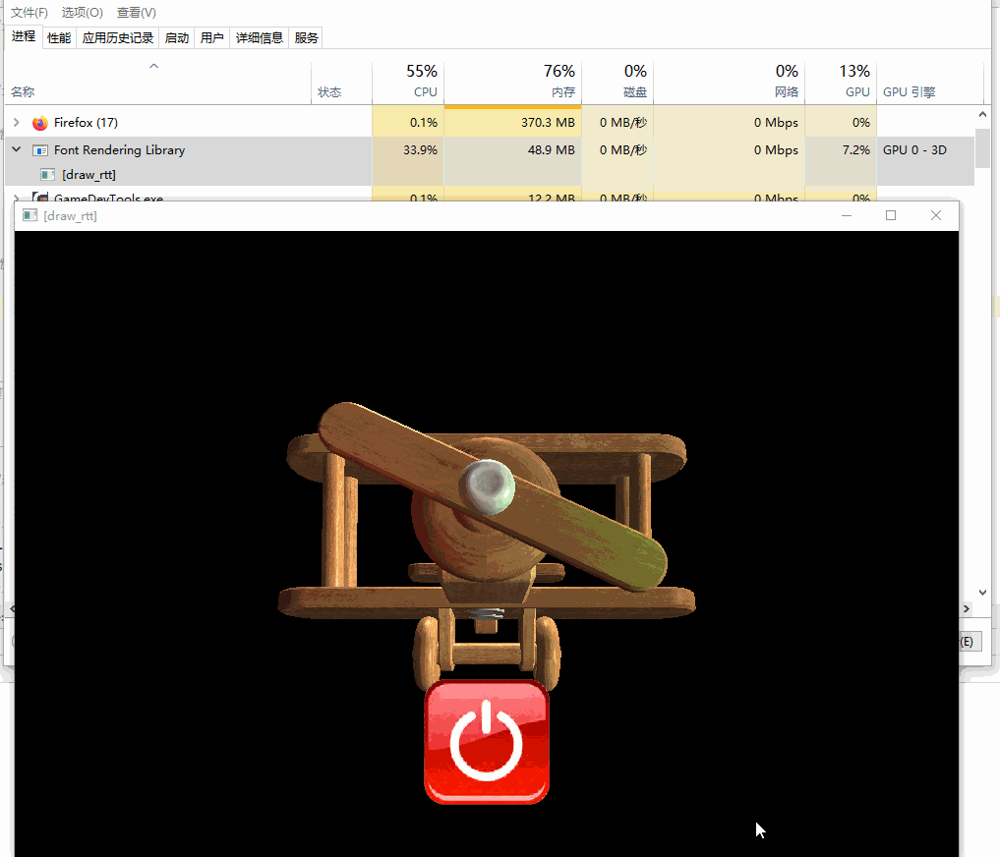
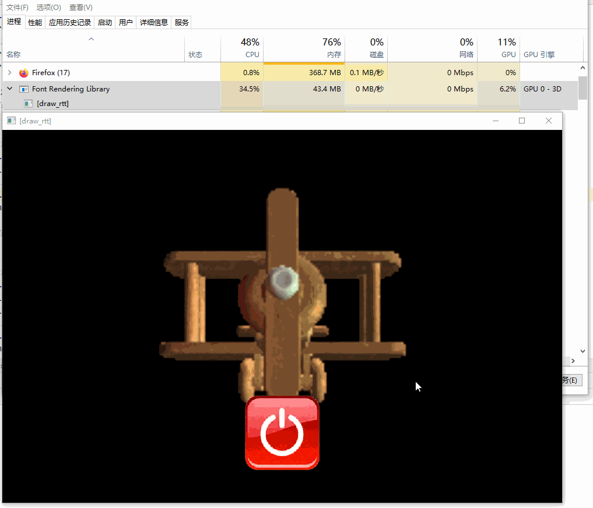
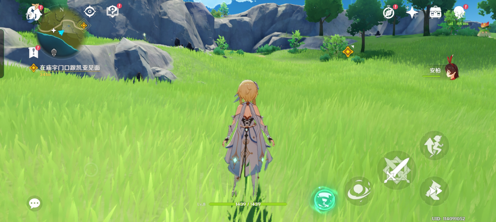
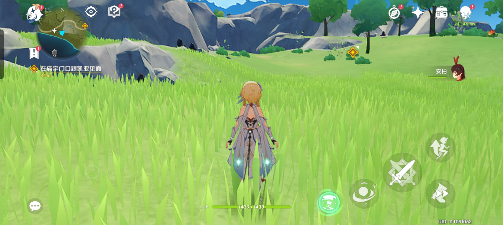
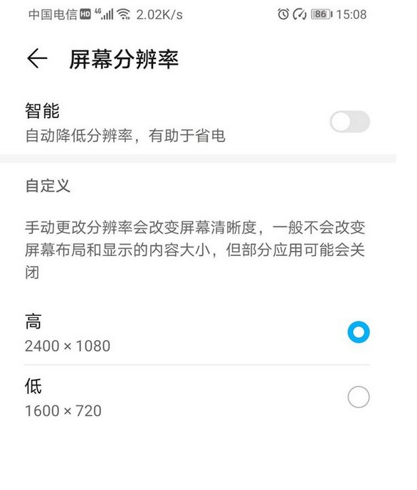

## 24.2 FBO与RenderTexture

```bash
CLion项目文件位于 samples\engine_editor\draw_rtt
```

原神游戏画面为何变糊，手机厂商宣称的GameTurbo又是如何提升帧率？

这到底是米哈游的技术优化，还是手机厂商的丧心病狂？

DLSS/FSR又是何方神圣，与GameTurbo有何区别？

### 1. 什么是FBO？

```text
参考：https://www.khronos.org/opengl/wiki/Rendering_Pipeline_Overview
```

在OpenGL里，在顶点着色器计算好顶点在屏幕坐标，在片段着色器计算好像素颜色之后，还需要经过下列测试：

1. 裁剪测试：判断像素是否窗口内
2. 模板测试
3. 深度测试

在 `14.3 UIMask` 介绍了模板测试，这里就不再重复。

#### 1.1 深度测试与深度缓冲区

和模板测试一样，GPU中有一个二维数组缓冲区，尺寸等于屏幕尺寸，每个像素对应数组的一个值，这个值就是当前像素记录的深度，这个二维数组缓冲区就是深度缓冲区。

垂直于屏幕的一条直线上，可能有多个片段。

OpenGL每处理一个片段，就把它的深度记录到深度缓冲区，当处理下一个片段的深度比这个大，那就抛弃这个片段，否则就更新深度值。

就是通过这个处理，实现了近处物体遮挡远处物体。

#### 1.2 颜色缓冲区

经过深度测试后，还需要进行颜色混合运算、逻辑运算、ColorMask运算，然后可以确定了要显示的颜色。

每个像素点都有一个颜色值，那么也需要一个二维数组，记录整个屏幕的颜色值，这个二维数组就是颜色缓冲区。

#### 1.3 帧缓冲区

这一系列的测试所需要的缓冲区，每一帧它们都会刷新重置，它们都归属于帧缓冲区。

默认情况下，是由操作系统提供的帧缓冲区。

操作系统提供的默认帧缓冲区，是直接输出到显示器上的，应用程序没法对其进行修改。

所以OpenGL提供了帧缓冲区对象(OpenGL FrameBuffer Object)，简称FBO，将模板、深度、颜色先存储到FBO中，然后再输出到系统提供的默认帧缓冲区中。 

有了FBO这个中间对象后，我们就可以对FBO进行修改，例如修改色调、加后期等。

### 1.4 附着点


OpenGL的FBO自身并不存储数据，它记录着颜色缓冲区、深度缓冲区的指针。

也就是说，我们需要创建颜色缓冲区、深度缓冲区，然后指定到FBO里。

这个指针，叫做附着点。

FBO包括一个模板附着点、一个深度附着点、多个颜色附着点。

1. 模板数据，其实是int 二维数组。
2. 深度数据，也是  int 二维数组。
3. 颜色数据，其实是vec3二维数组。

int二维数组，其实就是单通道纹理。
vec3二维数组，就是3通道纹理。

所以，3种附着点，都可以设置为Texture，就是模板贴图、深度贴图、颜色贴图，也就是RenderTexture。

而我们日常所说的RenderTexture，一般是指颜色贴图。

当启用了模板测试，则必须设置模板附着点，不然模板数据没有地方存储，就不会进行模板测试。

当启用了深度测试，则必须设置深度附着点，不然狠毒数据没有地方存储，就不会进行深度测试。

### 2. 创建FBO与RenderTexture

在OpenGL中使用FBO特别简单。

当创建了FBO对象，并且指定了使用它，那么OpenGL就会渲染到FBO里。

创建FBO之前，先来创建深度附着点、颜色附着点所需的Texture。

这里新建`RenderTexture`类，来创建Texture与FBO。

```c++
//file:source/renderer/render_texture.h

class Texture2D;
class RenderTexture {
public:
    RenderTexture();
    ~RenderTexture();

    /// 初始化RenderTexture，在GPU生成帧缓冲区对象(FrameBufferObject)
    /// \param width
    /// \param height
    void Init(unsigned short width,unsigned short height);

    unsigned short width(){
        return width_;
    }
    void set_width(unsigned short width){
        width_=width;
    }

    unsigned short height(){
        return height_;
    }
    void set_height(unsigned short height){
        height_=height;
    }

    unsigned int frame_buffer_object_handle(){
        return frame_buffer_object_handle_;
    }
    /// 是否正在被使用
    bool in_use(){
        return in_use_;
    }
    void set_in_use(bool in_use){
        in_use_=in_use;
    }
    Texture2D* color_texture_2d(){
        return color_texture_2d_;
    }
    Texture2D* depth_texture_2d(){
        return depth_texture_2d_;
    }
private:
    unsigned short width_;
    unsigned short height_;
    unsigned int frame_buffer_object_handle_;//关联的FBO Handle
    Texture2D* color_texture_2d_;//FBO颜色附着点关联的颜色纹理
    Texture2D* depth_texture_2d_;//FBO深度附着点关联的深度纹理
    bool in_use_;//正在被使用
};
```

```c++
//file:source/renderer/render_texture.cpp

RenderTexture::RenderTexture(): width_(128), height_(128), frame_buffer_object_handle_(0),in_use_(false),
                                color_texture_2d_(nullptr),depth_texture_2d_(nullptr) {
}

RenderTexture::~RenderTexture() {
    if(frame_buffer_object_handle_>0){
        RenderTaskProducer::ProduceRenderTaskDeleteFBO(frame_buffer_object_handle_);
    }
    //删除Texture2D
    if(color_texture_2d_!= nullptr){
        delete color_texture_2d_;
    }
    if(depth_texture_2d_!= nullptr){
        delete depth_texture_2d_;
    }
}

void RenderTexture::Init(unsigned short width, unsigned short height) {
    width_=width;
    height_=height;
    color_texture_2d_=Texture2D::Create(width_,height_,GL_RGB,GL_RGB,GL_UNSIGNED_SHORT_5_6_5, nullptr,0);
    depth_texture_2d_=Texture2D::Create(width_,height_,GL_DEPTH_COMPONENT,GL_DEPTH_COMPONENT,GL_UNSIGNED_SHORT, nullptr,0);
    //创建FBO任务
    frame_buffer_object_handle_ = GPUResourceMapper::GenerateFBOHandle();
    RenderTaskProducer::ProduceRenderTaskCreateFBO(frame_buffer_object_handle_,width_,height_,color_texture_2d_->texture_handle(),depth_texture_2d_->texture_handle());
}
```

在`RenderTexture::Init`里，发出了创建Texture与FBO的任务。

在渲染线程中，执行创建FBO的逻辑。

```c++
//file:source/render_device/render_task_consumer.cpp line:423

/// 创建FBO任务
void RenderTaskConsumer::CreateFBO(RenderTaskBase* task_base){
    RenderTaskCreateFBO* task=dynamic_cast<RenderTaskCreateFBO*>(task_base);
    //查询当前GL实现所支持的最大的RenderBufferSize,就是尺寸
    GLint support_size=0;
    glGetIntegerv(GL_MAX_RENDERBUFFER_SIZE, &support_size);
    //如果我们设定的尺寸超过了所支持的尺寸，就抛出错误
    if (support_size <= task->width_ || support_size <= task->height_) {
        DEBUG_LOG_ERROR("CreateFBO FBO Size Too Large!Not Support!");
        return;
    }
    //创建FBO
    GLuint frame_buffer_object_id=0;
    glGenFramebuffers(1, &frame_buffer_object_id);__CHECK_GL_ERROR__
    if(frame_buffer_object_id==0){
        DEBUG_LOG_ERROR("CreateFBO FBO Error!");
        return;
    }
    GPUResourceMapper::MapFBO(task->fbo_handle_, frame_buffer_object_id);

    glBindFramebuffer(GL_FRAMEBUFFER, frame_buffer_object_id);__CHECK_GL_ERROR__
    //将颜色纹理绑定到FBO颜色附着点
    GLuint color_texture=GPUResourceMapper::GetTexture(task->color_texture_handle_);
    glFramebufferTexture2D(GL_FRAMEBUFFER, GL_COLOR_ATTACHMENT0, GL_TEXTURE_2D, color_texture, 0);__CHECK_GL_ERROR__
    //将深度纹理绑定到FBO深度附着点
    GLuint depth_texture=GPUResourceMapper::GetTexture(task->depth_texture_handle_);
    glFramebufferTexture2D(GL_FRAMEBUFFER, GL_DEPTH_ATTACHMENT, GL_TEXTURE_2D, depth_texture, 0);__CHECK_GL_ERROR__

    glBindFramebuffer(GL_FRAMEBUFFER, 0);__CHECK_GL_ERROR__
}
```

创建了FBO之后，将创建的颜色纹理和深度纹理，分别绑定到FBO的颜色附着点、深度附着点上。

### 3. 渲染到RenderTexture

创建RenderTexture实例，并调用`RenderTexture::Init`初始化之后，FBO也就创建好了。

接下来在每一帧开始渲染时，设置将场景渲染到RenderTexture。

实例框架的渲染，是遍历所有Camera，然后在Camera下遍历所有MeshRenderer。

那么只要在Camera遍历MeshRenderer之前，设置好RenderTexture，就可以使用FBO了。

在`Camera`添加`RenderTexture`成员变量。

```c++
//file:source/renderer/camera.h

class Camera: public Component {
public:
    ......

    /// 检查target_render_texture_是否设置，是则使用FBO，渲染到RenderTexture。
    void CheckRenderToTexture();

    /// 检查是否要取消使用RenderTexture.
    void CheckCancelRenderToTexture();

    /// 设置渲染目标RenderTexture
    /// \param render_texture
    void set_target_render_texture(RenderTexture* render_texture);

    /// 清空渲染目标RenderTexture
    void clear_target_render_texture();
protected:
    ......

    RenderTexture* target_render_texture_;//渲染目标RenderTexture

    ......
};
```

在每个`Camera`的每一帧渲染之前，都检查是否指定了RenderTexture，如果指定了，就使用FBO，将游戏画面渲染到FBO。

```c++
//file:source/renderer/camera.cpp line:71

/// 检查target_render_texture_是否设置，是则使用FBO，渲染到RenderTexture。
void Camera::CheckRenderToTexture(){
    if(target_render_texture_== nullptr){//没有设置目标RenderTexture
        return;
    }
    if(target_render_texture_->in_use()){
        return;
    }
    if(target_render_texture_->frame_buffer_object_handle() == 0){//还没有初始化，没有生成FBO。
        return;
    }
    RenderTaskProducer::ProduceRenderTaskSetViewportSize(target_render_texture_->width(),target_render_texture_->height());
    RenderTaskProducer::ProduceRenderTaskBindFBO(target_render_texture_->frame_buffer_object_handle());
    target_render_texture_->set_in_use(true);
}

/// 检查是否要取消使用RenderTexture.
void Camera::CheckCancelRenderToTexture(){
    if(target_render_texture_== nullptr){//没有设置目标RenderTexture
        return;
    }
    if(target_render_texture_->in_use()==false){
        return;
    }
    if(target_render_texture_->frame_buffer_object_handle() == 0){//还没有初始化，没有生成FBO。
        return;
    }
    //更新ViewPort的尺寸
    RenderTaskProducer::ProduceRenderTaskSetViewportSize(Screen::width(),Screen::height());
    RenderTaskProducer::ProduceRenderTaskUnBindFBO(target_render_texture_->frame_buffer_object_handle());
    target_render_texture_->set_in_use(false);
}

/// 设置渲染目标RenderTexture
/// \param render_texture
void Camera::set_target_render_texture(RenderTexture* render_texture){
    if(render_texture== nullptr){
        clear_target_render_texture();
    }
    target_render_texture_=render_texture;
}

/// 清空渲染目标RenderTexture
void Camera::clear_target_render_texture() {
    if(target_render_texture_== nullptr){//没有设置目标RenderTexture
        return;
    }
    if(target_render_texture_->in_use()== false){
        return;
    }
    RenderTaskProducer::ProduceRenderTaskUnBindFBO(target_render_texture_->frame_buffer_object_handle());
    target_render_texture_->set_in_use(false);
}

......

void Camera::Foreach(std::function<void()> func) {
    for (auto iter=all_camera_.begin();iter!=all_camera_.end();iter++){
        current_camera_=*iter;
        current_camera_->CheckRenderToTexture();
        current_camera_->Clear();
        func();
        current_camera_->CheckCancelRenderToTexture();
    }
}
```

要注意的是，当设置了FBO之后，所有的物体就会被渲染到FBO上，FBO顶替了系统默认帧缓冲区。

我们可以简单的认为，FBO就是一个看不见的屏幕，所以使用FBO也叫做<font color=green>离屏渲染</font>。

由于FBO附着点上的Texture尺寸，并不一定等于窗口尺寸，所以设置FBO时，需要更新ViewPort的尺寸：

```c++
//file:source/renderer/camera.cpp line:96

/// 检查是否要取消使用RenderTexture.
void Camera::CheckCancelRenderToTexture(){
    ......

    //更新ViewPort的尺寸
    RenderTaskProducer::ProduceRenderTaskSetViewportSize(Screen::width(),Screen::height());
    RenderTaskProducer::ProduceRenderTaskUnBindFBO(target_render_texture_->frame_buffer_object_handle());

    ......
}
```

### 4. 测试

在之前的Lua代码中，渲染了一个飞机。

现在我们创建好RenderTexture，然后设置到3D Camera上，将飞机渲染到RenderTexture上。

然后再将RenderTexture以UI的形式显示出来。

```lua
--file:example/login_scene.lua

......

--- 创建主相机
function LoginScene:CreateMainCamera()
    --创建相机1 GameObject
    self.go_camera_= GameObject.new("main_camera")
    --挂上 Transform 组件
    self.go_camera_:AddComponent(Transform):set_position(glm.vec3(0, 0, 10))
    self.go_camera_:GetComponent(Transform):set_rotation(glm.vec3(0, 0, 0))
    --挂上 Camera 组件
    self.camera_=self.go_camera_:AddComponent(Camera)
    --设置为黑色背景
    self.camera_:set_clear_color(0,0,0,1)
    self.camera_:set_depth(0)
    self.camera_:set_culling_mask(1)
    self.camera_:SetView(glm.vec3(0.0,0.0,0.0), glm.vec3(0.0,1.0,0.0))
    self.camera_:SetPerspective(60, Screen:aspect_ratio(), 1, 1000)
    --设置RenderTexture
    self.render_texture_ = RenderTexture.new()
    self.render_texture_:Init(960,640)
    self.camera_:set_target_render_texture(self.render_texture_)
end

......

function LoginScene:CreateUI()
    -- 创建UI相机 GameObject
    self.go_camera_ui_=GameObject.new("ui_camera")
    -- 挂上 Transform 组件
    local transform_camera_ui=self.go_camera_ui_:AddComponent(Transform)
    transform_camera_ui:set_position(glm.vec3(0, 0, 10))
    -- 挂上 Camera 组件
    local camera_ui=self.go_camera_ui_:AddComponent(UICamera)
    camera_ui:set_culling_mask(2)
    -- 设置正交相机
    camera_ui:SetView(glm.vec3(0, 0, 0), glm.vec3(0, 1, 0))
    camera_ui:SetOrthographic(-Screen.width()/2,Screen.width()/2,-Screen.height()/2,Screen.height()/2,-100,100)

    -- 创建 UIImage
    self.go_ui_image_rtt_=GameObject.new("draw render texture")
    self.go_ui_image_rtt_:set_layer(2)
    -- 设置尺寸
    local rect_transform=self.go_ui_image_rtt_:AddComponent(RectTransform)
    rect_transform:set_rect(glm.vec2(960,640))
    -- 挂上 UIImage 组件，将RenderTexture绘制出来
    local ui_image_mod_bag=self.go_ui_image_rtt_:AddComponent(UIImage)
    ui_image_mod_bag:set_texture(self.render_texture_:color_texture_2d())
end

......
```

运行后效果：


和之前不使用RenderTexture的效果一致。

效果一致的原因是，本质上FBO可以看做是一块临时的软屏幕，将原本要输出到系统屏幕缓冲区的颜色数据，输出到了FBO。

另外一个原因就是，我们上面的代码，创建的RenderTexture尺寸，和实际系统屏幕缓冲区尺寸，也就是窗口尺寸是一致的。

### 5. GameTurbo

这里有个有意思的是，RenderTexture的宽高。

在Unity创建RenderTexture，也是需要指定宽高的。

这或许是句废话，创建Texture，当然需要指定宽高。

那这个宽高会影响到什么？

默认情况下，OpenGL是使用系统提供的默认帧缓冲区，而这个默认帧缓冲区，就等于屏幕像素值，当你的手机是960x640，那就是960x640。

这就意味着，每一帧，片段处理器要执行960x640次。

那现在使用了OpenGL的FBO，创建了240x160大小的RenderTexture，那么片段处理器就只需要处理240x160次了。

这个性能提升怎么样呢？

下图是960x640的原生分辨率RenderTexture下，GPU在6.1&-7.4%之间浮动。



下图是240x160的超低分辨率RenderTexture下，GPU在4.7&-6.2%之间浮动。



提升巨大！

当然了，FBO的颜色数据最终还是要送到系统默认的帧缓冲区去的，要呈现在显示器中。

这个时候240x160的数据，要显示到960x640的屏幕上，就会模糊了。

而红色的关机按钮，是作为UI渲染，并没有使用FBO。

很多大型手游为了保证流畅度，都会选中这种，降低场景FBO分辨率、保证UI原生分辨率的方式。

下面是我在原神里，截取的极高、极低画面效果对比，设备为一加Ace Pro。

可以看到场景人物分辨率差距很大，而UI并没有变化。





现在各品牌手机也有类似功能，智能分辨率，就是检测到游戏负载压力大时，直接就把游戏的默认帧缓冲区分辨率给降低。

好处都不用游戏自己来写逻辑，带来的问题就是，不仅场景人物模糊了，UI都给模糊了……



所以玩家们还是要关闭这种系统优化，在游戏自带的设置里调整比较好。

### 6. DLSS/FSR


上面我们将游戏场景渲染到240x160的RenderTexture上，然后放到到960x640，性能得到极大提升，但是画面变得特别模糊。

我之前用过一些人工智能放大图片的软件，可以将低分辨率图片，放到至2x、4x大小，而保持一定的清晰度。

```text
https://github.com/nagadomi/waifu2x/
```


那DLSS是什么，和这一小节有什么关联呢？


从网上摘抄一段DLSS简介：

```text

NVIDIA DLSS是唯一由AI驱动的超级分辨率技术，这一优势可转化为最高2倍的游戏性能提升。

同时它也是唯一可用的缩放技术，借助深度学习神经网络，确保图像质量媲美原生分辨率。

图像缩放技术若没有AI支持的时间性缩放，生成的图像会产生难看的伪影，如运动伪影、闪烁图案和暗淡、模糊的纹理。

简单来说DLSS就是利用AI深度学习神经网络在不影响图像质量的同时提升性能，带给玩家最好的画质和游戏体验。

```

DLSS是一种超分辨率技术，就是将低分辨率图片，借助AI技术，将其放大至2X，4X倍数，而不会变模糊。

而DLSS可以将240x160的RenderTexture，借助AI技术，将其放大到960x640，甚至1920x1080。

上面用AI放大图片是离线的，而DLSS是实时的。

你就说厉害不厉害！

DLSS是NVIDIA的，而FSR是AMD家开源的。

后续有希望在手机上使用到FSR，届时手游性能会有一个新的提升，这不是GameTurbo这种伪技术可以比拟的。

