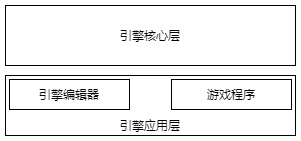
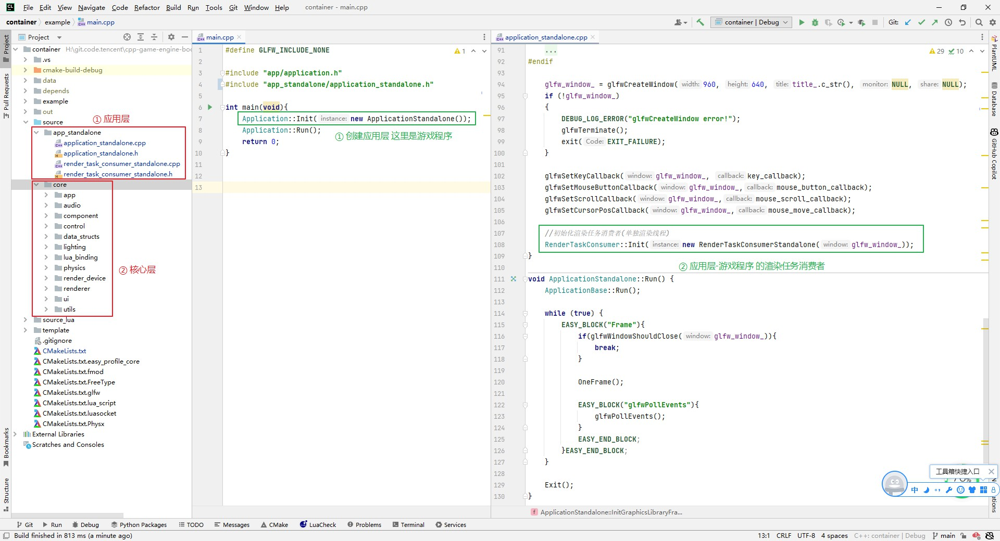

## 24.4 分离引擎核心层和应用层

```bash
CLion项目文件位于 samples\engine_editor\container
```

回顾前面的章节实例，我们是在做一个游戏程序，而不是一个游戏引擎！

### 1. 游戏程序和引擎程序

在`Application`里启动，创建初始化glfw，然后开始loop刷帧，这和我鼠标双击启动游戏是一个流程，所以它更像是一个游戏，而不是一个引擎。

在编辑器里制作UI、搭建场景，然后发布一个游戏包，这才像是使用游戏引擎的姿势。

这也就是我们的目标，不过现在要先做一件事情。

### 2. 引擎应用层和核心层

在引擎编辑器里播放一个人物动画，需要用到引擎的骨骼动画渲染。

在发布的游戏包里播放一个人物动画，也需要用到引擎的骨骼动画渲染。

为了播放一段音乐，它们都需要引擎的音频模块。

那么这些共用的模块，就需要提取出来，作为引擎核心层。

然后将引擎编辑器和游戏包的一些逻辑单独抽取出来，作为应用层。



这一小节，我们先对项目进行架构整理，抽取出应用层基类(ApplicationBase)，然后实现子类:游戏程序类(ApplicationStandalone)。

下一节再实现子类:引擎编辑器程序类，并集成Imgui，实现编辑器。

### 3. 应用层架构

游戏程序和编辑器相比较，有以下几点不同：

1. 游戏程序直接创建一个游戏窗口，而编辑器创建编辑器窗口，然后再运行游戏逻辑，并绘制到编辑器的Game视图。
2. 游戏程序直接处理鼠标事件，而编辑器里鼠标事件先被编辑器处理，然后传递到Game视图。
3. 游戏程序直接绘制游戏画面，而编辑器里先绘制编辑器，再绘制游戏。

对比可以看出，创建窗口、处理鼠标事件、渲染Loop入口的代码，在游戏程序和编辑器是有所不同的，它们就可以被组织到应用层中。

然后通过代理模式，来实现启动不同的应用层。

