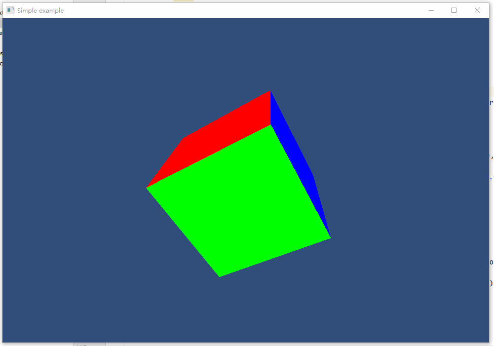

##3.2 画个立方体

        CLion项目文件位于 samples\draw_polygon\draw_cube\untitled

立方体由6个面组成，每个面2个三角形，下面的就是6x2个三角形,共36个顶点坐标数据。

```c++
static const glm::vec3 kPositions[36] = {
        //Front
        glm::vec3(-1.0f, -1.0f, 1.0f),
        glm::vec3(1.0f, -1.0f, 1.0f),
        glm::vec3(1.0f, 1.0f, 1.0f),

        glm::vec3(-1.0f, -1.0f, 1.0f),
        glm::vec3(1.0f, 1.0f, 1.0f),
        glm::vec3(-1.0f, 1.0f, 1.0f),

        //back
        glm::vec3(1.0f, -1.0f, -1.0f),
        glm::vec3(-1.0f, -1.0f, -1.0f),
        glm::vec3(-1.0f, 1.0f, -1.0f),

        glm::vec3(1.0f, -1.0f, -1.0f),
        glm::vec3(-1.0f, 1.0f, -1.0f),
        glm::vec3(1.0f, 1.0f, -1.0f),

        //left
        glm::vec3(-1.0f, -1.0f, -1.0f),
        glm::vec3(-1.0f, -1.0f, 1.0f),
        glm::vec3(-1.0f, 1.0f, 1.0f),

        glm::vec3(-1.0f, -1.0f, -1.0f),
        glm::vec3(-1.0f, 1.0f, 1.0f),
        glm::vec3(-1.0f, 1.0f, -1.0f),

        //right
        glm::vec3(1.0f, -1.0f, 1.0f),
        glm::vec3(1.0f, -1.0f, -1.0f),
        glm::vec3(1.0f, 1.0f, -1.0f),

        glm::vec3(1.0f, -1.0f, 1.0f),
        glm::vec3(1.0f, 1.0f, -1.0f),
        glm::vec3(1.0f, 1.0f, 1.0f),

        //up
        glm::vec3(-1.0f, 1.0f, 1.0f),
        glm::vec3(1.0f, 1.0f, 1.0f),
        glm::vec3(1.0f, 1.0f, -1.0f),

        glm::vec3(-1.0f, 1.0f, 1.0f),
        glm::vec3(1.0f, 1.0f, -1.0f),
        glm::vec3(-1.0f, 1.0f, -1.0f),

        //down
        glm::vec3(-1.0f, -1.0f, -1.0f),
        glm::vec3(1.0f, -1.0f, -1.0f),
        glm::vec3(1.0f, -1.0f, 1.0f),

        glm::vec3(-1.0f, -1.0f, -1.0f),
        glm::vec3(1.0f, -1.0f, 1.0f),
        glm::vec3(-1.0f, -1.0f, 1.0f),
};
```

然后设置对应数量的顶点颜色。

```c++
static const glm::vec4 kColors[36] = {
        //Front
        glm::vec4(1, 0, 0, 1),
        glm::vec4(1, 0, 0, 1),
        glm::vec4(1, 0, 0, 1),

        glm::vec4(1, 0, 0, 1),
        glm::vec4(1, 0, 0, 1),
        glm::vec4(1, 0, 0, 1),

        //back
        glm::vec4(1, 0, 0, 1),
        glm::vec4(1, 0, 0, 1),
        glm::vec4(1, 0, 0, 1),

        glm::vec4(1, 0, 0, 1),
        glm::vec4(1, 0, 0, 1),
        glm::vec4(1, 0, 0, 1),

        //left
        glm::vec4(0, 1, 0, 1),
        glm::vec4(0, 1, 0, 1),
        glm::vec4(0, 1, 0, 1),

        glm::vec4(0, 1, 0, 1),
        glm::vec4(0, 1, 0, 1),
        glm::vec4(0, 1, 0, 1),

        //right
        glm::vec4(0, 1, 0, 1),
        glm::vec4(0, 1, 0, 1),
        glm::vec4(0, 1, 0, 1),

        glm::vec4(0, 1, 0, 1),
        glm::vec4(0, 1, 0, 1),
        glm::vec4(0, 1, 0, 1),

        //up
        glm::vec4(0, 0, 1, 1),
        glm::vec4(0, 0, 1, 1),
        glm::vec4(0, 0, 1, 1),

        glm::vec4(0, 0, 1, 1),
        glm::vec4(0, 0, 1, 1),
        glm::vec4(0, 0, 1, 1),

        //down
        glm::vec4(0, 0, 1, 1),
        glm::vec4(0, 0, 1, 1),
        glm::vec4(0, 0, 1, 1),

        glm::vec4(0, 0, 1, 1),
        glm::vec4(0, 0, 1, 1),
        glm::vec4(0, 0, 1, 1),
};
```

通知GPU绘制这36个顶点。

```c++
//void glDrawArrays(GLenum mode,GLint first,GLsizei count);
glDrawArrays(GL_TRIANGLES, 0, 6*6);//表示从第0个顶点开始画，总共画6个面，每个面6个顶点。
```

编译运行，只看到一个正方形。


这是因为摄像机正好面对立方体的前面的中心，其他的面都被遮住了。

将原来的没有旋转的代码：

```c++
glm::mat4 rotation = glm::eulerAngleYXZ(glm::radians(0.f), glm::radians(0.f), glm::radians(0.f)); //使用欧拉角旋转;
```

修改为：

```c++
static float rotate_eulerAngle=0.f;
rotate_eulerAngle+=1;
glm::mat4 rotation = glm::eulerAngleYXZ(glm::radians(rotate_eulerAngle), glm::radians(rotate_eulerAngle), glm::radians(rotate_eulerAngle)); //使用欧拉角旋转;
```

让立方体旋转，就可以看到其他面了。

