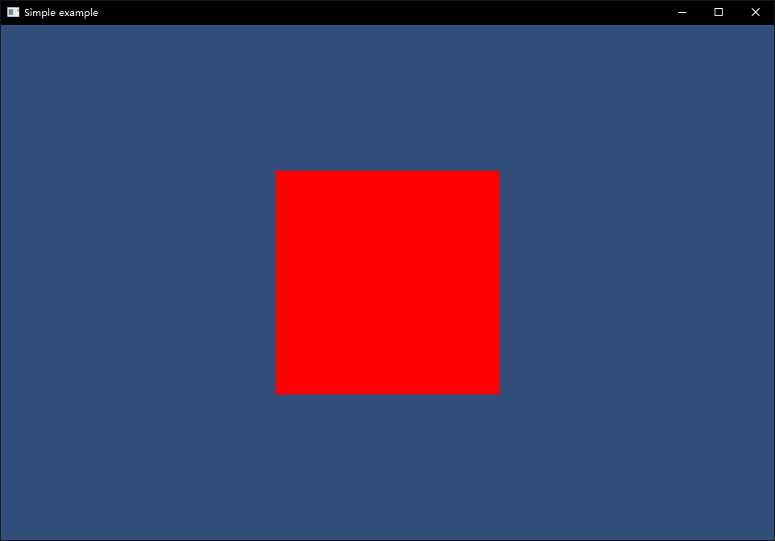

##3.2 画个立方体

        CLion项目文件位于 samples\draw_cube\untitled

立方体由6个面组成，每个面2个三角形，下面的就是6x2个三角形,共36个顶点坐标数据。

```c++
static const Vector3 Positions[36] =
{
        //前
        { -1.0f, -1.0f,1.0f},//左下
        { 1.0f,  -1.0f,1.0f},//右下
        { 1.0f,  1.0f,1.0f},//右上
        {  1.0f, 1.0f,1.0f},//右上
        { -1.0f, -1.0f,1.0f},//左上
        { -1.0f, 1.0f,1.0f},//左下

        //后
        { -1.0f, -1.0f,-1.0f},//左下
        {  1.0f, -1.0f,-1.0f},//右下
        {   1.0f,  1.0f,-1.0f},//右上
        {   1.0f,  1.0f,-1.0f},//右上
        { -1.0f, -1.0f,-1.0f},//左上
        { -1.0f,1.0f,-1.0f},//左下

        //左
        { -1.0f, -1.0f,-1.0f},//左下
        {  -1.0f, -1.0f,1.0f},//右下
        {   -1.0f,  1.0f,1.0f},//右上

        {   -1.0f,  1.0f,1.0f},//右上
        { -1.0f, 1.0f,-1.0f},//左上
        { -1.0f, -1.0f,-1.0f},//左下

        //右
        { 1.0f, -1.0f,-1.0f},//左下
        { 1.0f, -1.0f,1.0f},//右下
        { 1.0f, 1.0f,1.0f},//右上

        { 1.0f, 1.0f,1.0f},//右上
        { 1.0f, 1.0f,-1.0f},//左上
        { 1.0f, -1.0f,-1.0f},//左下

        //上
        { -1.0f, 1.0f,1.0f},//左下
        { 1.0f,  1.0f,1.0f},//右下
        { 1.0f,  1.0f,-1.0f},//右上

        { 1.0f,  1.0f,-1.0f},//右上
        { -1.0f, 1.0f,-1.0f},//左下
        { -1.0f, 1.0f,1.0f},//左下

        //下
        { -1.0f, -1.0f,1.0f},//左下
        { 1.0f,  -1.0f,1.0f},//右下
        { 1.0f,  -1.0f,-1.0f},//右上

        { 1.0f,  -1.0f,-1.0f},//右上
        { -1.0f, -1.0f,-1.0f},//左下
        { -1.0f, -1.0f,1.0f},//左下
};
```

然后设置对应数量的顶点颜色。

```c++
static const Color Colors[36] =
{
        //前
        { 1.f, 0.f, 0.f },//左下
        { 0.f, 1.f, 0.f },//右下
        { 0.f, 0.f, 1.f },//右上

        { 0.f, 0.f, 1.f },//右上
        { 1.f, 0.f, 0.f },//左上
        { 1.f, 0.f, 0.f },//左下

        //后
        { 1.f, 0.f, 0.f },//左下
        { 0.f, 1.f, 0.f },//右下
        { 0.f, 0.f, 1.f },//右上

        { 0.f, 0.f, 1.f },//右上
        { 1.f, 0.f, 0.f },//左上
        { 1.f, 0.f, 0.f },//左下

        //左
        { 1.f, 0.f, 0.f },//左下
        { 0.f, 1.f, 0.f },//右下
        { 0.f, 0.f, 1.f },//右上

        { 0.f, 0.f, 1.f },//右上
        { 1.f, 0.f, 0.f },//左上
        { 1.f, 0.f, 0.f },//左下

        //右
        { 1.f, 0.f, 0.f },//左下
        { 0.f, 1.f, 0.f },//右下
        { 0.f, 0.f, 1.f },//右上

        { 0.f, 0.f, 1.f },//右上
        { 1.f, 0.f, 0.f },//左上
        { 1.f, 0.f, 0.f },//左下

        //上
        { 1.f, 0.f, 0.f },//左下
        { 0.f, 1.f, 0.f },//右下
        { 0.f, 0.f, 1.f },//右上

        { 0.f, 0.f, 1.f },//右上
        { 1.f, 0.f, 0.f },//左上
        { 1.f, 0.f, 0.f },//左下

        //下
        { 1.f, 0.f, 0.f },//左下
        { 0.f, 1.f, 0.f },//右下
        { 0.f, 0.f, 1.f },//右上

        { 0.f, 0.f, 1.f },//右上
        { 1.f, 0.f, 0.f },//左上
        { 1.f, 0.f, 0.f },//左下
};
```

通知GPU绘制这36个顶点。

```c++
//void glDrawArrays(GLenum mode,GLint first,GLsizei count);
glDrawArrays(GL_TRIANGLES, 0, 6*6);//表示从第0个顶点开始画，总共画6个面，每个面6个顶点。
```

编译运行。



虽然成功运行了，但是却只看到一个面，这是因为立方体是绕Z轴旋转的，只有朝向摄像机的一个面被看到，其他几个面，没有机会展现。


```c++
mat4x4_rotate_Z(m, m, (float) glfwGetTime());//立方体绕Z轴旋转，导致只有朝向摄像机的一面被看到。
```

