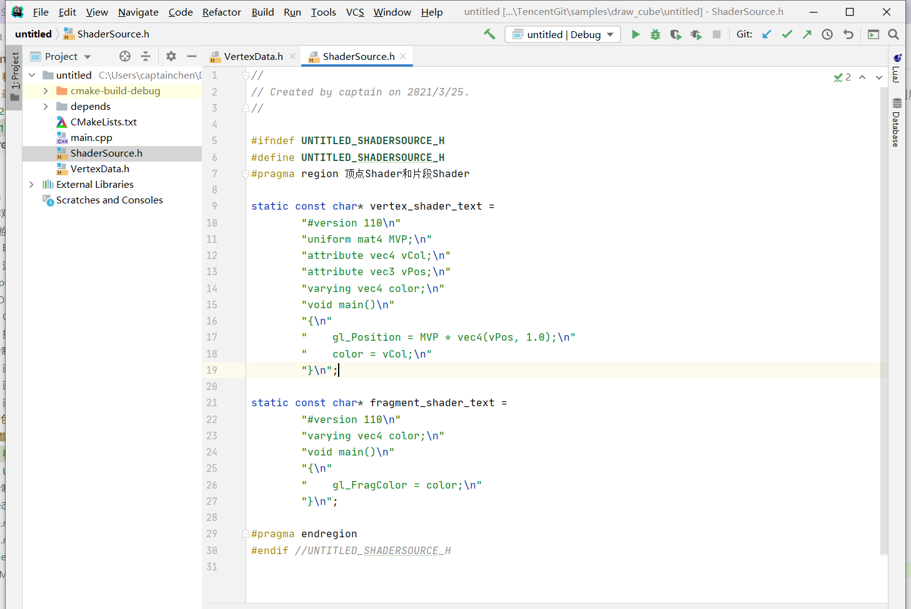

## 4. 着色器

着色器就是Shader，Shader就是一段GPU程序源码。

我们大学就学过的C语言是CPU程序源码，Shader和C 语言有很多相似之处，也要写代码、编译、链接。

通过下面的表格来做对照。

|   |   C语言| Shader|
|---|---|---|
|  目标硬件 | CPU  |GPU|
|编译流程|创建项目|创建GPU程序|
||创建编写多个C代码文件|创建编写Shader(顶点Shader和片段Shader)|
||把C代码发给编译器|把Shader代码发送到编译器|
||编译C代码|编译Shader代码|
||添加到链接列表|添加到链接列表|
||链接|链接|

是不是很相似呢！

渲染一个图像，其实就是在GPU上执行了Shader程序，然后将顶点坐标、颜色数据作为输入，经由Shader进行处理，然后输出像素数据到屏幕上。

和C语言不一样的是，C语言只需要一个main.c 文件就可以编译成功。

但是Shader是配套出现的， Vertex Shader(顶点着色器)、Fragment Shader(片段着色器)，两者缺一不可。

|   |   C语言| Shader|
|---|---|---|
|  目标硬件 | CPU  |GPU|
|代码文件列表|main.c|main.vs(Vertex Shader)|
||...|main.fs(Fragment Shader)|

### 着色器的种类

Vertex Shader(顶点着色器)、Fragment Shader(片段着色器/像素着色器) 我们听到最多的就是这两个。

Geometry Shader、Computer Shader看过但是实际项目中没用过。

Tessellation Control Shader 、Tessellation Evaluation Shader这两个就几乎没有听过。

这是由工作内容决定的，大家都是从事手机游戏开发。
目前市面上的手机，很大一部分仍然是OpenGL ES3.0的版本或更低。

Computer Shader在OpenGL ES 3.1版本才开始支持。

Geometry Shader在OpenGL ES 3.2版本才开始支持。

```txt
更多资料参考OpenGL官网：
https://www.khronos.org/opengl/wiki/Category:Shaders
```

本书也仅介绍Vertex Shader(顶点着色器)、Fragment Shader(片段着色器)。

在 `3.绘制简单图形` 这一章的配套项目里，`ShaderSource.h` 里面就存放着Vertex Shader 和 Fragment Shader 的源码。

如下图：



观察这段代码，又发现和C语言的相同之处 -- 入口都是 `main` 函数。

|   |   C语言| Shader|
|---|---|---|
|  目标硬件 | CPU  |GPU|
|入口|void main()|void main()|

当前小节对Shader有了一个大概的映像即可，后续章节再详细介绍。