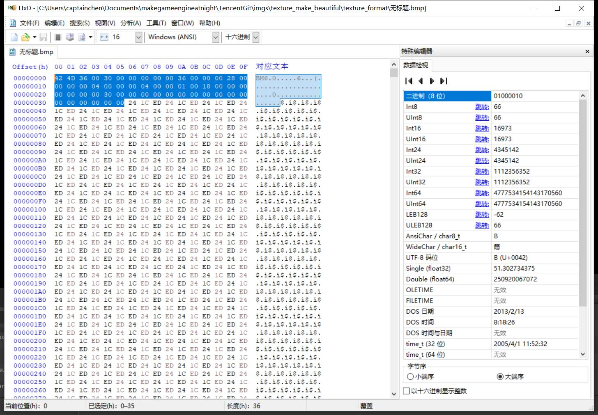
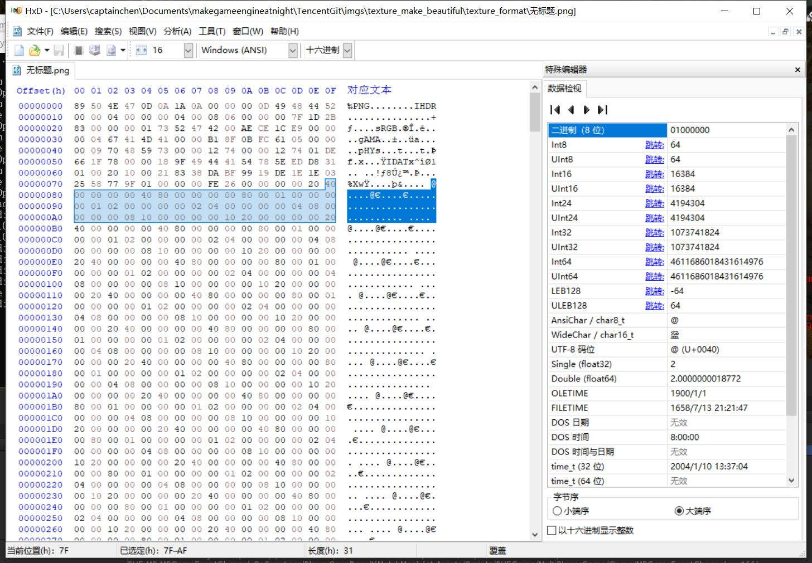
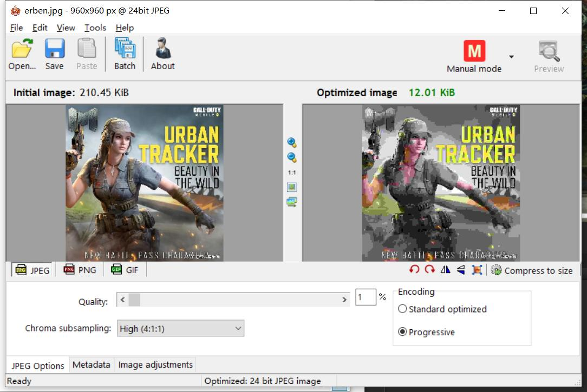
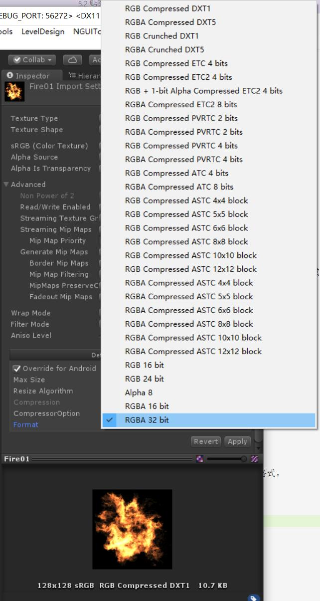

## 5.2 贴图文件介绍

贴图文件按格式大致分为3种：
1. 没有压缩的图片格式
2. CPU压缩的图片格式
3. 显卡支持的图片格式

下面一一介绍。

### 1.没有压缩的图片格式
在Unity中设置图片格式时，选择TrueColor就是没有压缩的图片格式，即真彩色。

没有压缩的TrueColor，每个像素值RGB分别用1个字节来表示，那么一张1024x1024的图，就是 1024x
1024x3=3145728，就是3M。

在Windows系统中，不压缩的图片格式就是 `.bmp`，下面用画图软件创建1024x1024的图片，保存为`.bmp`格式。

查看图片大小。

发现图片大小是 3145782。

这比上面计算的TrueColor图片尺寸大了一些，多了 54 字节。

这是为什么？

#### 1.1 文件的身份证--文件头

计算机文件类型数以千计，当用软件打开一个文件时，是如何判断这个文件可打开呢？

其实每一种文件，都有自己的身份证--文件头。

文件头就是文件的头部区域，所谓文件就是硬盘中存储的一块字节数据，这块字节数据的前面几个字节，就是文件头。

一个文件，一般是由2部分组成：

|  文件头 |  实际数据 |
|---|---|

上面创建的 `.bmp` 图片，就是因为多了文件头，所以会比计算的TrueColor尺寸大。

用HxD十六进制编辑器打开图片。

    下载地址：https://mh-nexus.de/en/downloads.php?product=HxD20

可以看到大片都是`24 1C ED`，这是因为图片里的红色RGB为(237,28,36)。

文件开始有54个字节，就是`.bmp`图片格式的文件头。

当我们用软件打开图片文件，软件会先读取前54个字节，判断是`.bmp`格式，就直接读取后面的字节数据，然后显示出来。

### 2. CPU压缩的图片格式

在日常工作中，几乎不会用到`.bmp`格式，因为占用空间太大了，存储/传输都不方便。
对于大文件，我们一般会用文件压缩软件对其进行压缩，保存为`.zip`等格式。

文件压缩方式分为无损压缩和有损压缩。
源文件压缩之后，再解压得到的文件，和源文件一致，这就叫做无损压缩。
我们熟知的`.zip` `.rar` `.7z`都是无损压缩，毕竟数据完整性是硬性需求。

那么什么时候能用到有损压缩？
对于精度要求不是那么高的，就可以用有损压缩，例如图片、骨骼动画。

#### 2.1 无损压缩

`.png`是常见的无损压缩格式。

把上面创建的`无标题.bmp`存为`.png`格式，文件大小变为 6,410 字节。

拖到 HxD十六进制编辑器中。

前面一段是文件头。

随后就是被压缩的颜色数据。

最后是文件尾。

#### 2.1 有损压缩
用的较多的有损压缩是 `.jpg`。
jpg图片可以一直压缩，直到压不动了为止。

### 3. 显卡支持的图片格式

#### 3.1 显卡图片格式优势

我们编写代码，读取`.png`、`.jpg`图片文件用于渲染，流程如下：

解压是特别耗时的操作，并且在解压的时候，需要占用额外一份内存。
因此一般我们都会选择将`.png`、`.jpg`图片，预先转换为显卡支持的图片格式，打包到游戏安装包，这样进游戏就只需要加载到内存，然后上传到GPU即可。

#### 3.2 Unity中的图片压缩
用Unity导入一个项目往往需要花费特别长的时间，有很大一部分都是花费在,预先转换图片为显卡支持的图像格式。
`.png`、`.jpg`图片文件读取到内存，然后解压，转换格式，存放到Library目录。

游戏Play时，从Library读取转换好的图像数据。

因为每个系统、每一种GPU，支持的最优图像格式都不同，所以根据选择的Platform，Unity会转换为不同的图像格式。

#### 3.3 常用显卡支持图像格式

在Unity的`Texture Import Setting`可以看到常用的显卡支持图像格式。

带 `Compressed`的都是压缩格式，由于显卡的大规模并行处理特性，解压缩不再是问题了。

