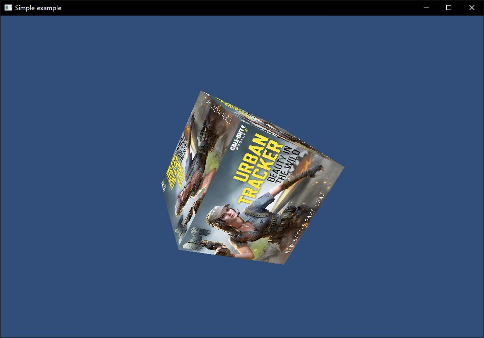
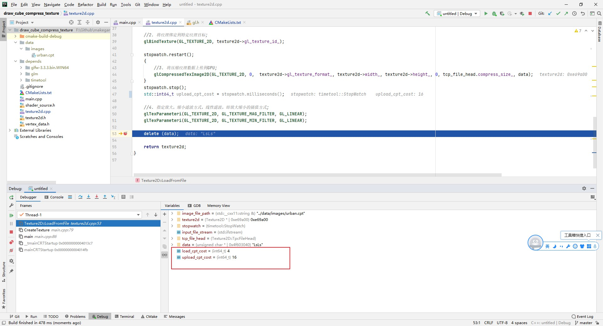

## 5.8 使用压缩纹理

```bash
CLion项目文件位于 samples\texture\draw_cube_compress_texture
```

前面了解了压缩纹理的优势，以及制作了纹理压缩的工具，这一节就加载 压缩纹理文件 `urban_compress_auto_format.cpt`进行渲染。

<font color=red>注意：上一节的压缩图片工具，由于每台电脑显卡不同，所以生成的`.cpt`格式会不一样，如果本节的实例运行后图片黑色，那么要在自己电脑上再生成一次`.cpt`。</font>

### 1. 加载cpt文件

之前项目中使用的是`.jpg`图片，`.jpg`图片并不是GPU支持的格式，需要借助`stb_image`这个库，在CPU中进行解析得到RGB数据，再上传到GPU。
本节要使用的`.cpt`文件，数据是从GPU下载保存的，是GPU支持的格式，所以就不需要再使用`stb_image`了，原来的加载流程也需要修改。

修改`Texture2D::LoadFromFile`，使用 C++ 标准库读取`.cpt`文件：
```c++
Texture2D* Texture2D::LoadFromFile(std::string& image_file_path)
{
    Texture2D* texture2d=new Texture2D();

    StopWatch stopwatch;
    stopwatch.start();

        //读取 cpt 压缩纹理文件
        ifstream input_file_stream(image_file_path,ios::in | ios::binary);
        TpcFileHead tcp_file_head;
        input_file_stream.read((char*)&tcp_file_head,sizeof(TpcFileHead));

        unsigned char* data =(unsigned char*)malloc(tcp_file_head.compress_size_);
        input_file_stream.read((char*)data,tcp_file_head.compress_size_);
        input_file_stream.close();

    stopwatch.stop();
    std::int64_t decompress_jpg_cost = stopwatch.milliseconds();

    texture2d->gl_texture_format_=tcp_file_head.gl_texture_format_;
    texture2d->width_=tcp_file_head.width_;
    texture2d->height_=tcp_file_head.height_;

    delete (data);

    return texture2d;
}
```

在`main.cpp` 修改读取文件为`urban_compress_auto_format.cpt`：
```c++
int main(void)
{
    init_opengl();

    CreateTexture("../data/images/urban_compress_auto_format.cpt");

    ......
}
```

调试查看数据：


正常读取到cpt文件头信息，而且解析cpt文件耗时仅6ms！

### 2. 上传cpt压缩纹理数据并渲染

从cpt文件读取到文件头和压缩纹理数据之后，就可以上传到GPU进行渲染。
```c++
Texture2D* Texture2D::LoadFromFile(std::string& image_file_path)
{
    ......

    //1. 通知显卡创建纹理对象，返回句柄;
    glGenTextures(1, &(texture2d->gl_texture_id_));

    //2. 将纹理绑定到特定纹理目标;
    glBindTexture(GL_TEXTURE_2D, texture2d->gl_texture_id_);

    stopwatch.restart();
    {
        //3. 将压缩纹理数据上传到GPU;
        glCompressedTexImage2D(GL_TEXTURE_2D, 0,  texture2d->gl_texture_format_, texture2d->width_, texture2d->height_, 0, tcp_file_head.compress_size_, data);
    }
    stopwatch.stop();
    std::int64_t upload_cpt_cost = stopwatch.milliseconds();

    //4. 指定放大，缩小滤波方式，线性滤波，即放大缩小的插值方式;
    glTexParameteri(GL_TEXTURE_2D, GL_TEXTURE_MAG_FILTER, GL_LINEAR);
    glTexParameteri(GL_TEXTURE_2D, GL_TEXTURE_MIN_FILTER, GL_LINEAR);

    delete (data);

    return texture2d;
}
```

和之前使用`.jpg`图片类似，唯一不同的是，这次我们上传的是压缩纹理数据，需要使用新的API：`glCompressedTexImage2D`，下面看介绍。
```c++
/** 
 * @brief 将压缩纹理数据上传到GPU;
 * @param target    目标纹理，GL_TEXTURE_2D(2D纹理)
 * @param level     当图片数据是包含多个mipmap层级时，指定使用mipmap层级。
 * @param internalformat 上传的压缩纹理数据格式
 * @param width
 * @param height
 * @param border
 * @param imageSize 上传的压缩纹理数据字节数
 * @param data 上传的数据
 * @return
 */
void glCompressedTexImage2D(GLenum target, GLint level, GLenum internalformat, GLsizei width, GLsizei height, GLint border, GLsizei imageSize, const void * data);
```

需要注意 `internalformat`，一定要和图片压缩后OpenGL返回的压缩格式保持一致，不然会出现错误。

编译运行，正常渲染了立方体：


### 3. 性能提升对比
断点调试查看耗时，如图:


与使用`.jpg`文件进行对比：

<table>
<tr bgcolor="AliceBlue"><td><b></td><td><b>解析耗时(ms)</td><td><b>上传耗时(ms)</td></tr>
<tr><td bgcolor="#FFFFCC">jpg</td><td>1571</td><td>960</td></tr>
<tr><td bgcolor="#FFFFCC">cpt</td><td>4</td><td>16</td></tr>
</table>

有很大的性能提升。

回顾一下，我们是先将`.jpg`图片，解析得到RGB数据，调用OpenGL API进行压缩上传至GPU，然后再从GPU下载压缩纹理数据，保存为`.cpt`文件。

这其实就是Unity导入图片的时候干的活，现在你知道为什么Unity导入图片那么慢了！


### 4.压缩发生在CPU还是GPU

一直以来，我都忽略了压缩和解压缩的效率区别，以至于想当然认为GPU既然解压快，那么压缩也快，那么应该是由GPU来压缩。

在请教了公司大佬和外部大佬之后，认为要看驱动具体实现，暂定压缩发生在CPU，主要缘由有以下：
1. 大佬认为GPU并行压缩是近年来才出现的方式，而且纹理压缩效率其实很低，并行化也并没有很大的优势，具体可以参考大佬的的文章： [用GPU加速ASTC纹理压缩](https://km.woa.com/group/27968/articles/show/475325)
2. GPU实现压缩，会侵犯现有的压缩算法专利。
3. 压缩发生时，CPU使用率较高，GPU无变化。