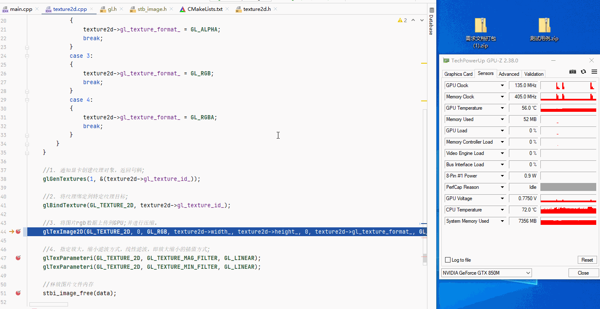
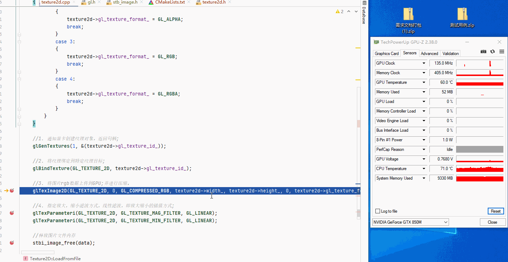
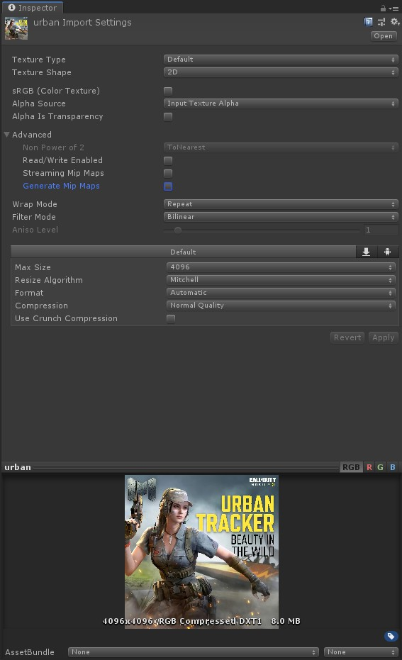
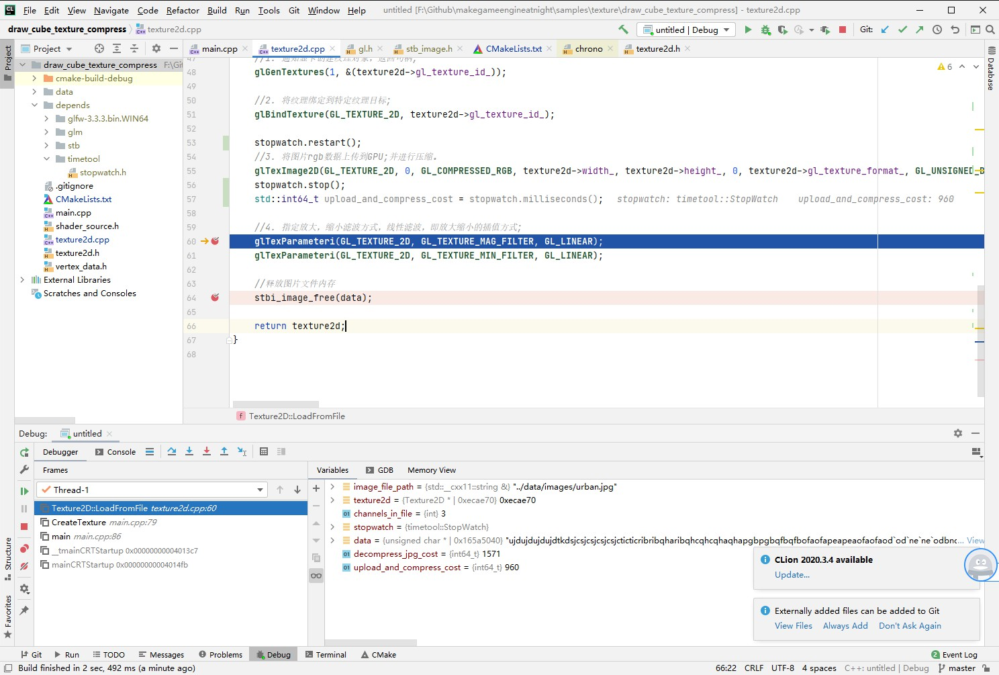

## 5.6 压缩纹理

    CLion项目文件位于 samples\texture\draw_cube_texture_compress

上一节解析了 `urban.jpg` 这个图片，从中拿到RGB数据，上传到GPU，进行渲染。
上传RGB数据到GPU，使用了下面的代码：
```c++
//3. 将图片rgb数据上传到GPU;
glTexImage2D(GL_TEXTURE_2D, 0, GL_RGB, texture2d->width_, texture2d->height_, 0, texture2d->gl_texture_format_, GL_UNSIGNED_BYTE, data);
```

接口定义如下：
```c++
/** 
 * @brief 将图片数据上传到GPU;
 * @param target    目标纹理，GL_TEXTURE_2D(2D纹理)
 * @param level     当图片数据是包含多个mipmap层级时，指定使用mipmap层级。
 * @param internalformat 图片数据上传到GPU后，在显存中保存为哪种格式？
 * @param width
 * @param height
 * @param border
 * @param format 上传的图片数据格式，RGB、RGBA、Alpha等
 * @param type 图片数据变量格式，一般都是GL_UNSIGNED_BYTE(0-255范围)
 * @param pixels 图片数据
 * @return
 */
void glTexImage2D(GLenum   target, GLint   level, GLint   internalformat, GLsizei   width, GLsizei   height, GLint   border, GLenum   format, GLenum   type, const void * pixels);
```

注意 `internalformat` 这个参数。
图片数据上传到到GPU后，可以选择保存的格式。
而我们这一章的主题是`压缩纹理`，那么我要讲的就是，可以保存为压缩格式。

### 1. 为什么使用压缩纹理？

为什么图片导入Unity之后，默认会设置为压缩格式？
在`glTexImage2D`这个接口里面，设置图片数据保存为压缩格式后，会有什么好处？

答案就是：<font color=blue>节省显存</font>。

如今的3A大作，各种4K贴图、超高精度模型，一个场景数据量几G，这些数据都是要上传到显存的，为了让游戏适配更多的硬件，开发者们也是各显神通，压缩纹理就是OpenGL官方提供的一种手段。

### 2. 使用压缩纹理
OpenGL支持的纹理数据格式如下：

<table>
<tr bgcolor="AliceBlue"><td><b>纹理格式</td><td><b>压缩纹理格式</td></tr>
<tr><td>GL_ALPHA</td><td>GL_COMPRESSED_ALPHA</td></tr>
<tr><td>GL_LUMINANCE</td><td>GL_COMPRESSED_LUMINANCE</td></tr>
<tr><td>GL_LUMINANCE_ALPHA</td><td>GL_COMPRESSED_LUMINANCE_ALPHA</td></tr>
<tr><td>GL_RGB</td><td>GL_COMPRESSED_RGB</td></tr>
<tr><td>GL_RGBA</td><td>GL_COMPRESSED_RGBA</td></tr>
<tr><td>GL_INTENSITY</td><td>GL_COMPRESSED_INTENSITY</td></tr>
</table>


之前`glTexImage2D`这个接口的 `internalformat` 参数值是`GL_RGB`，现在只要设置为对应的压缩纹理格式`GL_COMPRESSED_RGB`即可。

```c++
//3. 将图片rgb数据进行压缩上传到GPU。
glTexImage2D(GL_TEXTURE_2D, 0, GL_COMPRESSED_RGB, texture2d->width_, texture2d->height_, 0, texture2d->gl_texture_format_, GL_UNSIGNED_BYTE, data);
```

### 3. 查看压缩纹理效果

代码编译运行后，正常绘制了立方体，但是怎么样确认压缩纹理的效果呢，就是说怎么样确认显存占用降低？
这里借助GPU状态工具 - `GPU-Z` 来查看实时显存。

使用未压缩纹理，`glTexImage2D`接口调用前后显存对比如下：


从52m 变动到 116m，使用了约 64m 显存。

使用压缩纹理，接口调用前后显存对比如下：


从52m 变动到 60m，使用了约 8m 显存。

效果很明显，压缩纹理后，占用的显存是原来的 1/6 左右。

对比Unity中压缩后的效果，差异不大。


### 4. 问题与优化

启动时有一段时间的白屏，断点调试发现`stbi_load` 和 `glTexImage2D`耗时较长，这里引入`stopwatch`工具类来进行测量。
```c++
Texture2D* Texture2D::LoadFromFile(std::string& image_file_path)
{
    ......
    StopWatch stopwatch;
    stopwatch.start();
    unsigned char* data = stbi_load(image_file_path.c_str(), &(texture2d->width_), &(texture2d->height_), &channels_in_file, 0);
    stopwatch.stop();
    std::int64_t decompress_jpg_cost = stopwatch.milliseconds();
    ......

    stopwatch.restart();
    //3. 将图片rgb数据进行压缩上传到GPU。
    glTexImage2D(GL_TEXTURE_2D, 0, GL_COMPRESSED_RGB, texture2d->width_, texture2d->height_, 0, texture2d->gl_texture_format_, GL_UNSIGNED_BYTE, data);
    stopwatch.stop();
    std::int64_t upload_and_compress_cost = stopwatch.milliseconds();
    ......
}
```

耗时结果如下：


从硬盘加载jpg并解析得到RGB数据：1571 ms
压缩RGB数据上传到GPU：960 ms

这只是一张4096的图片，就花费了2.5s的时间，我们必须想办法优化。

制定优化方案之前，先理清楚为什么这么慢，主要是3个原因：
1. 解析jpg慢：jpg是一种压缩图片文件，需要解压才可以得到未压缩的RGB数据，解压是很慢的一个过程。
2. 压缩慢:对RGB数据进行压缩为GPU直接支持的格式，压缩需要耗费时间。
3. 上传慢：4096的图片，即使压缩后，上传要耗费一定时间。

对应的解决办法就是：<font color=blue>使用GPU支持的压缩纹理数据格式</font>。

具体做法就是：将压缩好的纹理数据，保存到硬盘作为图片文件。

带来的好处是：
1. 无需解析，直接上传GPU。
2. 数据已经压缩，无需再次压缩。
3. 数据已经压缩，上传数据量小。

OpenGL提供了接口`glGetCompressedTexImage`，将压缩好的纹理数据，从显存下载到内存，下一节将制作一个工具，对`.jpg`、`.png` 图片进行批量处理。