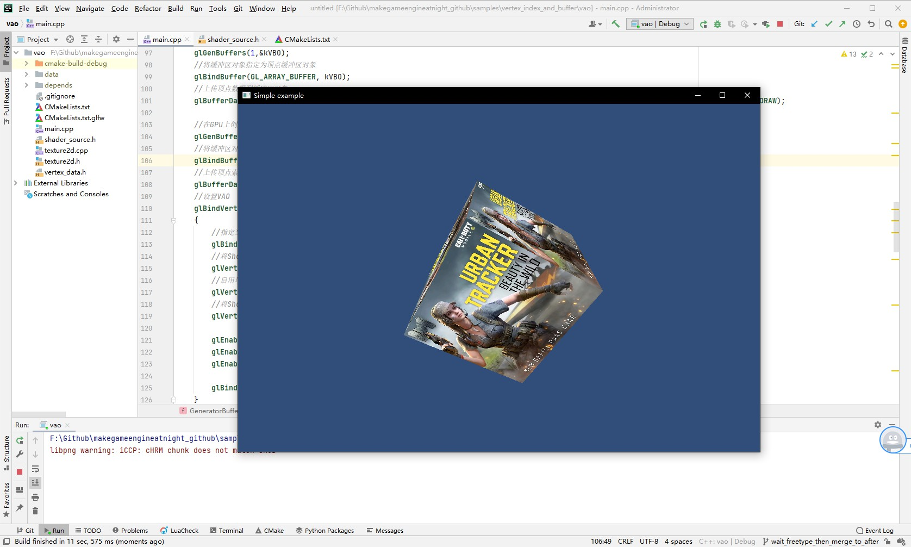

## 6.4 顶点数组对象

```c
CLion项目文件位于 samples\vertex_index_and_buffer\vao
```

顶点数组对象(Vertex Array Object，简称VAO)可以减少OpenGL API的调用次数。

VAO就像一个容器，在GPU端记录了一次绘制的顶点的状态。

例如每次绘制时，需要绑定VBO、EBO，代码如下：

```c++
//指定当前使用的VBO
glBindBuffer(GL_ARRAY_BUFFER, kVBO);

glBindBuffer(GL_ELEMENT_ARRAY_BUFFER, kEBO);
```

这就调用了2次API。

使用下面的代码，将上面的操作设置到VAO里面。

```c++
//生成一个VAO
glGenVertexArrays(1,&kVAO);
glBindVertexArray(kVAO);
{
    //指定当前使用的VBO
    glBindBuffer(GL_ARRAY_BUFFER, kVBO);

    glBindBuffer(GL_ELEMENT_ARRAY_BUFFER, kEBO);
}
glBindBuffer(GL_ARRAY_BUFFER, 0);
```

绘制的时候只要绑定VAO即可。

```c++
glBindVertexArray(kVAO);
{
    glDrawElements(GL_TRIANGLES,36,GL_UNSIGNED_SHORT,0);//使用顶点索引进行绘制，最后的0表示数据偏移量。
}
glBindVertexArray(0);
```

这就只需要调用1次API。

```c
如果了解过redis，就会想起来redis的lua脚本。
redis可以将多个命令写入lua脚本，然后载入内存。
客户端只要执行这个lua脚本，就可以在redis上执行多个命令。
```

下面看看测试项目的实际流程。

### 1.创建VAO

```c++
//file:main.cpp line:85

/// 创建VAO
void GeneratorVertexArrayObject(){
    glGenVertexArrays(1,&kVAO);
}
```

### 2.设置VAO

将非动态的内容，都可以设置到VAO里面。

```c++
//file:main.cpp line:90

/// 创建VBO和EBO，设置VAO
void GeneratorBufferObject()
{
    //在GPU上创建缓冲区对象
    glGenBuffers(1,&kVBO);
    //将缓冲区对象指定为顶点缓冲区对象
    glBindBuffer(GL_ARRAY_BUFFER, kVBO);
    //上传顶点数据到缓冲区对象
    glBufferData(GL_ARRAY_BUFFER, kVertexRemoveDumplicateVector.size() * sizeof(Vertex), &kVertexRemoveDumplicateVector[0], GL_STATIC_DRAW);

    //在GPU上创建缓冲区对象
    glGenBuffers(1,&kEBO);
    //将缓冲区对象指定为顶点索引缓冲区对象
    glBindBuffer(GL_ELEMENT_ARRAY_BUFFER, kEBO);
    //上传顶点索引数据到缓冲区对象
    glBufferData(GL_ELEMENT_ARRAY_BUFFER, kVertexIndexVector.size() * sizeof(unsigned short), &kVertexIndexVector[0], GL_STATIC_DRAW);
    //设置VAO
    glBindVertexArray(kVAO);
    {
        //指定当前使用的VBO
        glBindBuffer(GL_ARRAY_BUFFER, kVBO);
        //将Shader变量(a_pos)和顶点坐标VBO句柄进行关联，最后的0表示数据偏移量。
        glVertexAttribPointer(vpos_location, 3, GL_FLOAT, false, sizeof(Vertex), 0);
        //启用顶点Shader属性(a_color)，指定与顶点颜色数据进行关联
        glVertexAttribPointer(vcol_location, 4, GL_FLOAT, false, sizeof(Vertex), (void*)(sizeof(float)*3));
        //将Shader变量(a_uv)和顶点UV坐标VBO句柄进行关联，最后的0表示数据偏移量。
        glVertexAttribPointer(a_uv_location, 2, GL_FLOAT, false, sizeof(Vertex), (void*)(sizeof(float)*(3+4)));

        glEnableVertexAttribArray(vpos_location);
        glEnableVertexAttribArray(vcol_location);
        glEnableVertexAttribArray(a_uv_location);

        glBindBuffer(GL_ELEMENT_ARRAY_BUFFER, kEBO);
    }
    glBindBuffer(GL_ARRAY_BUFFER, 0);
}
```

### 3.使用VAO绘制

```c++
//file:main.cpp line:176

//指定GPU程序(就是指定顶点着色器、片段着色器)
glUseProgram(program);
{
    glEnable(GL_DEPTH_TEST);
    glEnable(GL_CULL_FACE);//开启背面剔除
    //上传mvp矩阵
    glUniformMatrix4fv(mvp_location, 1, GL_FALSE, &mvp[0][0]);

    //贴图设置
    //激活纹理单元0
    glActiveTexture(GL_TEXTURE0);
    //将加载的图片纹理句柄，绑定到纹理单元0的Texture2D上。
    glBindTexture(GL_TEXTURE_2D,texture2d->gl_texture_id_);
    //设置Shader程序从纹理单元0读取颜色数据
    glUniform1i(u_diffuse_texture_location,0);

    glBindVertexArray(kVAO);
    {
        glDrawElements(GL_TRIANGLES,36,GL_UNSIGNED_SHORT,0);//使用顶点索引进行绘制，最后的0表示数据偏移量。
    }
    glBindVertexArray(0);
}
glUseProgram(-1);
```


编译运行，效果正确：

