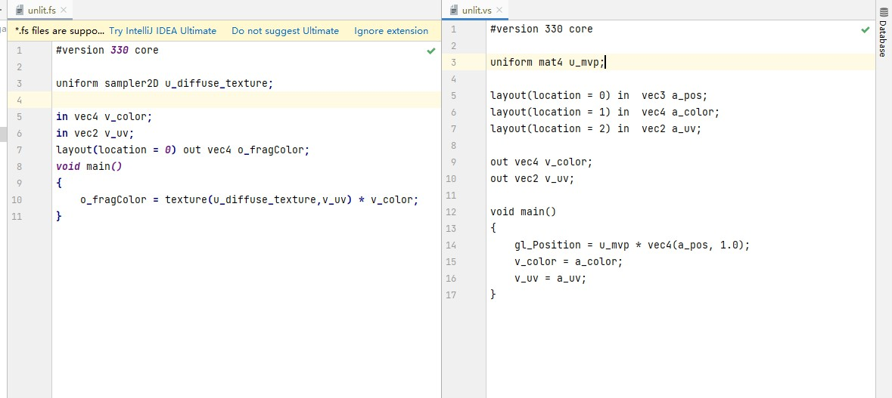
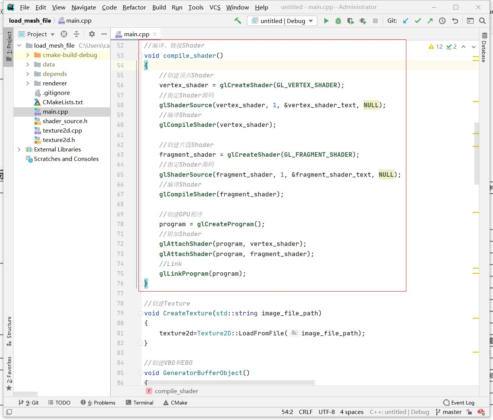

## 7.3 Shader文件创建与使用

```c
CLion项目文件位于 samples\mesh_and_material\use_shader_file
```

之前项目的Shader代码是写死在`shader_source.h`，不便于修改和更新。
Shader分为Vertex Shader(顶点Shader)和Fragment Shader(片段Shader)，现在就将它们分别存放到`.vs`和`.fs`文件中。

### 1. 创建Shader文件

创建`Unlit.vs` 和 `Unlit.fs`，将`shader_source.h`中的Shader代码放进去。




### 2. 加载Shader文件

创建类 `Shader`负责Shader文件的加载、编译、创建Shader程序、Link。，代码文件是`shader.h`。

#### 2.1 加载Shader文件

在创建Shader文件时，保证顶点Shader、片段Shader文件名一致，这样只要用`Shader文件路径` 和后缀拼起来就可以将他们都加载到内存。

```c++
//加载Shader文件并解析
void Shader::Parse(string shader_name) {
    shader_name_=shader_name;

    //组装完整文件路径
    string vertex_shader_file_path=shader_name+".vs";
    string fragment_shader_file_path=shader_name+".fs";

    //读取顶点Shader代码
    ifstream vertex_shader_input_file_stream(vertex_shader_file_path);
    string vertex_shader_source((std::istreambuf_iterator<char>(vertex_shader_input_file_stream)),std::istreambuf_iterator<char>());
    //读取片段Shader代码
    ifstream fragment_shader_input_file_stream(fragment_shader_file_path);
    string fragment_shader_source((std::istreambuf_iterator<char>(fragment_shader_input_file_stream)),std::istreambuf_iterator<char>());

    CreateGPUProgram(vertex_shader_source.c_str(), fragment_shader_source.c_str());
}
```

#### 2.2 创建GPUProgram

之前的例子，创建GPUProgram的代码在`main.cpp`中：



现在将它移动到`shader.cpp`中：
```c++
//编译Shader,创建GPU程序;
void Shader::CreateGPUProgram(const char* vertex_shader_text, const char* fragment_shader_text) {
    //创建顶点Shader
    unsigned int vertex_shader = glCreateShader(GL_VERTEX_SHADER);
    //指定Shader源码
    glShaderSource(vertex_shader, 1, &vertex_shader_text, NULL);
    //编译Shader
    glCompileShader(vertex_shader);
    ......
    ......
}
```


#### 2.3 缓存与查找

调用`Shader::Parse`就可以完成Shader文件的加载、编译，并创建GPU Program，不过从之前的例子知道，每执行一次Draw，就是激活一个GPU Program，一个游戏少说也有上百个DrawCall，那么必须要做的就是GPU Program的缓存了。

这里以`Shader文件路径`做Key，Shader对象实例做Value，缓存起来，并且提供静态接口`Find`查找或创建Shader:

```c++
//查找或创建Shader
Shader* Shader::Find(string shader_name) {
    unordered_map<string,Shader*>::iterator iter=kShaderMap.find(shader_name);
    if(iter!=kShaderMap.end()) {
        return iter->second;
    }

    Shader* shader=new Shader();
    shader->Parse(shader_name);

    kShaderMap.insert(pair<string,Shader*>(shader_name,shader));

    return shader;
}
```

#### 3. 使用Shader

在`main.cpp`中，创建Shader实例对象:

```c++
Shader* shader=Shader::Find("../data/shader/unlit");

mvp_location = glGetUniformLocation(shader->gl_program_id(), "u_mvp");
vpos_location = glGetAttribLocation(shader->gl_program_id(), "a_pos");
vcol_location = glGetAttribLocation(shader->gl_program_id(), "a_color");
a_uv_location = glGetAttribLocation(shader->gl_program_id(), "a_uv");
u_diffuse_texture_location= glGetUniformLocation(shader->gl_program_id(), "u_diffuse_texture");
```

渲染的时候，从Shader实例获取`gl_program_id`。

```c++
//指定GPU程序(就是指定顶点着色器、片段着色器)
glUseProgram(shader->gl_program_id());
{
    ......
    ......
}

```

编译运行，测试是否正常。

后续修改Shader代码，就只需要修改Shader文件了，游戏热更新和reload shader都可以安排上。

