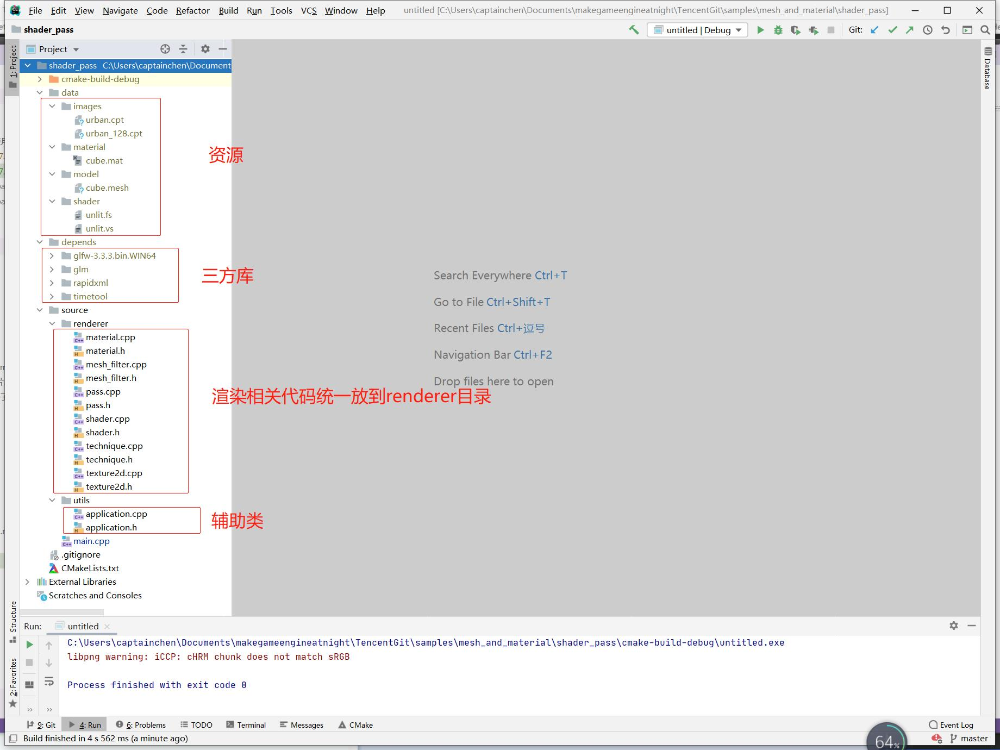

## 7.5 使用材质

```c
CLion项目文件位于 samples\mesh_and_material\shader_pass
```

本书教程里的材质文件，是以`xml`格式组织的，这里引入`rapidxml`这个xml库，对材质文件进行解析，另外项目结构也有所变化，渲染相关代码都整理到`source/renderer`目录，如下图。



### 1. 解析材质文件
按照材质文件的xml节点父子关系，分别创建类 `Material` `Technique` `Pass`，并将xml节点数据传入对应类的`Parse`函数进行解析。

<b>Material</b>

```xml
<material>
    <technique lod="0">

    </technique>
    <technique lod="1">

    </technique>
</material>
```

在类`Material`中，传入`.mat`材质文件路径，使用`rapidxml`解析，遍历`technique`节点并存储。
```c++
void Material::Parse(string material_path) {
    //解析xml
    rapidxml::file<> xml_file((Application::data_path()+material_path).c_str());
    rapidxml::xml_document<> document;
    document.parse<0>(xml_file.data());

    //根节点
    rapidxml::xml_node<>* root_node=document.first_node("material");
    if(root_node== nullptr){
        return;
    }

    //获取 technique 节点
    rapidxml::xml_node<>* technique_node=root_node->first_node("technique");
    while (technique_node!= nullptr){
        Technique* technique=new Technique();
        technique->Parse(technique_node);
        technique_vec_.push_back(technique);

        technique_node=technique_node->next_sibling("technique");
    }

    //LOD系统没有实现，就先设定第1个为默认Technique
    technique_active_=technique_vec_[0];
}
```

`technique`节点可以配置多个，但是生效的只有1个。在不同的LOD层级下，选择不同的`technique`节点进行渲染,在后面章节会详细介绍LOD系统。


<b>Technique</b>
```xml
<technique lod="0">
    <pass name="base" shader="shader/unlit">
        
    </pass>
</technique>
```

`technique`节点内有 `lod` 的属性，表示当前`technique`节点在哪一个LOD层级生效。
`technique`节点包含一个或多个`pass`节点，本小节实例很简单，就只有1个Pass，在一些比较复杂的效果则需要多个Pass。

`technique`节点解析XML的代码如下：
```c++
void Technique::Parse(rapidxml::xml_node<>* technique_node) {
    //根节点
    rapidxml::xml_node<>* root_node=technique_node;
    if(root_node== nullptr){
        return;
    }

    //pass 节点
    rapidxml::xml_node<>* pass_node=root_node->first_node("pass");
    while (pass_node!= nullptr){
        if(pass_node== nullptr){
            break;
        }

        Pass* pass=new Pass();
        pass->Parse(pass_node);
        pass_vec_.push_back(pass);

        pass_node=pass_node->next_sibling("pass");
    }
}
```
主要就是创建Pass实例，并存储起来。

<b>Pass</b>
```xml
<pass name="base" shader="shader/unlit">
    <texture name="u_diffuse_texture" image="images/urban_128.cpt"/>
</pass>
```

这里的Pass作用等同于Unity Shader中的Pass，代表一次Draw。
首先是属性 `name`，这个可有可无，为了方便区分而已。
属性`shader`，就是指这一次Draw所使用的的Shader。

`pass`节点下可存在多个渲染属性(数据)子节点，例如`texture`节点，用来指定贴图。后续章节会增加其他的一些节点。

对这一段XML进行解析时，顺便创建了Shader，生成了Texture，保存为Pass对象成员变量，方便渲染时获取并使用。

```c++
void Pass::Parse(rapidxml::xml_node<>* pass_node) {
    rapidxml::xml_attribute<>* pass_name_attribute=pass_node->first_attribute("name");
    if(pass_name_attribute== nullptr){
        return;
    }
    rapidxml::xml_attribute<>* pass_shader_attribute=pass_node->first_attribute("shader");
    if(pass_shader_attribute== nullptr){
        return;
    }
    //创建Shader
    shader_=Shader::Find(pass_shader_attribute->value());

    //解析Texture
    rapidxml::xml_node<>* pass_texture_node=pass_node->first_node("texture");
    while (pass_texture_node!= nullptr){
        rapidxml::xml_attribute<>* pass_texture_name_attribute=pass_texture_node->first_attribute("name");
        if(pass_texture_name_attribute== nullptr){
            return;
        }

        rapidxml::xml_attribute<>* pass_texture_image_attribute=pass_texture_node->first_attribute("image");
        if(pass_texture_image_attribute== nullptr){
            return;
        }

        std::string shader_property_name=pass_texture_name_attribute->value();
        std::string image_path=pass_texture_image_attribute->value();
        textures_.push_back(std::make_pair(pass_texture_name_attribute->value(),Texture2D::LoadFromFile(image_path)));

        pass_texture_node=pass_texture_node->next_sibling("texture");
    }
}
```

总的来说，其实就是3个步骤：

1. 解析`material`根节点，创建多个`Technique`。
2. 解析`technique`节点，创建多个`Pass`。
3. 解析`pass`节点，创建Shader和Texture。

### 2. 使用材质

OpenGL渲染一个物体，只需要准备顶点、Texture，然后运行对应的Shader，设置好状态。
顶点由`MeshFilter`提供，Texture和Shader都在材质的`pass`节点创建好了，万事俱备，按照顺序进行渲染就好了。

1. 初始化OpenGL环境
1. 创建`MeshFilter`
2. 创建`Material`
3. 从`Material`获取当前生效的`Technique`，遍历`Technique`下的多个`Pass`，获取`Shader`的`gl_program_id`，指定为目标Shader程序。
4. 上传顶点数据，生成缓冲区对象，指定纹理单元。
5. 调用`glDrawElements`提交渲染命令及数据。

修改`main.cpp`的`main()` 函数：

<b>2.1 创建Material对象解析材质</b>
```c++
Material* material=new Material();
material->Parse("material/cube.mat");
```

<b>2.2 从Pass获取数据进行渲染</b>
```c++
int main(void)
{
    ......
    Material* material=new Material();
    material->Parse("material/cube.mat");

    while (!glfwWindowShouldClose(window))
    {
        ......

        //遍历Pass节点，获取`Shader`的`gl_program_id`，指定为目标Shader程序。
        std::vector<Pass*>& pass_vec=material->technique_active()->pass_vec();
        for (int i = 0; i < pass_vec.size(); ++i) {
            Pass* pass=pass_vec[i];
            GLuint gl_program_id=pass->shader()->gl_program_id();
            //指定GPU程序(就是指定顶点着色器、片段着色器)
            glUseProgram(gl_program_id);
                glEnable(GL_DEPTH_TEST);

                GLint mvp_location = glGetUniformLocation(gl_program_id, "u_mvp");
                GLint vpos_location = glGetAttribLocation(gl_program_id, "a_pos");
                ......

                //指定当前使用的VBO
                glBindBuffer(GL_ARRAY_BUFFER, kVBO);
                //将Shader变量(a_pos)和顶点坐标VBO句柄进行关联，最后的0表示数据偏移量。
                glVertexAttribPointer(vpos_location, 3, GL_FLOAT, false, sizeof(MeshFilter::Vertex), 0);
                ......

                //上传mvp矩阵
                glUniformMatrix4fv(mvp_location, 1, GL_FALSE, &mvp[0][0]);

                //从Pass节点拿到保存的Texture
                std::vector<std::pair<std::string,Texture2D*>> textures=pass->textures();
                for (int texture_index = 0; texture_index < textures.size(); ++texture_index) {
                    GLint u_texture_location= glGetUniformLocation(gl_program_id, textures[texture_index].first.c_str());
                    //激活纹理单元0
                    glActiveTexture(GL_TEXTURE0+texture_index);
                    //将加载的图片纹理句柄，绑定到纹理单元0的Texture2D上。
                    glBindTexture(GL_TEXTURE_2D,textures[texture_index].second->gl_texture_id());
                    //设置Shader程序从纹理单元0读取颜色数据
                    glUniform1i(u_texture_location,GL_TEXTURE0);
                }

                //指定当前使用的顶点索引缓冲区对象
                glBindBuffer(GL_ELEMENT_ARRAY_BUFFER, kEBO);
                glDrawElements(GL_TRIANGLES,mesh_filter->mesh()->vertex_index_num_,GL_UNSIGNED_SHORT,0);//使用顶点索引进行绘制，最后的0表示数据偏移量。
            glUseProgram(-1);
        }
        ......
    }
    ......
}
```

### 3. 测试

编译运行项目，正确渲染了立方体：


材质文件中配置了多个`technique`节点，对应不同的LOD层级，可以修改`material`解析代码的最后一行，选择使用 LOD1 进行渲染：
```c++
technique_active_=technique_vec_[1];
```

LOD1的`technique`节点下，Pass中配置的是128x128的贴图，运行实例将看到立方体上模糊的贴图。
```xml
<technique lod="1">
    <pass name="base" shader="shader/unlit">
        <texture name="u_diffuse_texture" image="images/urban_128.cpt"/>
    </pass>
</technique>
```

