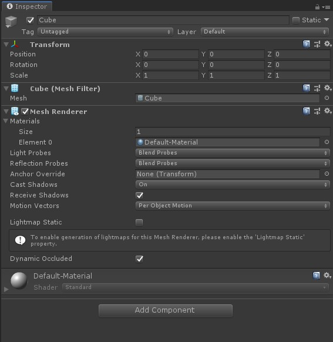

## 7.6 MeshRenderer

```c
CLion项目文件位于 samples\mesh_and_material\mesh_renderer
```

Mesh、Shader、材质都已经保存为文件，并创建了对应的类进行加载和解析，项目结构也逐渐清晰，但是这些数据文件的使用过程代码，仍然全部堆积在`main.cpp`中。

在Unity中创建一个Cube，可以看到除了MeshFilter、Material，还有一个MeshRenderer。
MeshRenderer，就是负责从MeshFilter、Material拿数据去渲染。



### 1. 创建MeshRenderer

创建类MeshRenderer，文件名为`mesh_renderer.cpp`。

MeshRenderer要从MeshFilter、Material拿数据，那么需要添加接口，用来保存对应对象到成员变量。

```c++
void MeshRenderer::SetMaterial(Material *material) {
    material_=material;
}

void MeshRenderer::SetMeshFilter(MeshFilter *mesh_filter) {
    mesh_filter_=mesh_filter;
}

void MeshRenderer::SetMVP(glm::mat4 mvp) {
    mvp_=mvp;
}
```

数据有了，就可以渲染了。

```c++
//file:source/renderer/mesh_renderer.cpp line:32

void MeshRenderer::Render() {
    //获取`Shader`的`gl_program_id`，指定为目标Shader程序。
    GLuint gl_program_id=material_->shader()->gl_program_id();

    if(vertex_array_object_ == 0){
        GLint vpos_location = glGetAttribLocation(gl_program_id, "a_pos");
        GLint vcol_location = glGetAttribLocation(gl_program_id, "a_color");
        GLint a_uv_location = glGetAttribLocation(gl_program_id, "a_uv");

        //在GPU上创建缓冲区对象
        glGenBuffers(1,&vertex_buffer_object_);
        //将缓冲区对象指定为顶点缓冲区对象
        glBindBuffer(GL_ARRAY_BUFFER, vertex_buffer_object_);
        //上传顶点数据到缓冲区对象
        glBufferData(GL_ARRAY_BUFFER, mesh_filter_->mesh()->vertex_num_ * sizeof(MeshFilter::Vertex), mesh_filter_->mesh()->vertex_data_, GL_STATIC_DRAW);

        //在GPU上创建缓冲区对象
        glGenBuffers(1,&element_buffer_object_);
        //将缓冲区对象指定为顶点索引缓冲区对象
        glBindBuffer(GL_ELEMENT_ARRAY_BUFFER, element_buffer_object_);
        //上传顶点索引数据到缓冲区对象
        glBufferData(GL_ELEMENT_ARRAY_BUFFER, mesh_filter_->mesh()->vertex_index_num_ * sizeof(unsigned short), mesh_filter_->mesh()->vertex_index_data_, GL_STATIC_DRAW);

        glGenVertexArrays(1,&vertex_array_object_);

        //设置VAO
        glBindVertexArray(vertex_array_object_);
        {
            //指定当前使用的VBO
            glBindBuffer(GL_ARRAY_BUFFER, vertex_buffer_object_);
            //将Shader变量(a_pos)和顶点坐标VBO句柄进行关联，最后的0表示数据偏移量。
            glVertexAttribPointer(vpos_location, 3, GL_FLOAT, false, sizeof(MeshFilter::Vertex), 0);
            //启用顶点Shader属性(a_color)，指定与顶点颜色数据进行关联
            glVertexAttribPointer(vcol_location, 4, GL_FLOAT, false, sizeof(MeshFilter::Vertex), (void*)(sizeof(float)*3));
            //将Shader变量(a_uv)和顶点UV坐标VBO句柄进行关联，最后的0表示数据偏移量。
            glVertexAttribPointer(a_uv_location, 2, GL_FLOAT, false, sizeof(MeshFilter::Vertex), (void*)(sizeof(float)*(3+4)));

            glEnableVertexAttribArray(vpos_location);
            glEnableVertexAttribArray(vcol_location);
            glEnableVertexAttribArray(a_uv_location);

            glBindBuffer(GL_ELEMENT_ARRAY_BUFFER, element_buffer_object_);
        }
        glBindBuffer(GL_ARRAY_BUFFER, 0);
    }

    glUseProgram(gl_program_id);
    {
        glEnable(GL_DEPTH_TEST);
        glEnable(GL_CULL_FACE);//开启背面剔除
        //上传mvp矩阵
        glUniformMatrix4fv(glGetUniformLocation(gl_program_id, "u_mvp"), 1, GL_FALSE, &mvp_[0][0]);

        //从Pass节点拿到保存的Texture
        std::vector<std::pair<std::string,Texture2D*>> textures=material_->textures();
        for (int texture_index = 0; texture_index < textures.size(); ++texture_index) {
            GLint u_texture_location= glGetUniformLocation(gl_program_id, textures[texture_index].first.c_str());
            //激活纹理单元0
            glActiveTexture(GL_TEXTURE0+texture_index);
            //将加载的图片纹理句柄，绑定到纹理单元0的Texture2D上。
            glBindTexture(GL_TEXTURE_2D,textures[texture_index].second->gl_texture_id());
            //设置Shader程序从纹理单元0读取颜色数据
            glUniform1i(u_texture_location,texture_index);
        }

        glBindVertexArray(vertex_array_object_);
        {
            glDrawElements(GL_TRIANGLES,mesh_filter_->mesh()->vertex_index_num_,GL_UNSIGNED_SHORT,0);//使用顶点索引进行绘制，最后的0表示数据偏移量。
        }
        glBindVertexArray(0);
    }
    glUseProgram(-1);
}
```

就是将

1. 上传顶点数据，生成缓冲区对象，指定纹理单元。
2. 调用`glDrawElements`提交渲染命令及数据。

这两个步骤的代码，从`main.cpp`移动过来。
`main.cpp`就负责调用MeshRenderer的接口，渲染相关代码就在MeshRenderer中。

### 2. 调用MeshRenderer渲染

`main.cpp`中移除了渲染相关代码后，结构变得清晰了。

```c++
int main(void)
{
    ......

    MeshFilter* mesh_filter=new MeshFilter();
    mesh_filter->LoadMesh("model/cube.mesh");

    Material* material=new Material();
    material->Parse("material/cube.xml");

    MeshRenderer* mesh_renderer=new MeshRenderer();
    mesh_renderer->SetMeshFilter(mesh_filter);
    mesh_renderer->SetMaterial(material);

    while (!glfwWindowShouldClose(window))
    {
        ......
        //计算mvp
        ......

        mesh_renderer->SetMVP(mvp);
        mesh_renderer->Render();


        glfwSwapBuffers(window);
        glfwPollEvents();
    }
    ......
}
```

编译运行，看看结果是否正常。