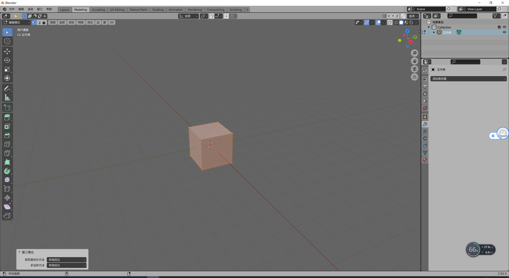

##8.5 Blender Python 导出顶点数据

学习Blender Python脚本的最终目的是导出模型为我们引擎的独有格式模型文件。

下面这段代码，就实现了导出顶点坐标、法线、索引、UV数据。

```python
#export_mesh.py
import bpy
import bmesh
import os
import struct

def ShowMessageBox(message = "", title = "Message Box", icon = 'INFO'):
    def draw(self, context):
        self.layout.label(text=message)
    bpy.context.window_manager.popup_menu(draw, title = title, icon = icon)

# Get the active mesh
object=bpy.context.object
mesh = object.data

print(mesh.vertices)


    
print("----EXPORT-----------------------------------")

if os.path.exists("export")==False:
    os.mkdir("export")
    
dir_path="export/"+object.name_full

if os.path.exists(dir_path)==False:
    os.mkdir(dir_path)
    
with open(dir_path+"/"+object.name_full+'.mesh', 'wb') as f:
    f.write(struct.pack('H',len(mesh.vertices)))
    for v in mesh.vertices:
        print("---------------")
        print(v)
        print(v.co)
        print(v.index)
        print(v.normal)
        
        f.write(struct.pack('fff',v.co.x,v.co.y,v.co.z))
        f.write(struct.pack('fff',v.normal.x,v.normal.y,v.normal.z))

        

    uv_layer = mesh.uv_layers.active.data
    f.write(struct.pack('H',len(mesh.polygons)))

    for poly in mesh.polygons:
        print("Polygon index: %d, length: %d" % (poly.index, poly.loop_total))
        if poly.loop_total==4:
            ShowMessageBox("Need Triangle","Polygon Error",  'ERROR')
            break
        
        # range is used here to show how the polygons reference loops,
        # for convenience 'poly.loop_indices' can be used instead.
        for loop_index in range(poly.loop_start, poly.loop_start + poly.loop_total):
            vertex_index=mesh.loops[loop_index].vertex_index
            uv=uv_layer[loop_index].uv
            
            print("    Vertex: %d" % vertex_index)
            print("    UV: %r" % uv)
            
            f.write(struct.pack('H',vertex_index))
            f.write(struct.pack('ff',uv.x,uv.y))
            
    f.close()
    
print("----SUCCESS-----------------------------------")
```

有一点需要注意，在3d制作软件里，默认都是4边形，但是游戏引擎都只支持三角形。

在Blender中，四边形转三角形的方式是：

    在编辑模式下，按 A 全选，然后 Ctrl+T 进行面三角化。




参考文档：

    https://docs.blender.org/api/current/bpy.types.Mesh.html#bpy.types.Mesh.polygons