## 88.1 第一个VSCode扩展程序

参照VSCode官网扩展开发教程，开发我们的第一个VSCode扩展程序：`输出Hello Captain`。

VSCode官网教程：`https://code.visualstudio.com/api/get-started/your-first-extension`


### 1. 配置开发环境

参考VSCode源码编译环境配置：`https://github.com/microsoft/vscode/wiki/How-to-Contribute` 。

VSCode基于 electron ，使用TypeScript开发，所以首先要安装TypeScript开发环境。

#### 1.1 Git

下载地址：`https://git-scm.com/`

#### 1.2 Node.JS

下载 Node.JS, x64, version >=16.14.x and <17。

官网：`https://nodejs.org/en/`。

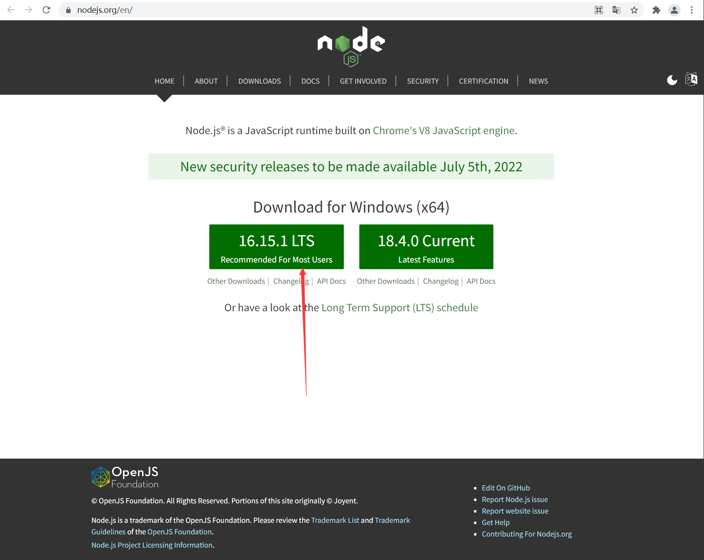

安装后在控制台输入 `node` ,输出版本号表示正常。


控制台输入 `npm` ，测试 Node.JS 的 包管理器是否正常。


#### 1.3 Yarn

参考官网安装教程：`https://classic.yarnpkg.com/en/docs/install#windows-stable`

控制台输入下面命令安装 Yarn:

```bash
npm install --global yarn
```

测试输出版本号查看是否安装成功：

```bash
yarn --version
```

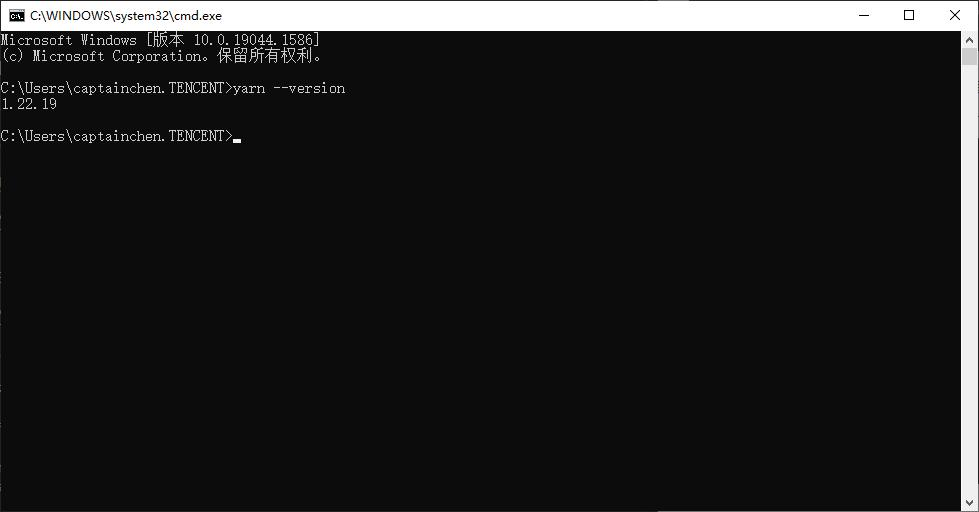


#### 1.4 Python

安装 Python 3.10.5 ，官网地址：`https://www.python.org/downloads/`


#### 1.5 Visual Studio 2019

安装 Visual Studio 2019 ，安装 C++ 桌面开发。


安装完成后，控制台输入 `npm config set msvs_version 2019` 。

#### 1.6 Yeoman

输入下面命令安装 Yeoman :

```bash
npm install -g yo
```

然后安装 VS Code Extension Generator (VSCode扩展项目生成器)：

```bash
npm install -g yo generator-code
```

### 2. 创建扩展程序项目

使用生成器，生成VSCode扩展程序项目：

```
yo code
```

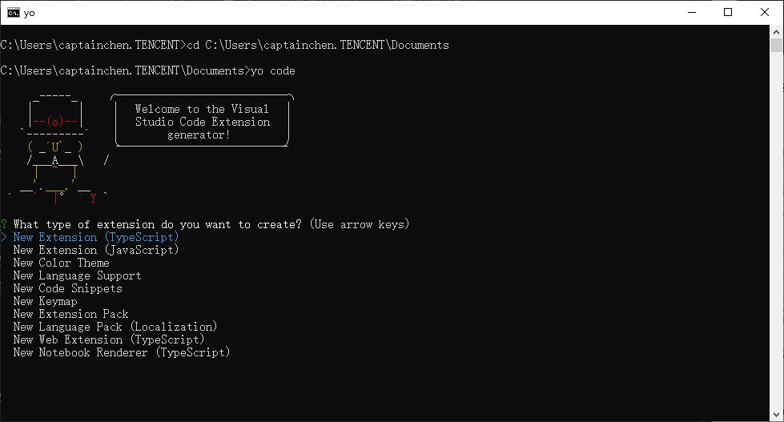

第一步选择扩展程序类型，就选择第一个，创建TypeScript空项目。

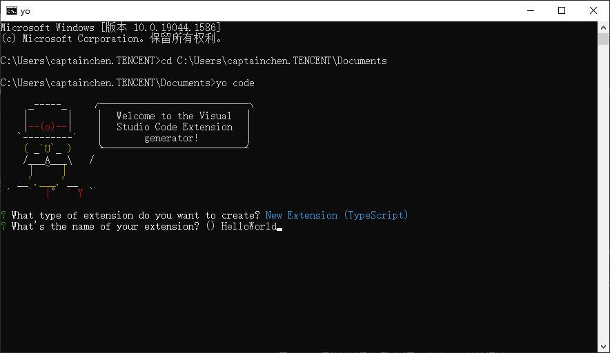

然后设置项目名。

然后一直回车，就会在当前目录创建项目文件夹。

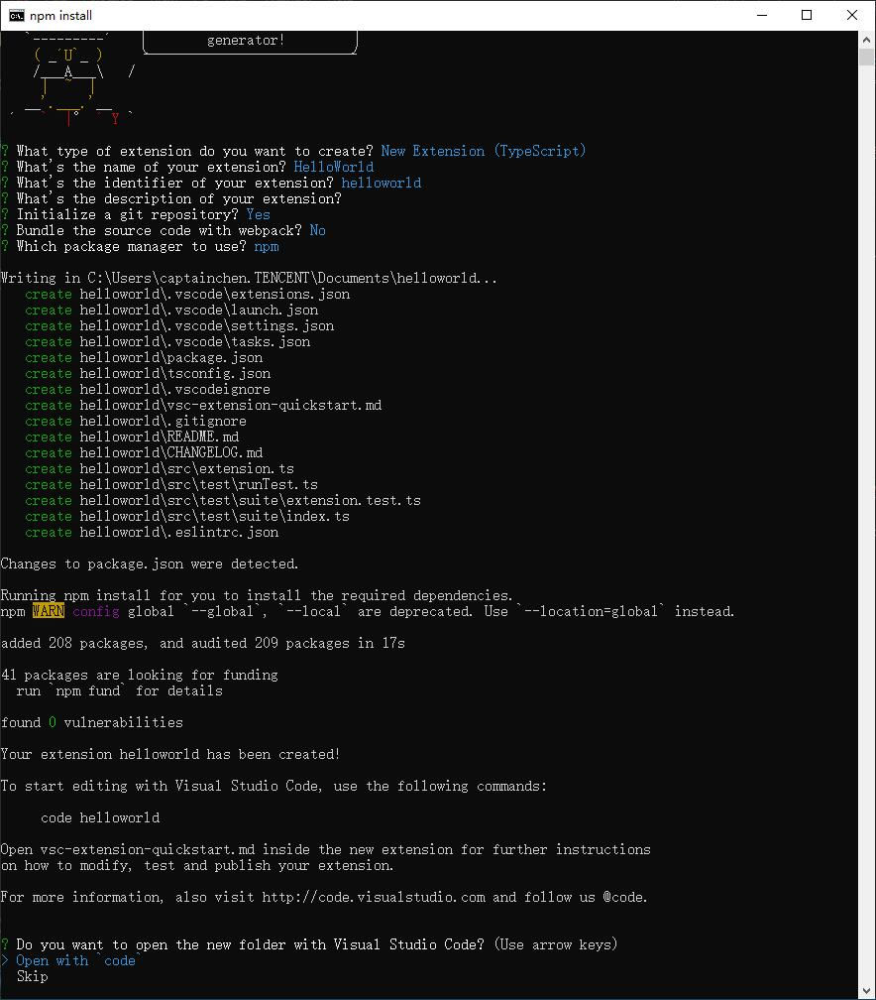

有时候会遇到 `npm install` 失败， 找不到 @types/vscode 对应版本的问题。

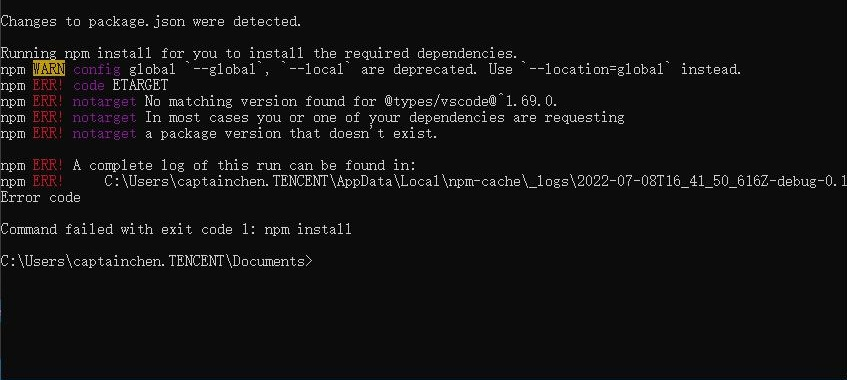

这是因为 yo 生成器指定的版本，在 npm 里找不到。

这多半是微软员工又偷懒，没有上传到 npm 。

这种事不是第一次了，例如以前的：

```bash
https://github.com/microsoft/vscode/issues/102045
```

可以到 npm 网站上看最新的版本：`https://www.npmjs.com/package/@types/vscode`

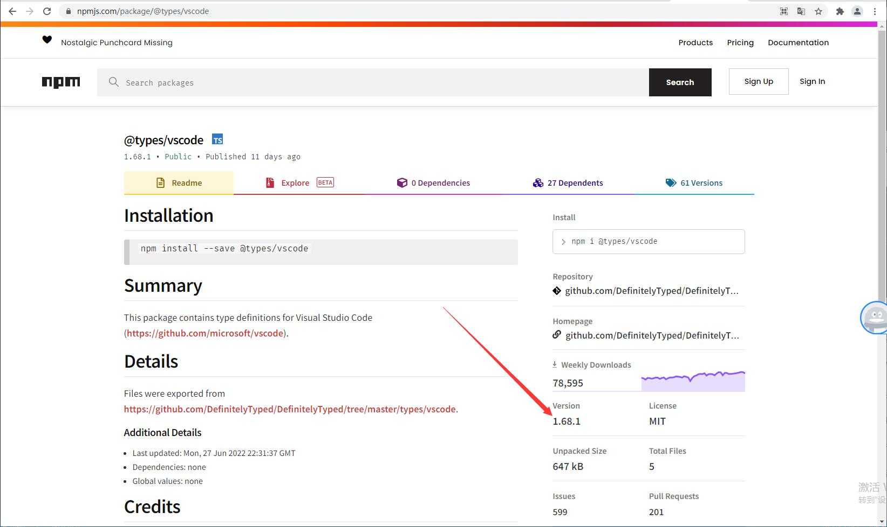

第二天再试就可以了。

### 3. 调试扩展程序

上面生成项目的最后，会提示是否用VSCode打开项目。


回车，用VSCode打开扩展程序项目目录，直接 F5 开始调试。

开始调试后，会打开一个新的VSCode，加载我们编写的扩展程序。

`ctrl + shift + p` ，打开命令框，输入 `Hello World` ，选中执行，就看到VSCode下方弹出了一个 Tips。

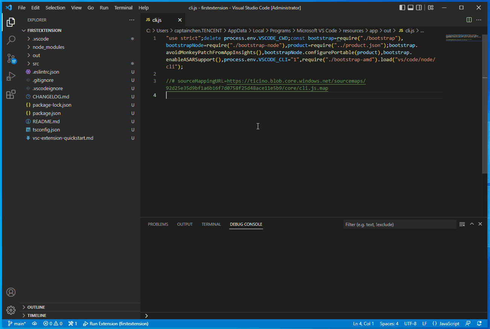


如果新打开的VSCode里，输入HelloWorld命令，却匹配不到对应命令，那么可以尝试更新 npm :`npm update -g`

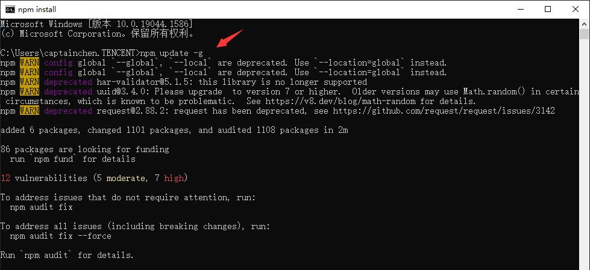

然后再启动调试。

#### 4. 项目结构解析

项目结构如下图：

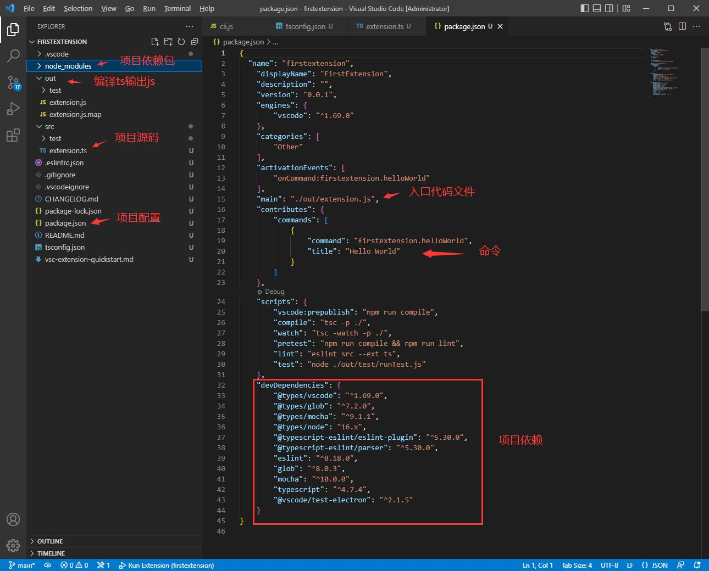

尝试修改配置文件的命令，和Tips内容：

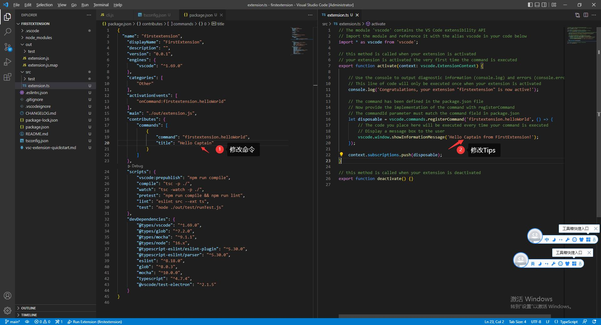

再次F5 启动调试：

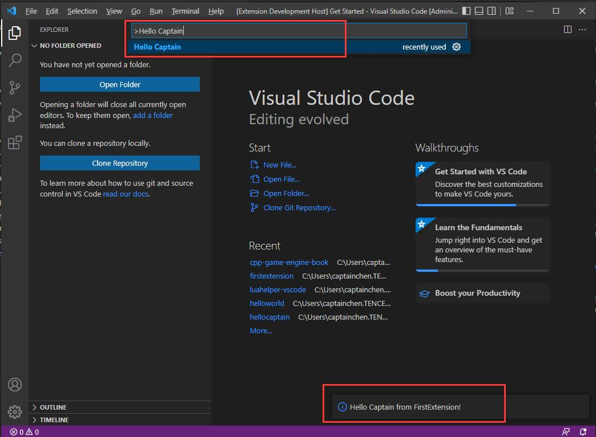

#### 5. 打包发布

VSCode扩展一般是发布到扩展商城，这样别人在VSCode里可以搜索安装。

也可以打包成文件，发给别人安装。

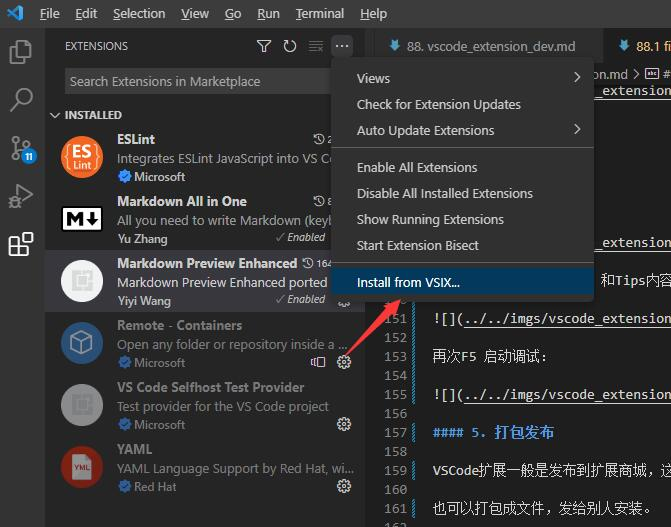

参考官网教程：

```bash
扩展打包发布：https://code.visualstudio.com/api/working-with-extensions/publishing-extension
```

不过我的目标是将扩展和VSCode打包到一起，提供给别人使用。而不是把这个扩展上传到商城让别人下载。

革命还没成功。

下一节介绍从源码编译VSCode，再下一节将做好的Hello Captain扩展与VSCode源码一起编译打包。

继续往后研究吧。