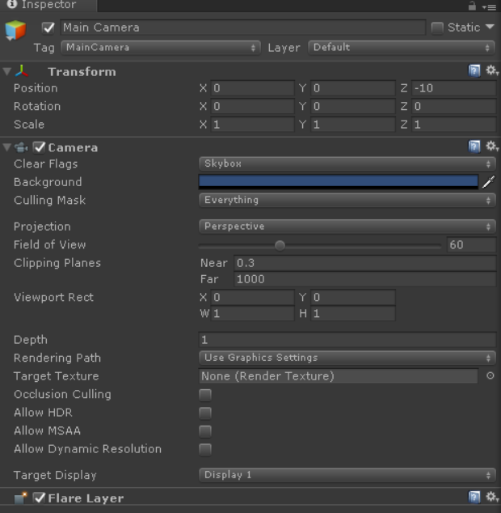

# 10. 相机

看到漂亮的人或物，我们会拿起数码相机，记录这一瞬间。
这一瞬间，相机镜头对准某一区域，传感器收集镜头看到的场景中的颜色，以数字形式记录到内存中。
从中我们提取出关键字：对准某一区域。
从关键字中又可以提取几个要素：

1. 相机位置
2. 相机朝向
3. 相机可视区域

游戏中常用的Camera，就是上面几个要素的集合。

<b>游戏引擎中的相机</b>

下图是Unity Camera:

核心参数解释：

1. Transform :指定 相机位置 和 朝向。
2. Filed of View:指定相机可视角度。
3. Clipping Planes:指定近裁剪面 和 远裁剪面。现实世界可以处理无限距离物体，但是虚拟世界物体需要经过计算处理，性能有限的条件下，只能采集场景的有限距离。 

这几个参数，就构成了最基础的Camera。

当然还有一些其他参数实现：

- Clear Flags：设置刷帧清屏内容种类，可以设置每帧清除颜色、深度等。
- Background: 每帧清除的颜色
- Culling Mask: 相机可以看见哪些Layer的物体。
- Projection: 相机类型，正交还是透视。
- Depth:  多个相机的排序
- Target Texture:将相机视野范围内的物体渲染到目标纹理。

这些其他的参数，在后续文章中也会实现。