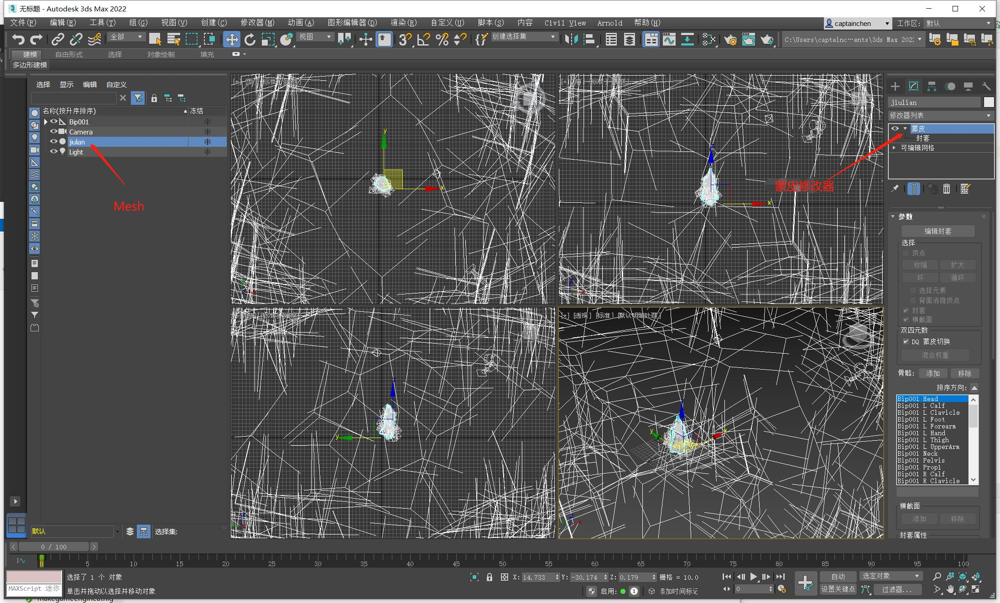
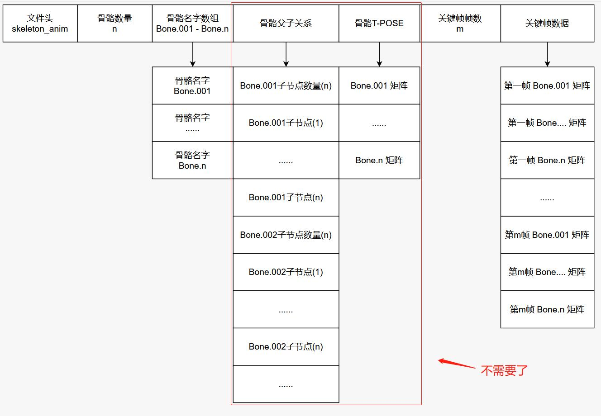

## 20.2 导出骨骼动画

```bash
CLion项目文件位于 samples\load_fbx\extra_skeleton_animation
```

### 1.名词介绍

FBX是AutoDesk家的私有格式，一般在项目中都是用3dsmax制作模型和动画，有必要了解一下3dsmax的基本操作。

这里简单介绍一些名词概念，便于理解。

* 节点：每个物体看做一个节点，节点之间有层级关系。
* 属性：节点可以是不同的类别，可以是Mesh、也可以是Camera、Light等。
* 修改器：为了实现不同效果，就需要挂上不同的修改器。要对一个Mesh进行编辑，就要添加可编辑Mesh修改器。要实现蒙皮动画，就要添加蒙皮修改器才能绘制权重。
* Cluster：受到某个骨骼影响的多个顶点，被称为Cluster，就是一组顶点的意思。一般Cluster是对应骨骼。这组顶点跟随这个Cluster移动旋转。




从FBX中导出骨骼动画，就是导出每一帧所有Cluster的移动旋转矩阵数据。

拿到矩阵后，就可以作用到顶点，让顶点动起来，这就是骨骼蒙皮动画。

按照下面的顺序：

1. 初始化FBX SDK。
2. 遍历节点，找到Mesh节点。
3. 从Mesh节点获取蒙皮修改器，获取所有Cluster。
4. 遍历帧数，获取每一帧每个Cluster的移动旋转矩阵数据。

前面2点上一节已经介绍过了，来看获取Cluster以及对应数据。

### 2.导出数据

```c++
//file:example/main.cpp line:153

/// 从Mesh节点获取蒙皮修改器，获取所有Cluster。遍历帧数，获取每一帧每个Cluster的移动旋转矩阵数据。
/// \param pNode Mesh节点
void ParseNodeRecursive(FbxNode* pNode){
    auto name=pNode->GetName();
    DEBUG_LOG_INFO("node name: {}", name);
    FbxNodeAttribute* lNodeAttribute = pNode->GetNodeAttribute();
    if (lNodeAttribute)
    {
        // 获取pNode相对于锚点的offset
        const FbxVector4 lT = pNode->GetGeometricTranslation(FbxNode::eSourcePivot);
        const FbxVector4 lR = pNode->GetGeometricRotation(FbxNode::eSourcePivot);
        const FbxVector4 lS = pNode->GetGeometricScaling(FbxNode::eSourcePivot);
        FbxAMatrix lGeometryOffset = FbxAMatrix(lT, lR, lS);

        DEBUG_LOG_INFO(" node translation: ({},{},{},{})", lT[0], lT[1], lT[2], lT[3]);
        DEBUG_LOG_INFO(" node rotation: ({},{},{},{})", lR[0], lR[1], lR[2], lR[3]);
        DEBUG_LOG_INFO(" node scaling: ({},{},{},{})", lS[0], lS[1], lS[2], lS[3]);

        if (lNodeAttribute->GetAttributeType() == FbxNodeAttribute::eMesh)
        {
            FbxMesh* pMesh = pNode->GetMesh();
            // 获取蒙皮数量，一般来说一个Mesh对应一个蒙皮修改器。
//            int lSkinCount = pMesh->GetDeformerCount(FbxDeformer::eSkin);
            Engine::Animation animation;
            animation.name_=mCurrentAnimationStack->GetName();

            FbxTime::EMode lTimeMode = mScene->GetGlobalSettings().GetTimeMode();
            animation.frame_per_second_=fbxsdk::FbxTime::GetFrameRate(lTimeMode);

            // 获取蒙皮修改器
            int lSkinIndex=0;
            FbxSkin * lSkinDeformer = (FbxSkin *)pMesh->GetDeformer(lSkinIndex, FbxDeformer::eSkin);
            // 获取蒙皮修改器上的顶点组数量，一般来说就是骨骼数量，绑定的时候，一般是以一个骨骼作为一个顶点组。
            int lClusterCount = lSkinDeformer->GetClusterCount();
            // 遍历骨骼
            for ( int lClusterIndex=0; lClusterIndex<lClusterCount; ++lClusterIndex) {
                // 获取骨骼的顶点组
                FbxCluster *lCluster = lSkinDeformer->GetCluster(lClusterIndex);
                animation.bone_name_vec_.push_back(lCluster->GetName());
            }

            // 每一帧的时间
            FbxTime mFrameTime;
            mFrameTime.SetTime(0, 0, 0, 1, 0, mScene->GetGlobalSettings().GetTimeMode());
            for(FbxTime pTime=mStart;pTime<mStop;pTime+=mFrameTime){
                // 首先获取当前节点的全局坐标
                FbxAMatrix lGlobalPosition = pNode->EvaluateGlobalTransform(pTime);
                FbxAMatrix lGlobalOffPosition = lGlobalPosition * lGeometryOffset;//相乘获得pNode在当前时间相对原点的坐标。

                std::vector<glm::mat4> one_frame_bone_matrix_vec;//一帧的所有骨骼变换矩阵
                for ( int lClusterIndex=0; lClusterIndex<lClusterCount; ++lClusterIndex) {
                    // 获取骨骼的顶点组
                    FbxCluster *lCluster = lSkinDeformer->GetCluster(lClusterIndex);
                    // 计算这个骨骼的形变，前面pNode是指计算到Mesh节点的形变，而这是是计算骨骼节点，后面会作用到顶点。
                    FbxAMatrix lVertexTransformMatrix;
                    ComputeClusterDeformation(lGlobalOffPosition, pMesh, lCluster, lVertexTransformMatrix, pTime);

                    glm::mat4 bone_matrix= FbxMatrixToGlmMat4(lVertexTransformMatrix);
                    one_frame_bone_matrix_vec.push_back(bone_matrix);
                }
                animation.frame_bones_matrix_vec_.push_back(one_frame_bone_matrix_vec);
            }//lClusterCount

            animation.frame_count_=animation.frame_bones_matrix_vec_.size();

            animation.Write(fmt::format("../data/animation/fbx_extra_{}.skeleton_anim", animation.name_).c_str());
        }
    }
    // 遍历子节点，递归
    const int lChildCount = pNode->GetChildCount();
    for (int lChildIndex = 0; lChildIndex < lChildCount; ++lChildIndex)
    {
        ParseNodeRecursive(pNode->GetChild(lChildIndex));
    }
}
```

核心代码其实就是下面这句，获取了当前Cluster在当前帧的形变。

```c++
//file:example/main.cpp line:204

// 计算这个骨骼的形变，前面pNode是指计算到Mesh节点的形变，而这是是计算骨骼节点，后面会作用到顶点。
FbxAMatrix lVertexTransformMatrix;
ComputeClusterDeformation(lGlobalOffPosition, pMesh, lCluster, lVertexTransformMatrix, pTime);
```

这个函数是从`ViewScene`里原样搬过来的，函数里面挺复杂，不用管它，我知道了这个函数返回的矩阵是最终作用到顶点上，那么这个矩阵就是我所需要的，用它就能作用到顶点上形成蒙皮动画。

```diff
+对其他建模软件或者模型格式也可以用这个套路，找到最后作用到顶点的矩阵导出即可。
```

### 3.文件结构

还记得在前面Blender导出时，需要导出T-POS矩阵，以及每一帧Bone的相对位移矩阵，然后在运行时，加载文件后，首先进行Bake计算出最终的矩阵。

而这里导出的矩阵是最终作用到顶点上，这和之前Blender导出骨骼动画数据有点差异，少了Bake阶段。

就是说导出的矩阵是全局的，而不是局部的，那么相比较就少了T-POS矩阵数据，文件结构修改为如下：



较之前版本，红色框内不需要了。
