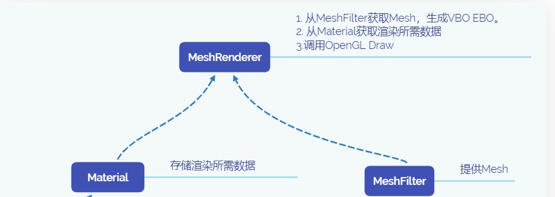
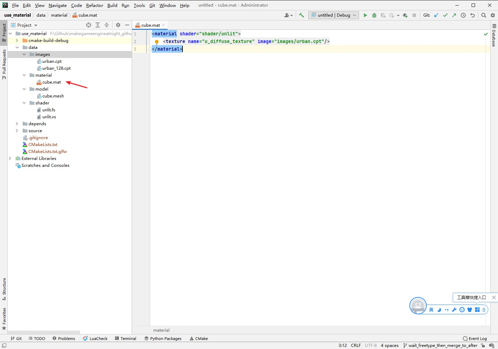

## 7.4 材质

模型离不开贴图和材质，我们已经学会了绘制贴图，那么材质是什么？

<b>材质是什么？</b>

在Unity里面可以创建一个材质，然后选择Shader，就可以在编辑器里修改Shader里面的字段值、拖图片到材质里。

材质，本质上就是一个文本文件，里面记录了以下信息：

```c
OpenGL参数
Shader名字
Shader参数对应值(int、float、纹理)
```

下图是Unity的材质文件。


每个游戏引擎使用的格式都不一样，本节教程使用下面格式的材质文件。

```xml
<material shader="shader/unlit">
    <texture name="u_diffuse_texture" image="images/urban.cpt"/>
</material>
```

这其实是一个`xml`文件，以`material`作为节点，标志这是一个材质文件。
存储一次绘制所需要的Shader、图片等资源。


在整个立方体的渲染里，material所处位置如下图：



将上面的内容保存为`cube.mat`，现在资源目录如下：


