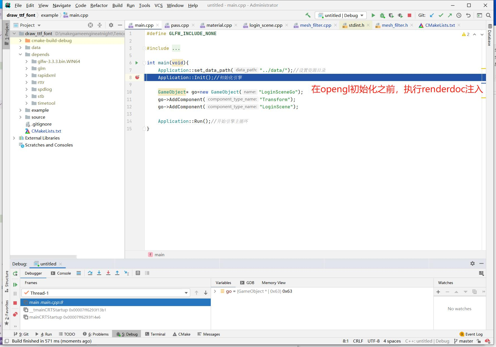
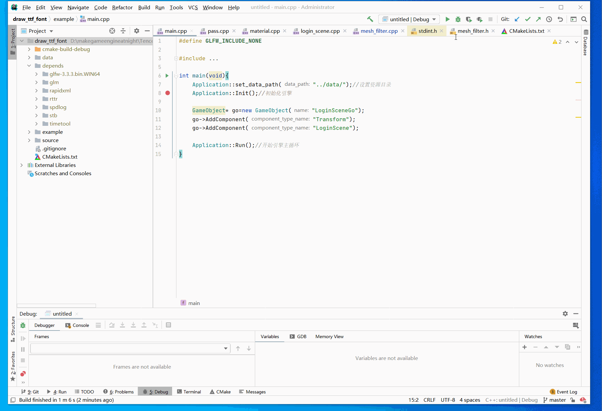
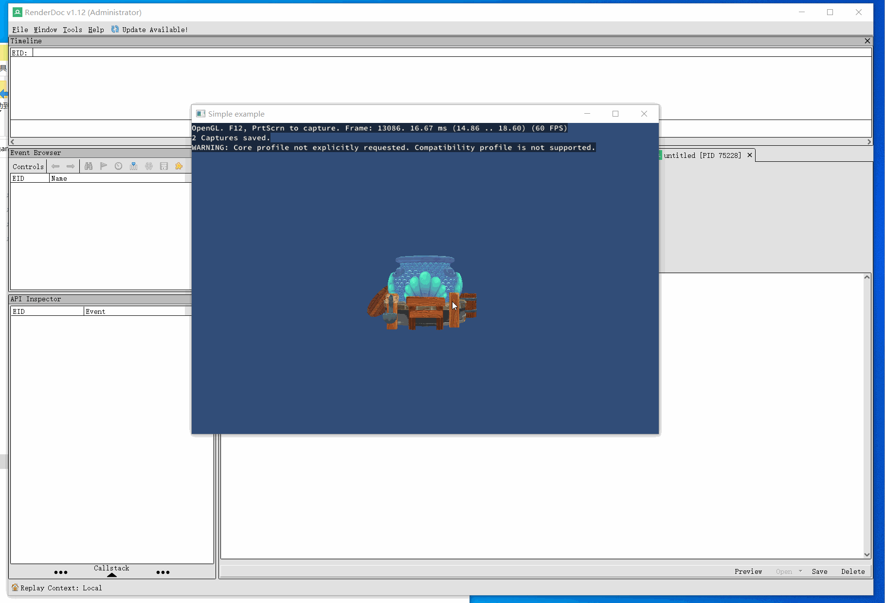
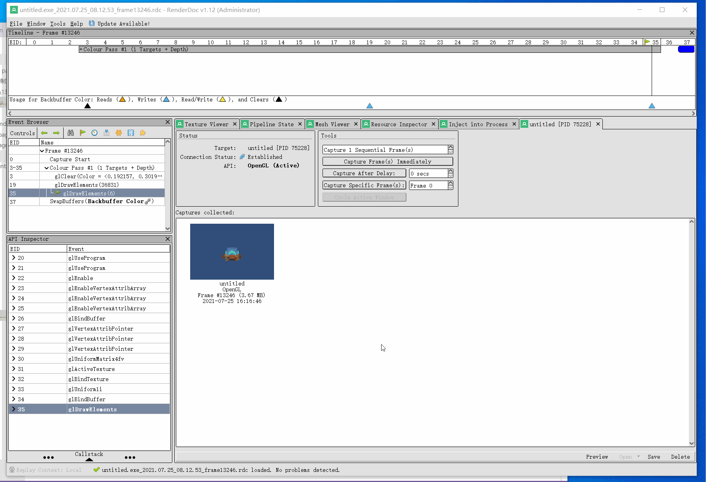
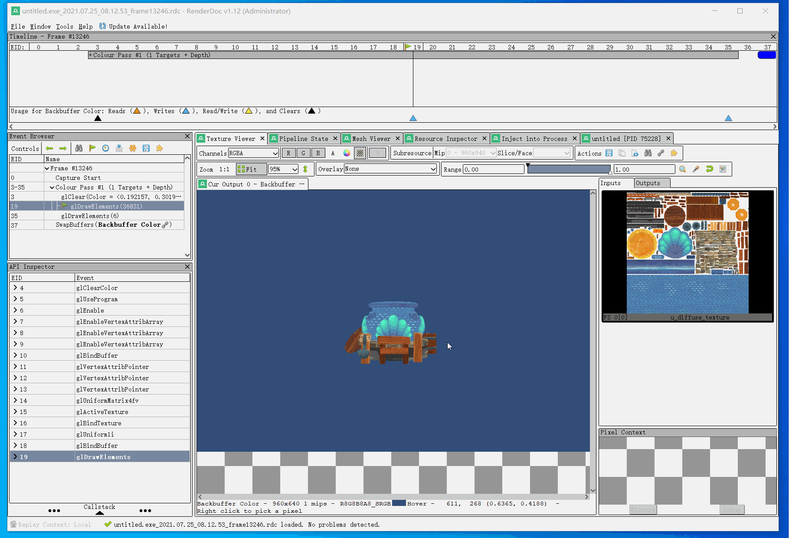
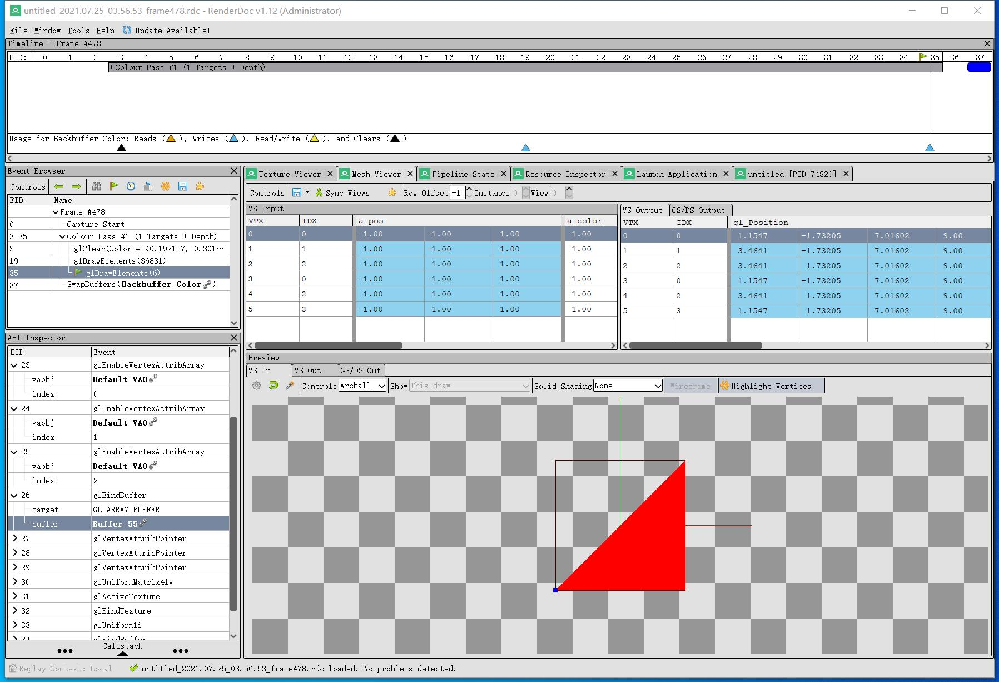
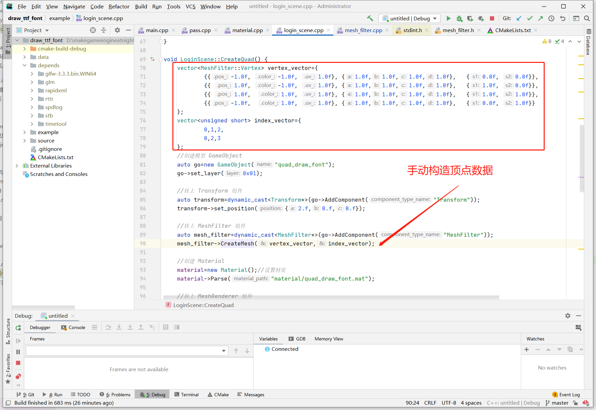
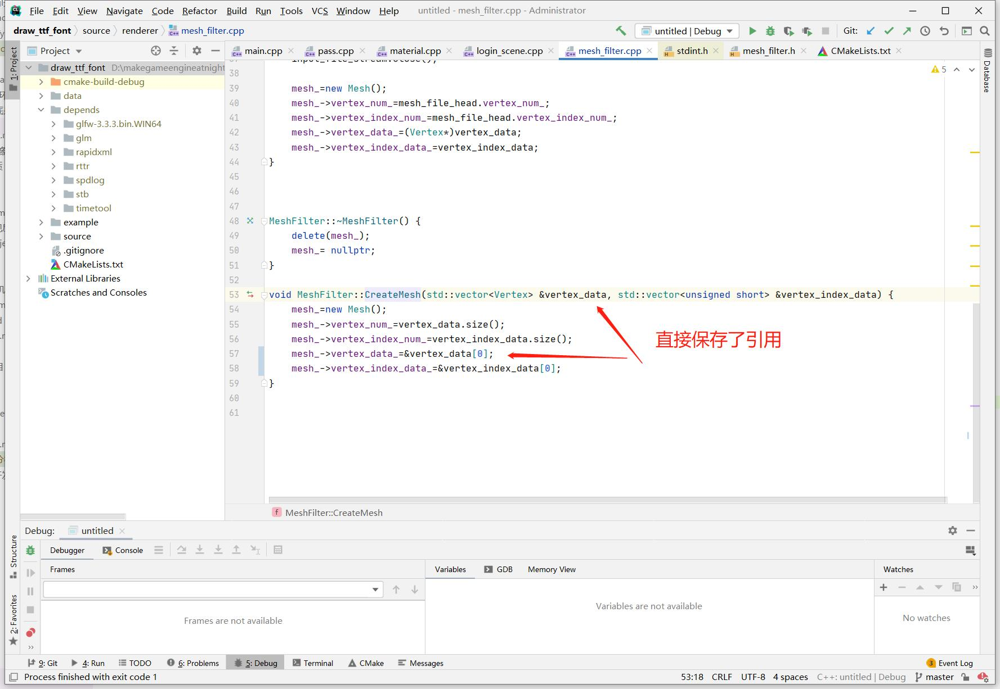
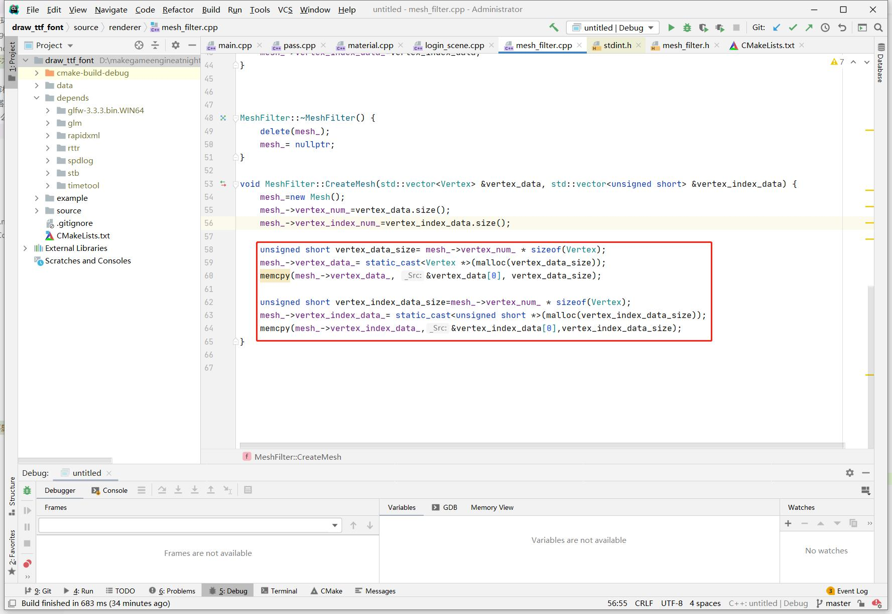

## 90.1 RenderDoc分析不显示bug

在《13.1 绘制TrueType》这一小节的实例中，遇到了奇怪的问题。

|||
|:--:|:--:|
| 在CLion直接运行的时候正常显示  | 在CLion断点调试的时候就不显示了  |

在我还是初学者的时候，都是在C++代码断点调试，然后看数据，打log去猜测哪里有问题。

现在都是直接开启RenderDoc看OpenGL API调用，快速定位问题。

### 1. Inject into Process

RenderDoc支持多种方式启动目标程序，因为问题是在CLion调试的时候出现的，所以选择注入到进程的方式。

注意：注入到进程的方式，需要在OpenGL初始化之前执行。

在程序启动的地方断点，然后在RenderDoc中选择程序注入。

可以看到最后程序启动后，顶部显示了RenderDoc的调试信息。

### 2. 分析一帧数据

注入成功后，在RenderDoc里截取一帧，就可以看到这一帧所有的OpenGL API调用。

物体不显示，可能有下列原因：

1. 压根就没有调用OpenGL API提交渲染。
2. 提交的顶点数据不对，超出视椎体。
3. 提交的参数不对。
4. 提交的纹理是全透明的。

在RenderDoc中对以上原因一一来看。

#### 2.1 检查提交的纹理

将RenderDoc切换到Texture View窗口，在左侧切换`glDrawElements`调用，查看提交的纹理。

可以看到有2个 `glDrawElements`调用，这说明是绘制了2个物体，排除原因1.

每次调用都提交了正确的纹理，排除原因4.

#### 2.2 检查顶点

将RenderDoc切换到Mesh View窗口，在左侧切换`glDrawElements`调用，查看提交的顶点。

第一个绘制，提交了鱼缸模型，在Mesh View窗口看到是正常的。

但是第二个绘制就出现了问题，顶点数据很多是空的，在Mesh View窗口看到的也没有组成正方形。

与直接运行截取的帧数据进行对比。

|||
|:--:|:--:|
| 在CLion直接运行的时候顶点数据正常  | 在CLion断点调试的时候顶点数据异常  |

这说明提交的顶点数据错了。

### 3. 解决问题

这个没有显示出来的Quad，顶点数据是在代码中写死的。

数据没问题，但是构造Mesh的时候出了问题。

直接存了引用，引用的顶点数据在函数结束时就销毁了，那么下一帧上传到GPU的就是空数据了。

找到问题所在，再Copy一次内存就好了。

